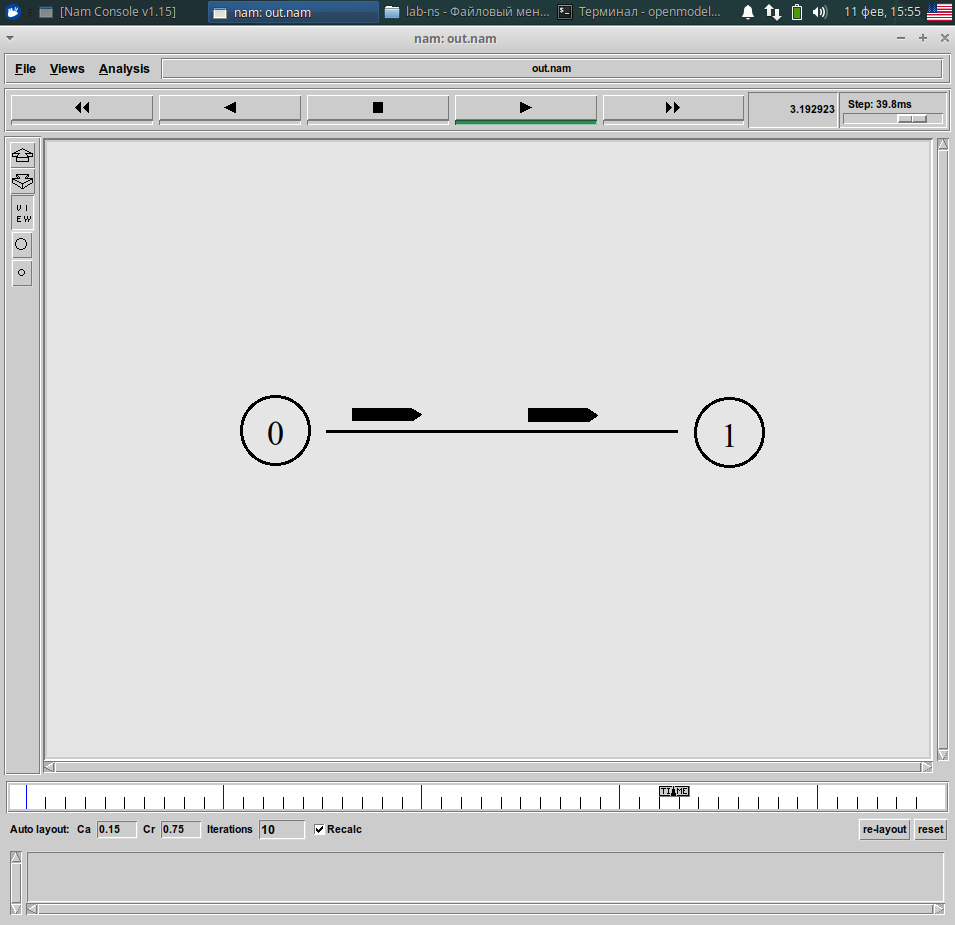
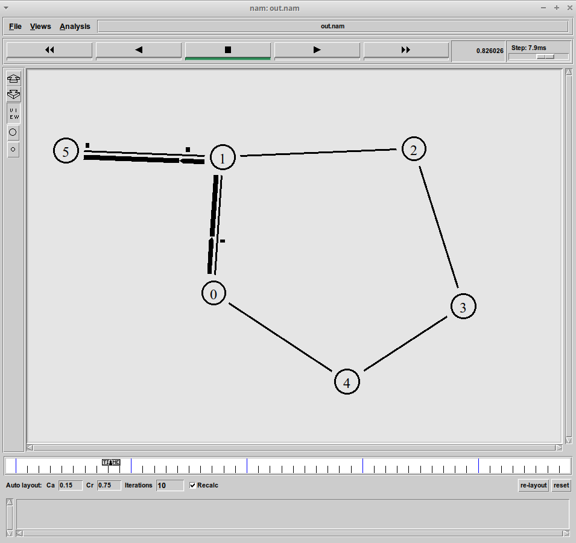
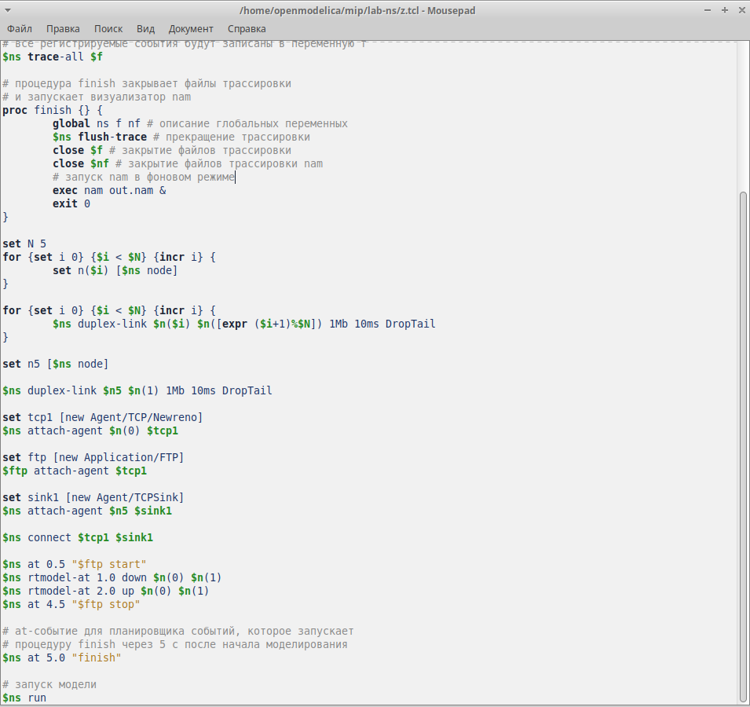

---
## Front matter
lang: ru-RU
title: Лабораторная работа № 1
subtitle: Имитационное моделирование
author:
  - Королёв И.А.
institute:
  - Российский университет дружбы народов, Москва, Россия

## i18n babel
babel-lang: russian
babel-otherlangs: english

## Formatting pdf
toc: false
toc-title: Содержание
slide_level: 2
aspectratio: 169
section-titles: true
theme: metropolis
header-includes:
 - \metroset{progressbar=frametitle,sectionpage=progressbar,numbering=fraction}
---

# Цель работы

Приобретение навыков моделирования сетей передачи данных с помощью средства имитационного моделирования NS-2, а также анализ полученных результатов
моделирования.

# Теоретическое введение

Network Simulator (NS-2) — один из программных симуляторов моделирования
процессов в компьютерных сетях. NS-2 позволяет описать топологию сети, конфигурацию источников и приёмников трафика, параметры соединений (полосу
пропускания, задержку, вероятность потерь пакетов и т.д.) и множество других
параметров моделируемой системы. Данные о динамике трафика, состоянии соединений и объектов сети, а также информация о работе протоколов фиксируются
в генерируемом trace-файле.

# Выполнение лабораторной работы

## Задание 1. Создание шаблона сценария для NS-2

## Создал директорию mip/lab-ns для выполнения лабораторной работы. 

Первый файл shablon.tcl будет содержать шаблон сценария для NS-2 

{#fig:001 width=70%}

## Написанные код шаблона сценария для NS-2 

Написанные код шаблона сценария для NS-2

{#fig:002 width=70%}

## Визуальное отображение работающей программы nam. 

В данном этапе никакого визуального отображения нет, т.к. нет прописанных протоколов передачи данных, агента для генерации и приёма трафика и at-событий. 

{#fig:003 width=70%}

## Задание 2. Простой пример описания топологии сети, состоящей из двух узлов и одного соединения

## Скопировали написанный в предыдущем задании шаблон NS-2 в файл example1.tcl. 

На основе данного шаблона будем моделировать сеть передачи данных.

{#fig:004 width=70%}

## Реализация модели. 

## Добавил 2 узла, соединил узлы дуплексным соединением с полосой пропускания  2 Мб/с и задержкой 10 мс

очередью с обслуживанием типа DropTail. Написал агента для приёма и генерации трафика. Добавил at-события.

{#fig:005 width=70%}

## Результат добавления описания топологии сети. 

Видим, что через 0.5 секунд из узла 0 данные поступают к узлу 1. Поступление остановится через 4.5 секунды. 

{#fig:006 width=70%}

## Задание 3.  Пример с усложнённой топологией сети

## Скопировали написанный в предыдущем задании шаблон NS-2 в файл example2.tcl. 

На основе данного шаблона добавил описание моделируемой сети из 4 узлов. 

{#fig:007 width=70%}

## На данных изображениях отображена визуальная работа усложнённой топологии сети. 

На рисунке 9 видим, что от узла 0 к узлу 2, от узла 1 к узлу 2 передаётся трафик, а от узла 2 передается трафик к узлу 3. Соединение 2 и 3 имеется полосу 1Мб, а от каждого узла передается по 200 пакетов. Соответственно, пакеты должны теряться. Так же, мы видим, как накапливается очередь. У нас наложены ограничения на размер очереди, поэтому она сбрасывается при её достижении.

{#fig:008 width=70%}

##

{#fig:009 width=70%}

## Задание 4.  Пример с кольцевой топологией сети

## Скопировали написанный в предыдущем задании шаблон NS-2 в файл example3.tcl. 

На основе данного шаблона добавил описание моделируемой сети из 7 узлов. 

{#fig:0010 width=70%}

## В at-событии прописано событие на разрыва соединения между узлами n(1) и n(2) на время в одну секунду. 

Во время разрыва пакеты не доходят до узла 3.

{#fig:0011 width=70%}

##

Чтобы пакеты доходили до конечного узла при разрыве, необходимо в начала программы, а после команды создания объекта Simulator добавить $ns rtproto DV 

{#fig:0012 width=70%}

## Упражнение для самостоятельной реализации. 

Все пункты упражнения выполнены. Результаты представлены в скриншотах. Передача пакетов идет по кратчайшему пути от узла 0 к узлу 5. При разрыве соединения между узлами 0 и 1, строится другой путь до узла 5. Когда разрыв прекращается, передача пакетов дальше идет по кратчайшему. 

## 

{#fig:0013 width=70%}

##

{#fig:0014 width=70%}

##

{#fig:0015 width=70%}

##

{#fig:0016 width=70%}

##

Код реализации. 

{#fig:0017 width=70%}

# Выводы

Приобрел навыки моделирования сетей передачи данных с помощью средства имитационного моделирования NS-2.

:::

