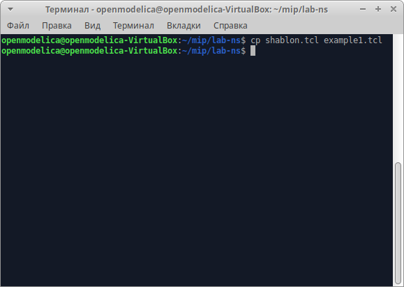
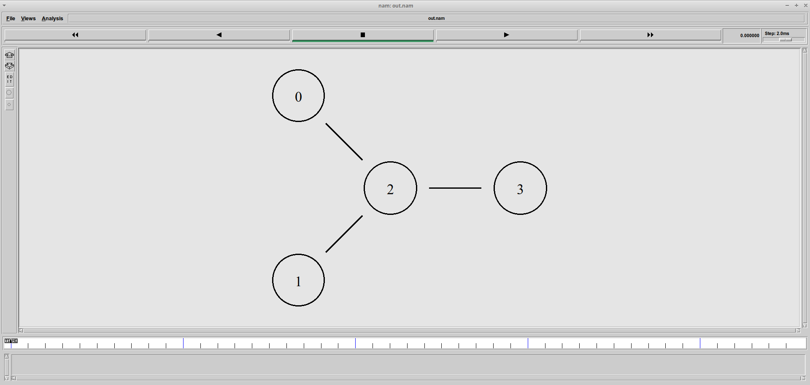
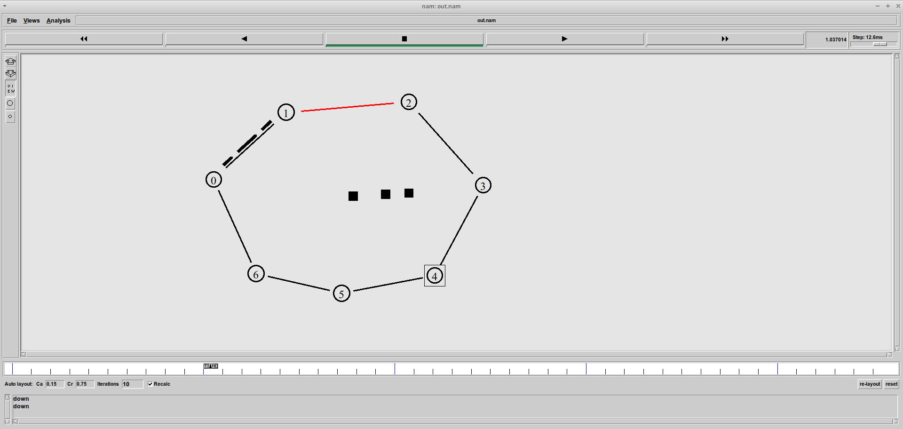
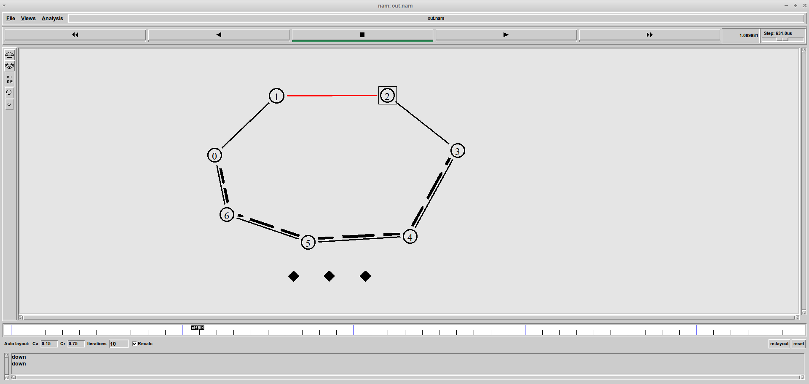
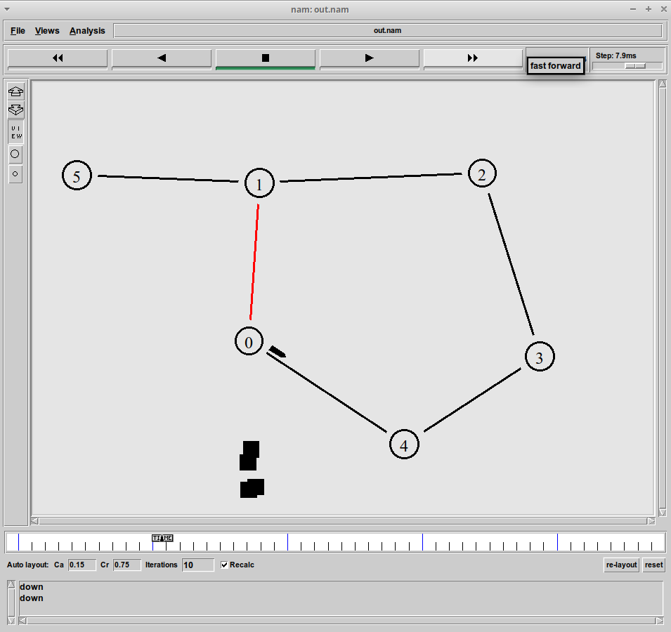
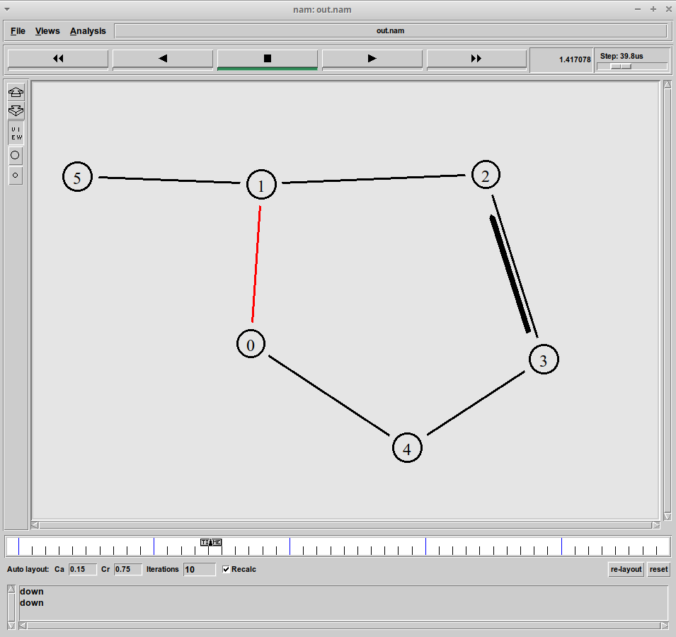

---
## Front matter
title: "Лабораторная работа № 1. Простые модели компьютерной сети"
subtitle: "Имитационное моделирование"
author: "Королёв Иван Андреевич"

## Generic otions
lang: ru-RU
toc-title: "Содержание"

## Bibliography
bibliography: bib/cite.bib
csl: pandoc/csl/gost-r-7-0-5-2008-numeric.csl

## Pdf output format
toc: true # Table of contents
toc-depth: 2
lof: true # List of figures
lot: true # List of tables
fontsize: 12pt
linestretch: 1.5
papersize: a4
documentclass: scrreprt
## I18n polyglossia
polyglossia-lang:
  name: russian
  options:
	- spelling=modern
	- babelshorthands=true
polyglossia-otherlangs:
  name: english
## I18n babel
babel-lang: russian
babel-otherlangs: english
## Fonts
mainfont: IBM Plex Serif
romanfont: IBM Plex Serif
sansfont: IBM Plex Sans
monofont: IBM Plex Mono
mathfont: STIX Two Math
mainfontoptions: Ligatures=Common,Ligatures=TeX,Scale=0.94
romanfontoptions: Ligatures=Common,Ligatures=TeX,Scale=0.94
sansfontoptions: Ligatures=Common,Ligatures=TeX,Scale=MatchLowercase,Scale=0.94
monofontoptions: Scale=MatchLowercase,Scale=0.94,FakeStretch=0.9
mathfontoptions:
## Biblatex
biblatex: true
biblio-style: "gost-numeric"
biblatexoptions:
  - parentracker=true
  - backend=biber
  - hyperref=auto
  - language=auto
  - autolang=other*
  - citestyle=gost-numeric
## Pandoc-crossref LaTeX customization
figureTitle: "Рис."
tableTitle: "Таблица"
listingTitle: "Листинг"
lofTitle: "Список иллюстраций"
lotTitle: "Список таблиц"
lolTitle: "Листинги"
## Misc options
indent: true
header-includes:
  - \usepackage{indentfirst}
  - \usepackage{float} # keep figures where there are in the text
  - \floatplacement{figure}{H} # keep figures where there are in the text
---

# Цель работы

Приобретение навыков моделирования сетей передачи данных с помощью средства имитационного моделирования NS-2, а также анализ полученных результатов
моделирования.

# Задание

## Шаблон сценария для NS-2

## Простой пример описания топологии сети, состоящей из двухузлов и одного соединения

Постановка задачи. Требуется смоделировать сеть передачи данных, состоящую
из двух узлов, соединённых дуплексной линией связи с полосой пропускания 2
Мб/с и задержкой 10 мс, очередью с обслуживанием типа DropTail. От одного узла
к другому по протоколу UDP осуществляется передача пакетов, размером 500 байт,
с постоянной скоростью 200 пакетов в секунду.

## Пример с усложнённой топологией сети

Постановка задачи. Описание моделируемой сети:
* сеть состоит из 4 узлов (n0, n1, n2, n3);
* между узлами n0 и n2, n1 и n2 установлено дуплексное соединение с пропускной
способностью 2 Мбит/с и задержкой 10 мс;
* между узлами n2 и n3 установлено дуплексное соединение с пропускной способностью 1,7 Мбит/с и задержкой 20 мс;
* каждый узел использует очередь с дисциплиной DropTail для накопления пакетов,
максимальный размер которой составляет 10;
* TCP-источник на узле n0 подключается к TCP-приёмнику на узле n3
(по-умолчанию, максимальный размер пакета, который TCP-агент может генерировать, равняется 1KByte)
* TCP-приёмник генерирует и отправляет ACK пакеты отправителю и откидывает
полученные пакеты;
* UDP-агент, который подсоединён к узлу n1, подключён к null-агенту на узле n3
(null-агент просто откидывает пакеты);
* генераторы трафика ftp и cbr прикреплены к TCP и UDP агентам соответственно;
* генератор cbr генерирует пакеты размером 1 Кбайт со скоростью 1 Мбит/с;
* работа cbr начинается в 0,1 секунду и прекращается в 4,5 секунды, а ftp начинает
работать в 1,0 секунду и прекращает в 4,0 секунды.

## Пример с кольцевой топологией сети

Постановка задачи. Требуется построить модель передачи данных по сети с кольцевой топологией и динамической маршрутизацией пакетов:
* сеть состоит из 7 узлов, соединённых в кольцо;
* данные передаются от узла n(0) к узлу n(3) по кратчайшему пути;
* с 1 по 2 секунду модельного времени происходит разрыв соединения между
узлами n(1) и n(2);
* при разрыве соединения маршрут передачи данных должен измениться на резервный.

## Упражнение Внесите следующие изменения в реализацию примера с кольцевой топологией сети:

* передача данных должна осуществляться от узла n(0) до узла n(5) по кратчайшему пути в течение 5 секунд модельного времени;
* передача данных должна идти по протоколу TCP (тип Newreno), на принимающей стороне используется TCPSink-объект типа DelAck; поверх TCP работает
протокол FTP с 0,5 до 4,5 секунд модельного времени;
* с 1 по 2 секунду модельного времени происходит разрыв соединения между
узлами n(0) и n(1);
* при разрыве соединения маршрут передачи данных должен измениться на резервный, после восстановления соединения пакеты снова должны пойти по
кратчайшему пути.

# Теоретическое введение

Network Simulator (NS-2) — один из программных симуляторов моделирования
процессов в компьютерных сетях. NS-2 позволяет описать топологию сети, конфигурацию источников и приёмников трафика, параметры соединений (полосу
пропускания, задержку, вероятность потерь пакетов и т.д.) и множество других
параметров моделируемой системы. Данные о динамике трафика, состоянии соединений и объектов сети, а также информация о работе протоколов фиксируются
в генерируемом trace-файле.

NS-2 является объектно-ориентированным программным обеспечением. Его ядро
реализовано на языке С++. В качестве интерпретатора используется язык скриптов
(сценариев) OTcl (Object oriented Tool Command Language). NS-2 полностью поддерживает иерархию классов С++ и подобную иерархию классов интерпретатора OTcl.
Обе иерархии обладают идентичной структурой, т.е. существует однозначное соответствие между классом одной иерархии и таким же классом другой. Объединение
для совместного функционирования С++ и OTcl производится при помощи TclCl
(Classes Tcl). В случае, если необходимо реализовать какую-либо специфическую
функцию, не реализованную в NS-2 на уровне ядра, для этого используется код на
С++

Процесс создания модели сети для NS-2 состоит из нескольких этапов:
1. создание нового объекта класса Simulator, в котором содержатся методы, необходимые для дальнейшего описания модели (например, методы new и delete
используются для создания и уничтожения объектов соответственно);
2. описание топологии моделируемой сети с помощью трёх основных функциональных блоков: узлов (nodes), соединений (links) и агентов (agents);
3. задание различных действий, характеризующих работу сети.

# Выполнение лабораторной работы

## Задание 1. Создание шаблона сценария для NS-2

Создал директорию mip/lab-ns для выполнения лабораторной работы. Первый файл shablon.tcl будет содержать шаблон сценария для NS-2 (рис. [-@fig:001]).

{#fig:001 width=70%}

Написанные код шаблона сценария для NS-2 (рис. [-@fig:002]).

{#fig:002 width=70%}

Визуальное отображение работающей программы nam. В данном этапе никакого визуального отображения нет, т.к. нет прописанных протоколов передачи данных, агента для генерации и приёма трафика и at-событий. (рис. [-@fig:003]).

{#fig:003 width=70%}

## Задание 2. Простой пример описания топологии сети, состоящей из двух узлов и одного соединения

Скопировали написанный в предыдущем задании шаблон NS-2 в файл example1.tcl. На основе данного шаблона будем моделировать сеть передачи данных. (рис. [-@fig:004]).

{#fig:004 width=70%}

Реализация модели. Добавил 2 узла, соединил узлы дуплексным соединением с полосой пропускания  2 Мб/с и задержкой 10 мс, очередью с обслуживанием типа DropTail. Написал агента для приёма и генерации трафика. Добавил at-события. (рис. [-@fig:005]).

{#fig:005 width=70%}

Результат добавления описания топологии сети. Видим, что через 0.5 секунд из узла 0 данные поступают к узлу 1. Поступление остановится через 4.5 секунды. (рис. [-@fig:006]).

{#fig:006 width=70%}

## Задание 3.  Пример с усложнённой топологией сети

Скопировали написанный в предыдущем задании шаблон NS-2 в файл example2.tcl. На основе данного шаблона добавил описание моделируемой сети из 4 узлов. (рис. [-@fig:007]).

{#fig:007 width=70%}

На данных изображениях отображена визуальная работа усложнённой топологии сети. На рисунке 9 видим, что от узла 0 к узлу 2, от узла 1 к узлу 2 передаётся трафик, а от узла 2 передается трафик к узлу 3. Соединение 2 и 3 имеется полосу 1Мб, а от каждого узла передается по 200 пакетов. Соответственно, пакеты должны теряться. Так же, мы видим, как накапливается очередь. У нас наложены ограничения на размер очереди, поэтому она сбрасывается при её достижении. (рис. [-@fig:008]), (рис. [-@fig:009])

{#fig:008 width=70%}

{#fig:009 width=70%}

## Задание 4.  Пример с кольцевой топологией сети

Скопировали написанный в предыдущем задании шаблон NS-2 в файл example3.tcl. На основе данного шаблона добавил описание моделируемой сети из 7 узлов. (рис. [-@fig:0010]).

{#fig:0010 width=70%}

В at-событии прописано событие на разрыва соединения между узлами n(1) и n(2) на время в одну
секунду. Во время разрыва пакеты не доходят до узла 3. (рис. [-@fig:0011])

{#fig:0011 width=70%}

Чтобы пакеты доходили до конечного узла при разрыве, необходимо в начала программы, а после команды создания объекта Simulator добавить $ns rtproto DV (рис. [-@fig:0012])

{#fig:0012 width=70%}

## Упражнение для самостоятельной реализации. 

Все пункты упражнения выполнены. Результаты представлены в скриншотах. Передача пакетов идет по кратчайшему пути от узла 0 к узлу 5. При разрыве соединения между узлами 0 и 1, строится другой путь до узла 5. Когда разрыв прекращается, передача пакетов дальше идет по кратчайшему. (рис. [-@fig:0013]), (рис. [-@fig:0014]), (рис. [-@fig:0015]), (рис. [-@fig:0016])

{#fig:0013 width=70%}

{#fig:0014 width=70%}

{#fig:0015 width=70%}

{#fig:0016 width=70%}

Код реализации. (рис. [-@fig:0017])

{#fig:0017 width=70%}

# Выводы

Приобрел навыки моделирования сетей передачи данных с помощью средства имитационного моделирования NS-2.

# Список литературы{.unnumbered}

::: {#refs}
:::
