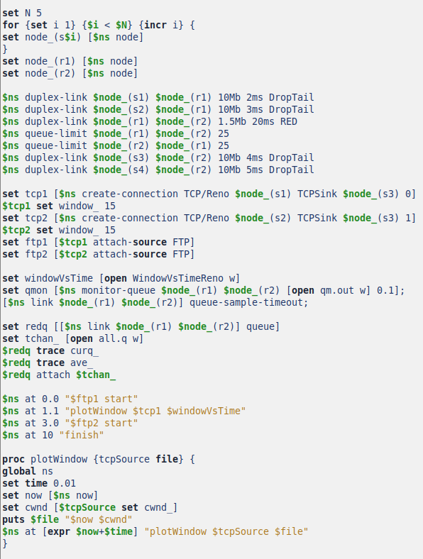
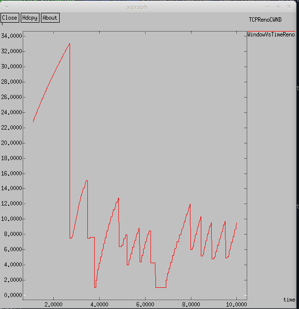
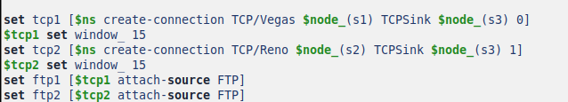
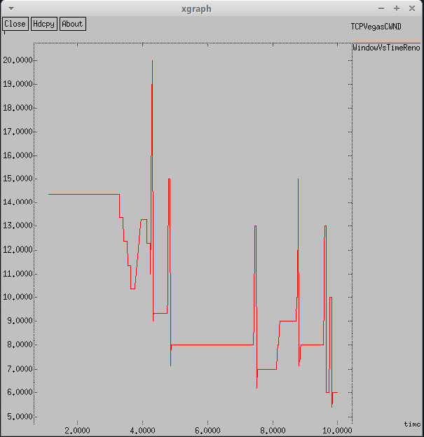
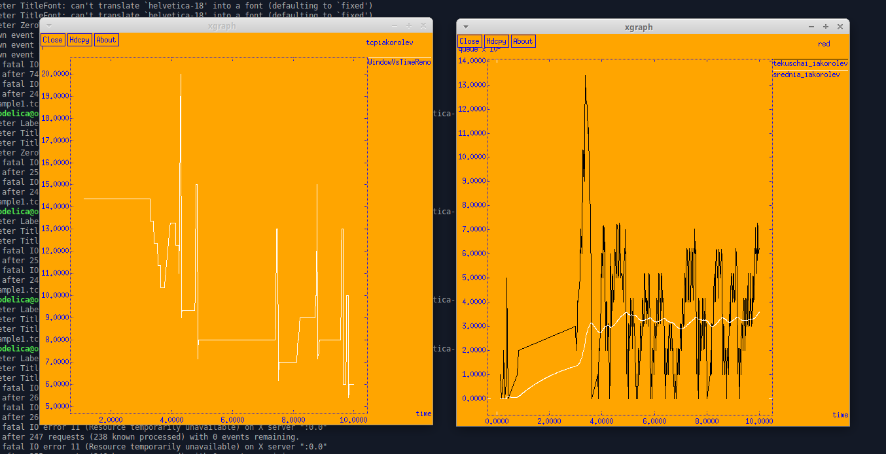
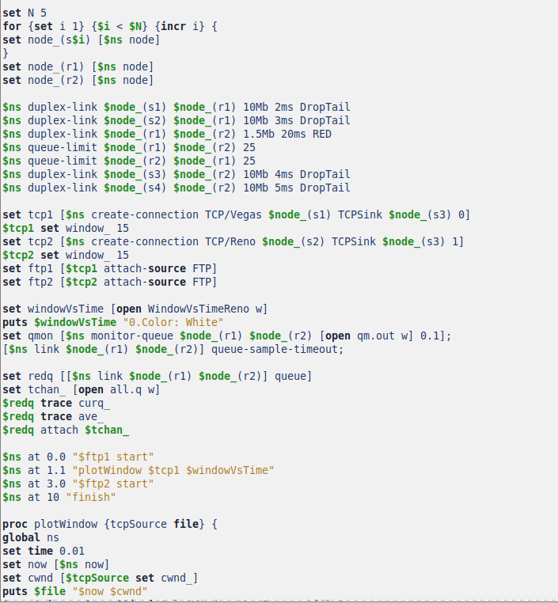

---
## Front matter
lang: ru-RU
title: Лабораторная работа № 2
subtitle: Имитационное моделирование
author:
  - Королев И.А.
institute:
  - Российский университет дружбы народов, Москва, Россия

## i18n babel
babel-lang: russian
babel-otherlangs: english

## Formatting pdf
toc: false
toc-title: Содержание
slide_level: 2
aspectratio: 169
section-titles: true
theme: metropolis
header-includes:
 - \metroset{progressbar=frametitle,sectionpage=progressbar,numbering=fraction}
---

# Цель работы

Более подробно познакомится с протоколом TCP и мониторингом очередей.

# Задание

# Пример с дисциплиной RED

* сеть состоит из 6 узлов;
* между всеми узлами установлено дуплексное соединение с различными пропускной способностью и задержкой 10 мс (см. рис. 2.4);
* узел r1 использует очередь с дисциплиной RED для накопления пакетов, максимальный размер которой составляет 25;
* TCP-источники на узлах s1 и s2 подключаются к TCP-приёмнику на узле s3;
* генераторы трафика FTP прикреплены к TCP-агентам.
На рис. 2.4 приведена схема моделируемой сети.

# Упражнение

* Измените в модели на узле s1 тип протокола TCP с Reno на NewReno, затем на
Vegas. Сравните и поясните результаты.
* Внесите изменения при отображении окон с графиками (измените цвет фона,
цвет траекторий, подписи к осям, подпись траектории в легенде).

# Теоретическое введение

# Протокол TCP

**Протокол управления передачей** (Transmission Control Protocol, **TCP**) имеет средства управления потоком и коррекции ошибок, ориентирован на установление
соединения.

#  Мониторинг очередей

Объект мониторинга очереди оповещает диспетчера очереди о поступлении пакета.
Диспетчер очереди осуществляет мониторинг очереди.

# Выполнение лабораторной работы

# Пример с дисциплиной RED

# Реализация модели

Реализация модели. Описываются узлы сети, соединения, агенты и приложения, мониторинг размера окна, мониторинг очереди, добавление at-событий и формирование файла с данными о размере окна TCP.

{#fig:001 width=32%}

# Реализация модели

Реализация модели. Добавление процедуры finish. Подключение кода AWK. Открытие файла f на запись. Выполнение кода AWK, подпись траекторий в легенде. Запуск xgraph с графиками окна TCP и очереди.

{#fig:002 width=32%}

# График изменения TCP-окна. Тип TCP-агента: Reno

В начале соединения окно перегрузки быстро растет, что характерно для фазы медленного старта. Примерно на 2 секундах происходит резкое уменьшение окна, что свидетельствует о потери пакетов. После первого спада окно перегрузки начинает увеличиваться, но с периодическими падениями, что указывает на Reno. Максимальное значение окна примерно 33, минимальное значение окна около 1. 

{#fig:003 width=32%}

# График изменения длины очереди и средней длины очереди. Тип TCP-агента: Reno

Текущий размер очереди показывает высокие колебания. Средняя очередь постепенно растет и остается на стабильном уровне, что говорит о настройке RED. Максимальное значение примерно 13.5, минимальное значение окна около 0. 

{#fig:004 width=32%}

# Упражнение.

# Изменить в модели на узле s1 тип протокола TCP с Reno на NewReno.

Изменяем тип протокола на NewReno.

{#fig:005 width=32%}

# График изменения TCP-окна. Тип TCP-агента: NewReno

В начале соединения окно перегрузки быстро растет, что характерно для фазы медленного старта. Примерно на 3 секундах происходит резкое уменьшение окна, что свидетельствует о потери пакетов. После первого спада окно перегрузки начинает увеличиваться, но с периодическими падениями, что указывает на NewReno. Максимальное значение окна примерно 33, минимальное значение окна около 4. 

{#fig:006 width=32%}

# График изменения длины очереди и средней длины очереди. Тип TCP-агента: NewReno

Текущий размер очереди показывает довольно высокие колебания, но более маленькие, чем у Reno. Средняя очередь постепенно растет и остается на стабильном уровне, что говорит о настройке RED. Максимальное значение примерно 13.5, минимальное значение окна около 0.

{#fig:007 width=32%}

# Изменить в модели на узле s1 тип протокола TCP с Reno на Vegas

Изменяем тип протокола на Vegas.

{#fig:008 width=32%}

# График изменения TCP-окна. Тип TCP-агента: Vegas

В начале соединения окно перегрузки сохраняет значение.При Vegas максимальный размер окна составляет 20, а не 34, как в NewReno. Vegas обнаруживает перегрузки сети до того, как произойдет потеря, поэтому можно сказать он не теряет пакеты. 

{#fig:009 width=32%}

# График изменения длины очереди и средней длины очереди. Тип TCP-агента: Vegas

С нуля до примерно двух секунд, происходит скачок и плавное изменение значения в текущем размере очереди. Текущий размер очереди показывает довольно высокие колебания. Средняя очередь постепенно растет и остается на стабильном уровне, что говорит о настройке RED. Максимальное значение примерно 13.5, минимальное значение окна около 5. 

{#fig:0010 width=32%}

# Сравнение Newreno и Vegas

* Newreno лучше для сетей с высокой потерей пакетов.
* Vegas эффективнее в условиях высокой задержки.

Если сеть имеет переменную задержку и много конкурирующих соединений, то лучше выбрать Newreno. Если же сеть стабильна и перегруженность предсказуема, то Vegas.

# Внесите изменения при отображении окон с графиками (измените цвет фона, цвет траекторий, подписи к осям, подпись траектории в легенде).

Сначала изменяю цвет фона и подписи к осям. После, добавляю новые подписи траекторий в легенде и цвет траекторий.

{#fig:0011 width=32%}

# Внесите изменения при отображении окон с графиками (измените цвет фона, цвет траекторий, подписи к осям, подпись траектории в легенде).

{#fig:0012 width=32%}

# Измененный код реализации модели. 

{#fig:0013 width=32%}

# Измененный код реализации модели. 

{#fig:0014 width=32%}

# Выводы

Более подробно познакомился с протоколом TCP и мониторингом очередей.

