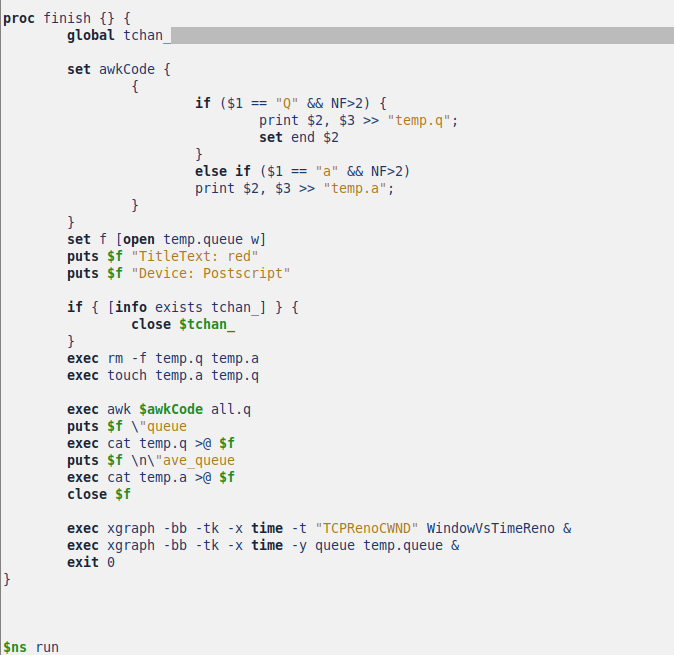
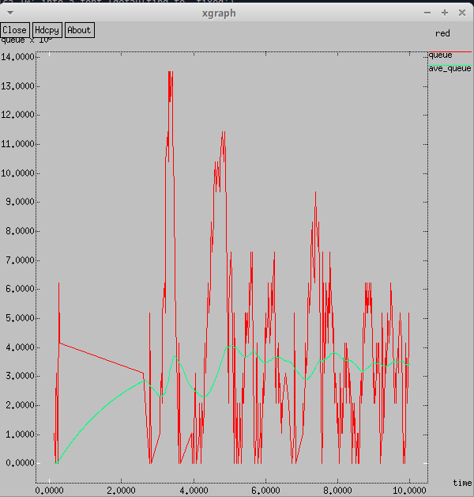
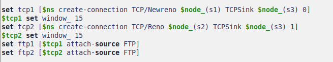
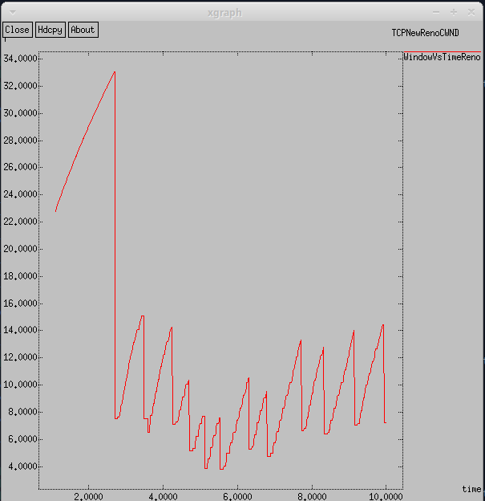

---
## Front matter
title: Лабораторная работа № 2
subtitle: Имитационное моделирование
author: Королёв Иван Андреевич

## Generic otions
lang: ru-RU
toc-title: "Содержание"

## Bibliography
bibliography: bib/cite.bib
csl: pandoc/csl/gost-r-7-0-5-2008-numeric.csl

## Pdf output format
toc: true # Table of contents
toc-depth: 2
lof: true # List of figures
lot: true # List of tables
fontsize: 12pt
linestretch: 1.5
papersize: a4
documentclass: scrreprt
## I18n polyglossia
polyglossia-lang:
  name: russian
  options:
	- spelling=modern
	- babelshorthands=true
polyglossia-otherlangs:
  name: english
## I18n babel
babel-lang: russian
babel-otherlangs: english
## Fonts
mainfont: IBM Plex Serif
romanfont: IBM Plex Serif
sansfont: IBM Plex Sans
monofont: IBM Plex Mono
mathfont: STIX Two Math
mainfontoptions: Ligatures=Common,Ligatures=TeX,Scale=0.94
romanfontoptions: Ligatures=Common,Ligatures=TeX,Scale=0.94
sansfontoptions: Ligatures=Common,Ligatures=TeX,Scale=MatchLowercase,Scale=0.94
monofontoptions: Scale=MatchLowercase,Scale=0.94,FakeStretch=0.9
mathfontoptions:
## Biblatex
biblatex: true
biblio-style: "gost-numeric"
biblatexoptions:
  - parentracker=true
  - backend=biber
  - hyperref=auto
  - language=auto
  - autolang=other*
  - citestyle=gost-numeric
## Pandoc-crossref LaTeX customization
figureTitle: "Рис."
tableTitle: "Таблица"
listingTitle: "Листинг"
lofTitle: "Список иллюстраций"
lotTitle: "Список таблиц"
lolTitle: "Листинги"
## Misc options
indent: true
header-includes:
  - \usepackage{indentfirst}
  - \usepackage{float} # keep figures where there are in the text
  - \floatplacement{figure}{H} # keep figures where there are in the text
---

# Цель работы

Более подробно познакомится с протоколом TCP и мониторингом очередей.

# Задание

# Пример с дисциплиной RED

* сеть состоит из 6 узлов;
* между всеми узлами установлено дуплексное соединение с различными пропускной способностью и задержкой 10 мс (см. рис. 2.4);
* узел r1 использует очередь с дисциплиной RED для накопления пакетов, максимальный размер которой составляет 25;
* TCP-источники на узлах s1 и s2 подключаются к TCP-приёмнику на узле s3;
* генераторы трафика FTP прикреплены к TCP-агентам.
На рис. 2.4 приведена схема моделируемой сети.

# Упражнение

* Измените в модели на узле s1 тип протокола TCP с Reno на NewReno, затем на
Vegas. Сравните и поясните результаты.
* Внесите изменения при отображении окон с графиками (измените цвет фона,
цвет траекторий, подписи к осям, подпись траектории в легенде).

# Теоретическое введение

# Протокол TCP

**Протокол управления передачей** (Transmission Control Protocol, **TCP**) имеет средства управления потоком и коррекции ошибок, ориентирован на установление
соединения.

В ns-2 поддерживает следующие TCP-агенты односторонней передачи:
* Agent/TCP
* Agent/TCP/Reno
* Agent/TCP/Newreno
* Agent/TCP/Sack1 — TCP с выборочным повтором (RFC2018)
* Agent/TCP/Vegas
* Agent/TCP/Fack — Reno TCP с «последующим подтверждением»
* Agent/TCP/Linux — TCP-передатчик с поддержкой SACK, который использует
TCP с перезагрузкой контрольных модулей из ядра Linux
Односторонние агенты приёма:
* Agent/TCPSink
* Agent/TCPSink/DelAck
* Agent/TCPSink/Sack1
* Agent/TCPSink/Sack1/DelAck
Двунаправленный агент:
* Agent/TCP/FullTcp

#  Мониторинг очередей

Объект мониторинга очереди оповещает диспетчера очереди о поступлении пакета.
Диспетчер очереди осуществляет мониторинг очереди.

Объекты очереди:
* qlim_ — максимально разрешённое число пакетов в очереди;
* limit_ — размер очереди в пакетах;
* blocked_ — принимает значение true, если очередь заблокирована;
* unblock_on_resume_ — принимает значение true, указывая, что очередь должна
быть разблокирована после отправки последнего пакета;
* bytes_ — принимает значение true, если используется режим передачи в байтах,
а не в пакетах;
* queue-in-bytes_ — принимает значение true, если используется режим измерения среднего размера очереди в байтах, а не пакетах;
* thresh_ — минимальный порог среднего размера очереди (в пакетах);
* maxthresh_ — максимальный порог среднего размера очереди (в пакетах);
* mean_pktsize_ — грубая оценка среднего размера пакета (в байтах);
* q_weight_ — вес очереди (используется при расчёте экспоненциальновзвешенного скользящего среднего размера очереди;
* wait_ — интервал времени между сброшенными пакетами.
Объекты мониторинга очереди:
* size_ — размер мгновенной длины очереди (в байтах);
* pkts_ — размер мгновенной длины очереди (в пакетах);
* parrivals_ — промежуточная сумма поступивших пакетов;
* barrivals_ — промежуточная сумма байт в поступивших пакетах
* pdepartures_ — промежуточная сумма обслуженных пакетов (не отброшенных);
* bdepartures_ — промежуточная сумма байт обслуженных пакетов (не отброшенных);
* pdrops_ — общая сумма отброшенных пакетов;
* bdrops_ — общая сумма байт отброшенных пакетов;
* bytesInt_ — заполненность очереди в байтах;
* pktsInt_ — заполненность очереди в пакетах;
* epdrops_ — число сброшенных по алгоритму RED пакетов;
* ebdrops_ — число байт в сброшенных по алгоритму RED пакетах;
* enable_in_ — устанавливается значение true, если требуется мониторинг потока
на входе;
* enable_out_ — устанавливается значение true, если требуется мониторинг потока на выходе;
* enable_drop_ — устанавливается значение true, если требуется мониторинг
сброшенных из потока пакетов;
* enable_edrop_ — устанавливается значение true, если требуется мониторинг
сброшенных из потока пакетов по алгоритму RED;
* src_ — адрес источника пакетов, принадлежащих потоку;
* dst_ — адрес получателя пакетов, принадлежащих потоку;
* flowid_ — идентификатор потока.

# Выполнение лабораторной работы

## Пример с дисциплиной RED

### Реализация модели

Реализация модели. Описываются узлы сети, соединения, агенты и приложения, мониторинг размера окна, мониторинг очереди, добавление at-событий и формирование файла с данными о размере окна TCP. (рис. [-@fig:001]).

{#fig:001 width=70%}

Реализация модели. Добавление процедуры finish. Подключение кода AWK. Открытие файла f на запись. Выполнение кода AWK, подпись траекторий в легенде. Запуск xgraph с графиками окна TCP и очереди. (рис. [-@fig:002]).

{#fig:002 width=70%}

### График изменения TCP-окна. Тип TCP-агента: Reno

В начале соединения окно перегрузки быстро растет, что характерно для фазы медленного старта. Примерно на 2 секундах происходит резкое уменьшение окна, что свидетельствует о потери пакетов. После первого спада окно перегрузки начинает увеличиваться, но с периодическими падениями, что указывает на Reno. Максимальное значение окна примерно 33, минимальное значение окна около 1.  (рис. [-@fig:003]).

{#fig:003 width=70%}

### График изменения длины очереди и средней длины очереди. Тип TCP-агента: Reno

Текущий размер очереди показывает высокие колебания. Средняя очередь постепенно растет и остается на стабильном уровне, что говорит о настройке RED. Максимальное значение примерно 13.5, минимальное значение окна около 0.  (рис. [-@fig:004]).

{#fig:004 width=70%}

## Упражнение.

### Изменить в модели на узле s1 тип протокола TCP с Reno на NewReno.

Изменяем тип протокола на NewReno.(рис. [-@fig:005]).

{#fig:005 width=70%}

### График изменения TCP-окна. Тип TCP-агента: NewReno

В начале соединения окно перегрузки быстро растет, что характерно для фазы медленного старта. Примерно на 3 секундах происходит резкое уменьшение окна, что свидетельствует о потери пакетов. После первого спада окно перегрузки начинает увеличиваться, но с периодическими падениями, что указывает на Reno. Максимальное значение окна примерно 33, минимальное значение окна около 4.  (рис. [-@fig:006]).

{#fig:006 width=70%}

### График изменения длины очереди и средней длины очереди. Тип TCP-агента: NewReno

Текущий размер очереди показывает довольно высокие колебания, но более маленькие, чем у Reno. Средняя очередь постепенно растет и остается на стабильном уровне, что говорит о настройке RED. Максимальное значение примерно 13.5, минимальное значение окна около 0.  (рис. [-@fig:007]).

{#fig:007 width=70%}

### Изменить в модели на узле s1 тип протокола TCP с Reno на Vegas

Изменяем тип протокола на Vegas.(рис. [-@fig:008]).

{#fig:008 width=70%}

### График изменения TCP-окна. Тип TCP-агента: Vegas

В начале соединения окно перегрузки сохраняет значение.При Vegas максимальный размер окна составляет 20, а не 34, как в NewReno. Vegas обнаруживает перегрузки сети до того, как произойдет потеря, поэтому можно сказать он не теряет пакеты. (рис. [-@fig:009]).

{#fig:009 width=70%}

### График изменения длины очереди и средней длины очереди. Тип TCP-агента: Vegas

С нуля до примерно двух секунд, происходит скачок и плавное изменение значения в текущем размере очереди. Текущий размер очереди показывает довольно высокие колебания. Средняя очередь постепенно растет и остается на стабильном уровне, что говорит о настройке RED. Максимальное значение примерно 13.5, минимальное значение окна около 5.  (рис. [-@fig:0010]).

{#fig:0010 width=70%}

### Сравнение Newreno и Vegas

* Newreno лучше для сетей с высокой потерей пакетов.
* Vegas эффективнее в условиях высокой задержки.

Если сеть имеет переменную задержку и много конкурирующих соединений, то лучше выбрать Newreno. Если же сеть стабильна и перегруженность предсказуема, то Vegas.

### Внесите изменения при отображении окон с графиками (измените цвет фона, цвет траекторий, подписи к осям, подпись траектории в легенде).

Сначала изменяю цвет фона и подписи к осям. После, добавляю новые подписи траекторий в легенде и цвет траекторий. (рис. [-@fig:0011]), (рис. [-@fig:0012])

{#fig:0011 width=70%}

{#fig:0012 width=70%}

Измененный код реализации модели. (рис. [-@fig:0013]), (рис. [-@fig:0014])

{#fig:0013 width=70%}

{#fig:0014 width=70%}

# Выводы

Более подробно познакомился с протоколом TCP и мониторингом очередей.

# Список литературы{.unnumbered}

::: {#refs}
:::
