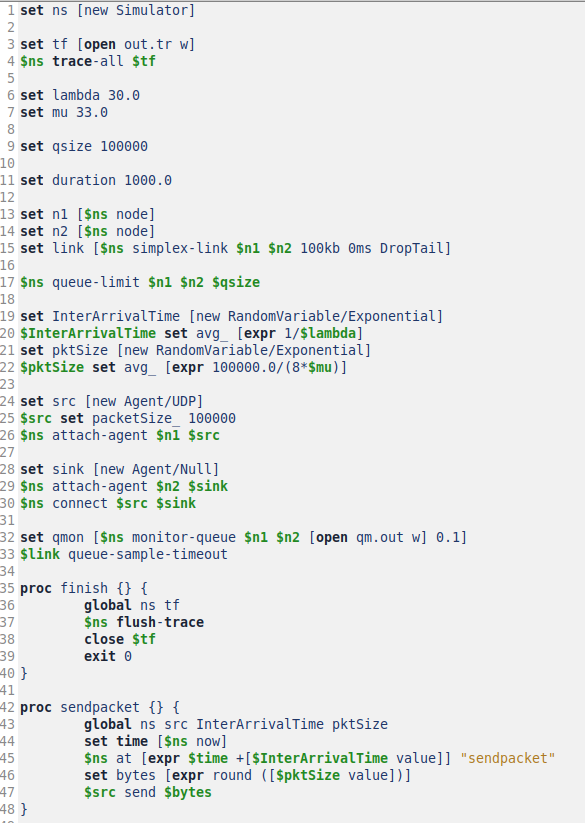
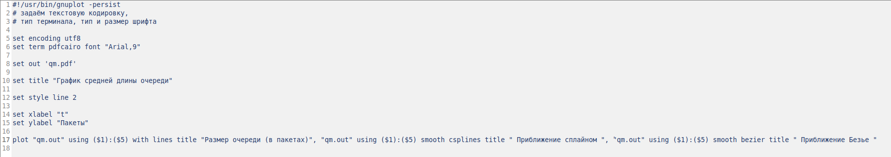
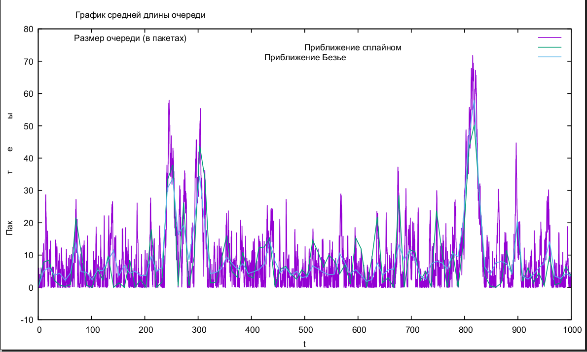

---
## Front matter
lang: ru-RU
title: Лабораторная работа № 3
subtitle: Имитационное моделирование
author:
  - Королев И.А.
institute:
  - Российский университет дружбы народов, Москва, Россия
## i18n babel
babel-lang: russian
babel-otherlangs: english

## Formatting pdf
toc: false
toc-title: Содержание
slide_level: 2
aspectratio: 169
section-titles: true
theme: metropolis
header-includes:
 - \metroset{progressbar=frametitle,sectionpage=progressbar,numbering=fraction}
---

# Информация

## Докладчик

:::::::::::::: {.columns align=center}
::: {.column width="70%"}

  * Королев Иван Андреевич
  * Студент
  * Российский университет дружбы народов

:::
::::::::::::::

# Цель работы

Необходимо освоить навык моделирования стохастических процессов и закрепить навык построения графиков в GNUplot

# Задание

# Реализация модели на NS-2

# График в GNUplot

# Теоретическое введение

# Предварительные сведения. М | М | 1

М | М | 1 - однолинейная СМО с накопителем бесконечной ёмкости. Поступающий поток заявок — пуассоновский с интенсивностью λ. Времена обслуживания заявок — независимые в совокупности случайные величины, распределённые по
экспоненциальному закону с параметром µ.

#  Предварительные сведения. М | М | n | R

М | М | n | R - — однолинейная СМО с накопителем конечной ёмкости R. Поступающий поток заявок — пуассоновский с интенсивностью λ. Времена обслуживания
заявок — независимые в совокупности случайные величины, распределённые по
экспоненциальному закону с параметром µ

# Выполнение лабораторной работы

# Реализация модели М | М | 1 на NS-2

На данном скриншоте изображена реализация модели на NS-2. Создается объект Simulator, файл для регистрации событий, задаем параметры системы, размер очереди и длительность эксперимента. Задаем узлы и соединяем их симплексным соединением, добавляем ограничение на размер очереди, указываем распределения интервалов времени поступления пакетов и размера пакетов. Добавляем мониторинг очереди, процедуру завершения трассировки и процедуру для случайного генерирования пакетов.

# Реализация модели М | М | 1 на NS-2

{#fig:001 width=70%}

# Реализация модели М | М | 1 на NS-2

Добавляем at-события рассчитываем загрузки системы и вероятности потери пакетов, запускаем модель. 

{#fig:002 width=70%}

# Результат работы модели

Модель показала, что теоретическая вероятность потери пакетов = 0.0, теоретическая средняя длина очереди = 9.09 

{#fig:003 width=70%}

# Написание кода для построения графика в GNUplot

Создал отдельный файл для построения графика. Задаем текстовую кодировку, тип терминала, тип и размер шрифта. Задаем выходной файл графика, стиль линии, подписи осей. Построения графика, используя значения 1-го и 5-го столбцов файла  qm.out.

{#fig:004 width=70%}

## График средней длины очереди

График средней длины очереди

{#fig:005 width=70%}

# Выводы

Освоил навык моделирования стохастических процессов и закрепил навык построения графиков в GNUplot

# 
