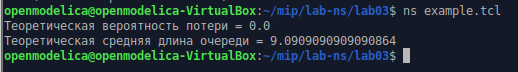

---
## Front matter
title: Лабораторная работа № 3
subtitle: Имитационное моделирование
author: "Королёв Иван"

## Generic otions
lang: ru-RU
toc-title: "Содержание"

## Bibliography
bibliography: bib/cite.bib
csl: pandoc/csl/gost-r-7-0-5-2008-numeric.csl

## Pdf output format
toc: true # Table of contents
toc-depth: 2
lof: true # List of figures
lot: true # List of tables
fontsize: 12pt
linestretch: 1.5
papersize: a4
documentclass: scrreprt
## I18n polyglossia
polyglossia-lang:
  name: russian
  options:
	- spelling=modern
	- babelshorthands=true
polyglossia-otherlangs:
  name: english
## I18n babel
babel-lang: russian
babel-otherlangs: english
## Fonts
mainfont: IBM Plex Serif
romanfont: IBM Plex Serif
sansfont: IBM Plex Sans
monofont: IBM Plex Mono
mathfont: STIX Two Math
mainfontoptions: Ligatures=Common,Ligatures=TeX,Scale=0.94
romanfontoptions: Ligatures=Common,Ligatures=TeX,Scale=0.94
sansfontoptions: Ligatures=Common,Ligatures=TeX,Scale=MatchLowercase,Scale=0.94
monofontoptions: Scale=MatchLowercase,Scale=0.94,FakeStretch=0.9
mathfontoptions:
## Biblatex
biblatex: true
biblio-style: "gost-numeric"
biblatexoptions:
  - parentracker=true
  - backend=biber
  - hyperref=auto
  - language=auto
  - autolang=other*
  - citestyle=gost-numeric
## Pandoc-crossref LaTeX customization
figureTitle: "Рис."
tableTitle: "Таблица"
listingTitle: "Листинг"
lofTitle: "Список иллюстраций"
lotTitle: "Список таблиц"
lolTitle: "Листинги"
## Misc options
indent: true
header-includes:
  - \usepackage{indentfirst}
  - \usepackage{float} # keep figures where there are in the text
  - \floatplacement{figure}{H} # keep figures where there are in the text
---

# Цель работы

Необходимо освоить навык моделирования стохастических процессов и закрепить навык построения графиков в GNUplot

# Задание

## Реализация модели на NS-2

## График в GNUplot

# Теоретическое введение

##  Предварительные сведения. М | М | 1

М | М | 1 - однолинейная СМО с накопителем бесконечной ёмкости. Поступающий поток заявок — пуассоновский с интенсивностью λ. Времена обслуживания заявок — независимые в совокупности случайные величины, распределённые по
экспоненциальному закону с параметром µ.

##  Предварительные сведения. М | М | n | R

М | М | n | R - — однолинейная СМО с накопителем конечной ёмкости R. Поступающий поток заявок — пуассоновский с интенсивностью λ. Времена обслуживания
заявок — независимые в совокупности случайные величины, распределённые по
экспоненциальному закону с параметром µ

# Выполнение лабораторной работы

## Реализация модели М | М | 1 на NS-2

На данном скриншоте изображена реализация модели на NS-2. Создается объект Simulator, файл для регистрации событий, задаем параметры системы, размер очереди и длительность эксперимента. Задаем узлы и соединяем их симплексным соединением, налаживаем ограничение на размер очереди, указываем распределения интервалов времени поступления пакетов и размера пакетов. Добавляем мониторинг очереди, процедуру завершения трассировки и процедуру для случайного генерирования пакетов. (рис. [-@fig:001]).

{#fig:001 width=70%}

Добавляем at-события рассчитываем загрузки системы и вероятности потери пакетов, запускаем модель. (рис. [-@fig:002]).

{#fig:002 width=70%}

## Результат работы модели

Модель показала, что теоретическая вероятность потери пакетов = 0.0, теоретическая средняя длина очереди = 9.09 (рис. [-@fig:003]).

{#fig:003 width=70%}

## Написание кода для построения графика в GNUplot

Создал отдельный файл для построения графика. Задаем текстовую кодировку, тип терминала, тип и размер шрифта. Задаем выходной файл графика, стиль линии, подписи осей. Построения графика, используя значения 1-го и 5-го столбцов файла  qm.out. (рис. [-@fig:004])

{#fig:004 width=70%}

## График средней длины очереди

График средней длины очереди (рис. [-@fig:005])

{#fig:005 width=70%}

# Выводы

Освоил навык моделирования стохастических процессов и закрепил навык построения графиков в GNUplot

# Список литературы{.unnumbered}

::: {#refs}
:::
