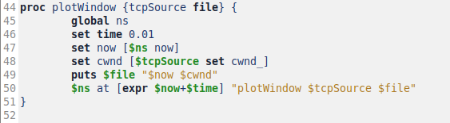
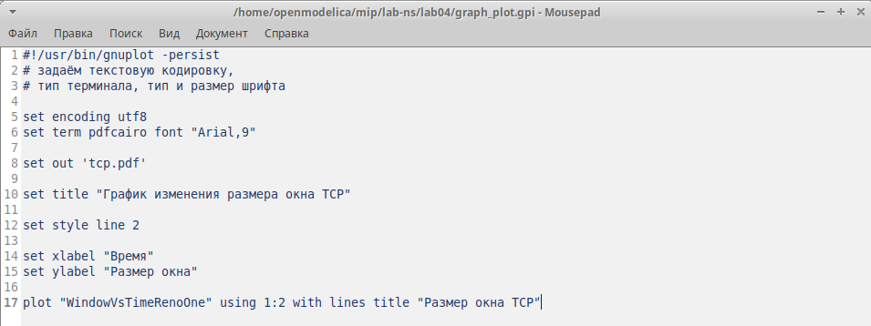
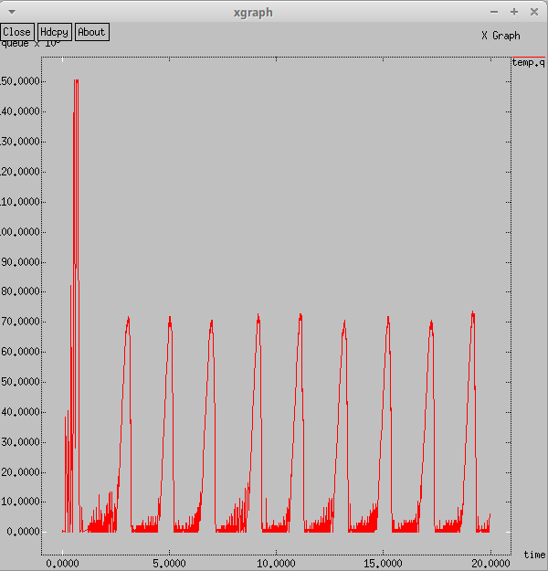

---
## Front matter
title: "Лабораторная работа № 4"
subtitle: "Имитационное моделирование"
author: "Королёв Иван Андреевич"

## Generic otions
lang: ru-RU
toc-title: "Содержание"

## Bibliography
bibliography: bib/cite.bib
csl: pandoc/csl/gost-r-7-0-5-2008-numeric.csl

## Pdf output format
toc: true # Table of contents
toc-depth: 2
lof: true # List of figures
lot: true # List of tables
fontsize: 12pt
linestretch: 1.5
papersize: a4
documentclass: scrreprt
## I18n polyglossia
polyglossia-lang:
  name: russian
  options:
	- spelling=modern
	- babelshorthands=true
polyglossia-otherlangs:
  name: english
## I18n babel
babel-lang: russian
babel-otherlangs: english
## Fonts
mainfont: IBM Plex Serif
romanfont: IBM Plex Serif
sansfont: IBM Plex Sans
monofont: IBM Plex Mono
mathfont: STIX Two Math
mainfontoptions: Ligatures=Common,Ligatures=TeX,Scale=0.94
romanfontoptions: Ligatures=Common,Ligatures=TeX,Scale=0.94
sansfontoptions: Ligatures=Common,Ligatures=TeX,Scale=MatchLowercase,Scale=0.94
monofontoptions: Scale=MatchLowercase,Scale=0.94,FakeStretch=0.9
mathfontoptions:
## Biblatex
biblatex: true
biblio-style: "gost-numeric"
biblatexoptions:
  - parentracker=true
  - backend=biber
  - hyperref=auto
  - language=auto
  - autolang=other*
  - citestyle=gost-numeric
## Pandoc-crossref LaTeX customization
figureTitle: "Рис."
tableTitle: "Таблица"
listingTitle: "Листинг"
lofTitle: "Список иллюстраций"
lotTitle: "Список таблиц"
lolTitle: "Листинги"
## Misc options
indent: true
header-includes:
  - \usepackage{indentfirst}
  - \usepackage{float} # keep figures where there are in the text
  - \floatplacement{figure}{H} # keep figures where there are in the text
---

# Цель работы

Закрепить и продемонстрировать навыки самостоятельной разработки имитационной модели в пакете NS-2 и построении графиков.

# Задание

1. По приведенной схеме разработать имитационную модель в пакете NS-2.
**Схема:**
- сеть состоит из N TCP-источников, N TCP-приёмников, двух маршрутизаторов
R1 и R2 между источниками и приёмниками (N — не менее 20);
- между TCP-источниками и первым маршрутизатором установлены дуплексные
соединения с пропускной способностью 100 Мбит/с и задержкой 20 мс очередью
типа DropTail;
- между TCP-приёмниками и вторым маршрутизатором установлены дуплексные
соединения с пропускной способностью 100 Мбит/с и задержкой 20 мс очередью
типа DropTail;
- между маршрутизаторами установлено симплексное соединение (R1–R2) с пропускной способностью 20 Мбит/с и задержкой 15 мс очередью типа RED,
размером буфера 300 пакетов; в обратную сторону — симплексное соединение (R2–R1) с пропускной способностью 15 Мбит/с и задержкой 20 мс очередью
типа DropTail;
- данные передаются по протоколу FTP поверх TCPReno;
- параметры алгоритма RED: qmin = 75, qmax = 150, qw = 0, 002, pmax = 0.1;
- максимальный размер TCP-окна 32; размер передаваемого пакета 500 байт; время
моделирования — не менее 20 единиц модельного времени.

2. Построить график изменения размера окна TCP (в Xgraph и в GNUPlot);

3. Построить график изменения длины очереди и средней длины очереди на первом
маршрутизаторе.

# Теоретическое введение

Network Simulator (NS-2) — один из программных симуляторов моделирования
процессов в компьютерных сетях. NS-2 позволяет описать топологию сети, конфигурацию источников и приёмников трафика, параметры соединений (полосу
пропускания, задержку, вероятность потерь пакетов и т.д.) и множество других
параметров моделируемой системы. Данные о динамике трафика, состоянии соединений и объектов сети, а также информация о работе протоколов фиксируются
в генерируемом trace-файле.
NS-2 является объектно-ориентированным программным обеспечением. Его ядро
реализовано на языке С++. В качестве интерпретатора используется язык скриптов
(сценариев) OTcl (Object oriented Tool Command Language). NS-2 полностью поддерживает иерархию классов С++ и подобную иерархию классов интерпретатора OTcl.
Обе иерархии обладают идентичной структурой, т.е. существует однозначное соответствие между классом одной иерархии и таким же классом другой. Объединение
для совместного функционирования С++ и OTcl производится при помощи TclCl
(Classes Tcl). В случае, если необходимо реализовать какую-либо специфическую
функцию, не реализованную в NS-2 на уровне ядра, для этого используется код на
С++.

# Выполнение лабораторной работы

## Разработка имитационной модели по схеме

Cоздание объекта типа Simulator. Затем создаём переменную nf и указываем, что требуется открыть на запись nam-файл для регистрации выходных результатов моделирования.Далее создаём переменную f и открываем на запись файл трассировки для регистрации всех событий модели. Установка максимального размера окна и размера передаваемого пакета. Создание двух маршрутизаторов и установка между маршрутизаторами симплексного соединения. (рис. [-@fig:001]).

{#fig:001 width=70%}

Создание и соединение узлов. (рис. [-@fig:002]).

{#fig:002 width=70%}

Мониторинг размера окна TCP и очереди (рис. [-@fig:003]).

{#fig:003 width=70%}

Формирование файла с данными о размере окна TCP (рис. [-@fig:004]).

{#fig:004 width=70%}

Процедура finish, которая завершает симуляцию и запускает анализ результатов (рис. [-@fig:005]).

{#fig:005 width=70%}

Добавление at-событий и запуск модели. (рис. [-@fig:006]).

{#fig:006 width=70%}

## Полный код реализованной модели

```

# Создание объекта симулятора
set ns [new Simulator]

# Открытие файла out.nam для записи данных визуализации NAM
set nf [open out.nam w]

# Настройка записи трассировочных данных для визуализатора NAM в файл out.nam
$ns namtrace-all $nf

# Открытие файла out.tr для записи событий симуляции
set f [open out.tr w]

# Настройка записи всех событий симуляции в файл out.tr
$ns trace-all $f

# Установка параметров TCP-агента: размер окна TCP равен 32
Agent/TCP set window_ 32

# Установка размера пакетов TCP на 500 байт
Agent/TCP set pktSize_ 500

# Определение процедуры finish, которая завершает симуляцию и запускает анализ результатов
proc finish {} {
    global tchan_

    # Код на AWK для обработки выходных данных
    set awkCode {
        {
            if ($1 == "Q" && NF>2) {
                print $2, $3 >> "temp.q";
                set end $2
            }
            else if ($1 == "a" && NF>2)
                print $2, $3 >> "temp.a";
        }
    }

    # Удаление временных файлов, если они существуют
    exec rm -f temp.q temp.a

    # Создание пустых файлов temp.q и temp.a
    exec touch temp.a temp.q

    # Добавление заголовка цвета для файла temp.q
    set f [open temp.q w]
    puts $f "0.Color: Purple"
    close $f

    # Добавление заголовка цвета для файла temp.a
    set f [open temp.a w]
    puts $f "0.Color: Purple"
    close $f

    # Запуск обработки файлов через AWK
    exec awk $awkCode all.q

    # Запуск графиков xgraph для визуализации окна TCP и очереди
    exec xgraph -fg pink -bg purple -bb -tk -x time -t "TCPRenoCWND" WindowVsTimeRenoOne
    exec xgraph -fg pink -bg purple -bb -tk -x time -t "TCPRenoCWND" WindowVsTimeRenoAll
    exec xgraph -bb -tk -x time -y queue temp.q &
    exec xgraph -bb -tk -x time -y queue temp.a &

    # Запуск NAM для визуализации симуляции
    exec nam out.nam &

    # Завершение работы симулятора
    exit 0
}

# Определение процедуры plotWindow для мониторинга размера окна TCP
proc plotWindow {tcpSource file} {
    global ns
    set time 0.01

    # Получение текущего времени симуляции
    set now [$ns now]

    # Получение текущего размера окна TCP
    set cwnd [$tcpSource set cwnd_]

    # Запись значения окна TCP в файл
    puts $file "$now $cwnd"

    # Запланировать повторное выполнение через 0.01 секунды
    $ns at [expr $now+$time] "plotWindow $tcpSource $file"
}

# Создание двух узлов маршрутизаторов
set r1 [$ns node]
set r2 [$ns node]

# Создание симплексных каналов с различными параметрами
$ns simplex-link $r1 $r2 20Mb 15ms RED  # Пропускная способность 20 Мбит/с, задержка 15 мс, очередь RED
$ns simplex-link $r2 $r1 15Mb 20ms DropTail  # Пропускная способность 15 Мбит/с, задержка 20 мс, очередь DropTail

# Ограничение размера очереди между r1 и r2 до 300 пакетов
$ns queue-limit $r1 $r2 300

# Количество создаваемых узлов
set N 30

# Цикл создания 30 TCP-соединений
for {set i 0} {$i < $N} {incr i} {
    # Создание узлов отправителя и получателя
    set n1($i) [$ns node]
    set n2($i) [$ns node]

    # Создание дуплексных каналов с параметрами
    $ns duplex-link $n1($i) $r1 100Mb 20ms DropTail
    $ns duplex-link $n2($i) $r2 100Mb 20ms DropTail

    # Создание TCP-соединения между узлами
    set tcp($i) [$ns create-connection TCP/Reno $n1($i) TCPSink $n2($i) $i]

    # Привязка TCP-источника к FTP-приложению
    set ftp($i) [$tcp($i) attach-source FTP]
}

# Открытие файлов для записи данных о размере окна TCP
set windowVsTimeOne [open WindowVsTimeRenoOne w]
puts $windowVsTimeOne "0.Color: White"
set windowVsTimeAll [open WindowVsTimeRenoAll w]
puts $windowVsTimeAll "0.Color: White"

# Мониторинг очереди между r1 и r2 с интервалом 0.1 секунды
set qmon [$ns monitor-queue $r1 $r2 [open qm.out w] 0.1];

# Запуск таймера выборки для очереди
[$ns link $r1 $r2] queue-sample-timeout;

# Получение ссылки на очередь RED и настройка параметров RED-буфера
set redq [[$ns link $r1 $r2] queue]
$redq set thresh_ 75       # Минимальный порог очереди
$redq set maxthresh_ 150   # Максимальный порог очереди
$redq set q_weight_ 0.002  # Вес очереди
$redq set linterm_ 10      # Линейный интервал

# Открытие файла для записи данных об очереди
set tchan_ [open all.q w]

# Настройка трассировки параметров очереди RED
$redq trace curq_  # Текущий размер очереди
$redq trace ave_   # Средний размер очереди

# Привязка файла к RED-очереди
$redq attach $tchan_

# Запуск всех TCP-источников и мониторинг окон TCP
for {set i 0} {$i < $N} {incr i} {
    $ns at 0.0 "$ftp($i) start"  # Запуск передачи FTP
    $ns at 0.0 "plotWindow $tcp($i) $windowVsTimeAll"  # Мониторинг окна TCP
}

# Мониторинг окна TCP для конкретного TCP-соединения
$ns at 0.0 "plotWindow $tcp(1) $windowVsTimeOne"

# Планирование завершения симуляции через 20 секунд
$ns at 20.0 "finish"

# Запуск симуляции
$ns run

```

## График изменения размера окна TCP (в Xgraph и в GNUPlot)

График изменения размера окна TCP на линке 1-го источника в Xgraph. Текущий размер очереди показывает высокие колебания. Максимальное знание размера окна TCP равнятся 32, минимальное значение примерно 1. (рис. [-@fig:007]).

{#fig:007 width=70%}

График изменения размера окна TCP P на всех источниках при N=20 в Xgraph. Текущий размер очереди показывает высокие колебания. Максимальное знание размера окна TCP равнятся чуть больше 32, минимальное значение примерно 1. (рис. [-@fig:008]).

{#fig:008 width=70%}

График изменения размера окна TCP в GNUPlot. Текущий размер очереди показывает высокие колебания. Максимальное знание размера окна TCP равнятся 32, минимальное значение примерно 1. И описание кода (рис. [-@fig:009]), (рис. [-@fig:0010])

{#fig:009 width=70%}

{#fig:0010 width=70%}

## Построить график изменения длины очереди и средней длины очереди на первом маршрутизаторе.

Изменение размера длины очереди на линке (R1–R2) при N=20, qmin = 75, qmax = 150. Максимальное значение около 150, минимальное значение ноль. (рис. [-@fig:0011])

{#fig:0011 width=70%}

Изменение размера средней длины очереди на линке (R1–R2) при N=20, qmin = 75, qmax = 150 Максимальное значение около 110, минимальное значение ноль. (рис. [-@fig:0012])

{#fig:0012 width=70%}

## Демонстрация работы модели

Передача пакетов из узлов к маршрутизатору ноль. От маршрутизатора ноль пакеты идут к маршрутизатору 1 и распределяются от него по узлам, соединенным с ним. (рис. [-@fig:0013]).

{#fig:0013 width=70%}

При переполнении очереди происходит сброс (рис. [-@fig:0014]).

{#fig:0014 width=70%}

# Выводы

Закрепл и продемонстрировал навыки самостоятельной разработки имитационной модели в пакете NS-2 и построил графики.

# Список литературы{.unnumbered}

::: {#refs}
:::
