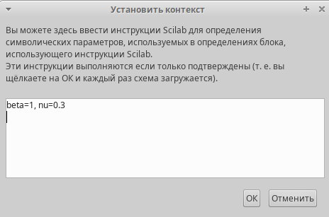
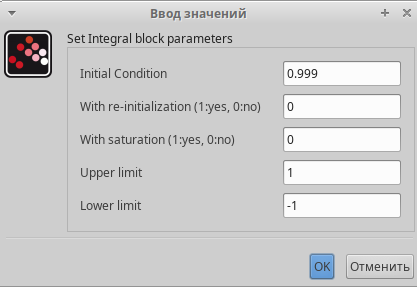
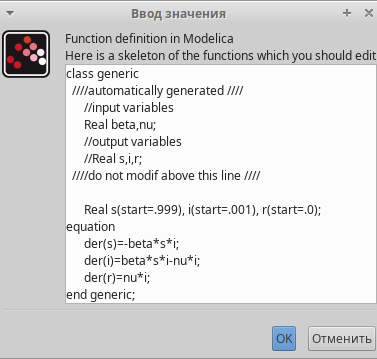
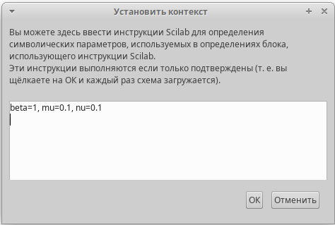
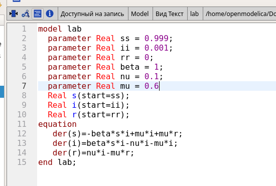
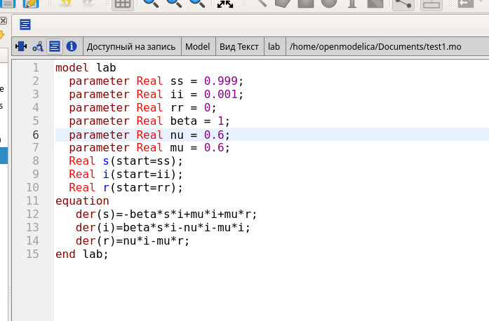
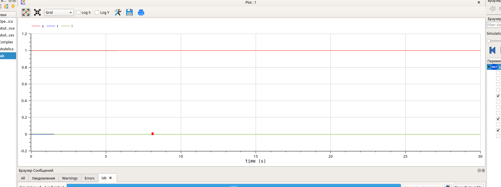

---
## Front matter
lang: ru-RU
title: Лабораторная работа № 5
subtitle: Имитационное моделирование
author:
  - Королев И.А.
institute:
  - Российский университет дружбы народов, Москва, Россия
  
## i18n babel
babel-lang: russian
babel-otherlangs: english

## Formatting pdf
toc: false
toc-title: Содержание
slide_level: 2
aspectratio: 169
section-titles: true
theme: metropolis
header-includes:
 - \metroset{progressbar=frametitle,sectionpage=progressbar,numbering=fraction}
---

# Информация

## Докладчик

:::::::::::::: {.columns align=center}
::: {.column width="70%"}

  * Королев Иван Андреевич
  * Студент, НФИбд-01-22
  * Российский университет дружбы народов

:::
::::::::::::::

# Цель работы

Построение модели эпидемии (SIR) в xcos, с помощью блока Modelica и в OpenModelica.

# Задание

1. Необходимо реализовать модель эпидемии в xcos

2. Необходимо реализовать модель эпидемии с помощью блока Modelica в xcos

3. Выполнить упражнение построения модели эпидемии в OpenModelica

4. Задание для самостоятельного выполнения. Требуется:

*  реализовать модель SIR с учётом процесса рождения / гибели особей в xcos (в том числе и с использованием блока Modelica), а также в OpenModelica;
* построить графики эпидемического порога при различных значениях параметров модели (в частности изменяя параметр µ);
* сделать анализ полученных графиков в зависимости от выбранных значений параметров модели.

# Теоретическое введение

Модель SIR предложена в 1927 г. (W. O. Kermack, A. G. McKendrick). С описанием модели можно ознакомиться, например в [1].
Предполагается, что особи популяции размера N могут находиться в трёх различных состояниях:
* S (susceptible, уязвимые) — здоровые особи, которые находятся в группе риска и могут подхватить инфекцию;
* I (infective, заражённые, распространяющие заболевание) — заразившиеся переносчики болезни;
* R (recovered/removed, вылечившиеся) — те, кто выздоровел и перестал распространять болезнь (в эту категорию относят, например, приобретших иммунитет или умерших). Внутри каждой из выделенных групп особи считаются неразличимыми по свойствам.

# Выполнение лабораторной работы

# Реализация модели эпидемии в xcos

Зафиксируем начальные данные: **β = 1, ν = 0, 3, s(0) = 0, 999, i(0) = 0, 001, r(0) = 0**.

# Реализация модели эпидемии в xcos

В меню моделирования устанавливаем переменные окружения

{#fig:001 width=45%}

# Реализация модели эпидемии в xcos

Для реализации модели потребуется:
* CLOCK_c — запуск часов модельного времени;
* CSCOPE — регистрирующее устройство для построения графика;
* TEXT_f — задаёт текст примечаний;
* MUX — мультиплексер, позволяющий в данном случае вывести на графике сразу несколько кривых;
* INTEGRAL_m — блок интегрирования
* GAINBLK_f — в данном случае позволяет задать значения коэффициентов β и ν;
* SUMMATION — блок суммирования;
* PROD_f — поэлементное произведение двух векторов на входе блока.

# Реализация модели эпидемии в xcos

Добавляем эти блоки из палитры инструментов и строим с их помощью данную систему дифференциальных уравнений:

$$
\begin{cases}
  \dot s = - \beta s(t)i(t); \\
  \dot i = \beta s(t)i(t) - \nu i(t);\\
  \dot r = \nu i(t),
\end{cases}
$$

где $\beta$ -- скорость заражения, $\nu$ -- скорость выздоровления.

# Реализация модели эпидемии в xcos

Реализованная модель эпидемии. Выходы трёх блоков интегрирования соединяем с мультиплексором

{#fig:002 width=45%}

# Реализация модели эпидемии в xcos

В параметрах верхнего блока интегрирования задаем значения s(0) = 0, 999, который отвечает за здоровых особей.

{#fig:003 width=45%}

# Реализация модели эпидемии в xcos

В параметрах среднего блока интегрирования задаем значения i(0) = 0, 001, который отвечает за переносчиков болезни.

{#fig:004 width=45%}

# Реализация модели эпидемии в xcos

В нижнем блоке интегрирования начальные значения по умолчанию заданы нулю, как в нашем условии. Данная часть отвечает за тех, кто имеет иммунитет.

# Реализация модели эпидемии в xcos

Далее, устанавливаем конечное время интегрирования. Оно равно 30 

{#fig:005 width=45%}

# Реализация модели эпидемии в xcos

Результат моделирования представлен, где черной линией обозначен график s(t) (динамика численности уязвимых к болезни особей), красная линия r(t) — динамику численности выздоровевших особей, наконец, зеленая линия i(t) — динамику численности заражённых особей. Пересечение трёх линий определяет порог эпидемии.

{#fig:006 width=45%}

# Реализация модели с помощью блока Modelica в xcos

{#fig:007 width=45%}

# Реализация модели с помощью блока Modelica в xcos

Указываем параметры для блока реализации. Переменные на входе (“beta”, “nu”) и выходе (“s”, “i”, “r”) блока заданы как внешние (“E”). 

{#fig:008 width=45%}

# Задаем переменные beta, nu. Указываем начальные значения для s, i, r и пишем систему уравнения.

{#fig:009 width=45%}\

# Реализация модели с помощью блока Modelica в xcos

Результат работы модели. Он идентичен с реализацией в xcos.

{#fig:0010 width=45%}

# Выполнение упражнени построения модели эпидемии в OpenModelica

Задаем все начальные параметры с помощью parameter Real, как было в реализациях xcos. Записываем систему уравнения, реализация очень сильно схожа с реализацией с помощью блока Modelica в xcos

{#fig:0011 width=45%}

# Выполнение упражнени построения модели эпидемии в OpenModelica

Результат модели. Результат идентичен с построением с помощью других способов, значит все выполнено правильно.

{#fig:0012 width=45%}

# Задание для самостоятельного выполнения. Реализация с помощью xcos

Необходимо реализовать такую же модель эпидемии, только с учётом процесса рождения / гибели особей в xcos (в том числе и с использованием блока Modelica), а также в OpenModelica.

# Задание для самостоятельного выполнения. Реализация с помощью xcos

Так выглядит система уравнения:

$$
\begin{cases}
  \dot s = - \beta s(t)i(t) + \mu (N - s(t)); \\
  \dot i = \beta s(t)i(t) - \nu i(t) - \mu i(t);\\
  \dot r = \nu i(t) - \mu r(t),
\end{cases}
$$

где $\mu$ — константа, которая равна коэффициенту смертности и рождаемости.

# Задание для самостоятельного выполнения. Реализация с помощью xcos

Реализуем эту модель в *xcos*. Тут нам понадобятся три блока суммирования и 4 блока констант (добавляется константа $\nu$).

# В меню моделирования устанавливаем переменные окружения. 

{#fig:0013 width=45%}

# Задание для самостоятельного выполнения. Реализация с помощью xcos

{#fig:0014 width=45%}

# Задание для самостоятельного выполнения. Реализация с помощью xcos

{#fig:0015 width=45%}

# Задание для самостоятельного выполнения. Реализация с помощью блока Modelica в xcos

{#fig:0016 width=45%}

# Задание для самостоятельного выполнения. Реализация с помощью блока Modelica в xcos

Переменные на входе (“beta”, “nu”, "mu") и выходе (“s”, “i”, “r”) блока заданы как внешние (“E”).

{#fig:0017 width=45%}

# Задание для самостоятельного выполнения. Реализация с помощью блока Modelica в xcos

Задаем переменные beta, nu, mu. Указываем начальные значения для s, i, r и пишем систему уравнения.

{#fig:0018 width=45%}

# Задание для самостоятельного выполнения. Реализация с помощью блока Modelica в xcos

{#fig:0019 width=45%}

# Задание для самостоятельного выполнения. Реализация в OpenModelica

{#fig:0020 width=45%}

# Задание для самостоятельного выполнения. Реализация в OpenModelica

Результат модели. Результат идентичен с построением с помощью других способов, значит все выполнено правильно.

{#fig:0021 width=45%}

# Результаты на различных параметрах. 

При mu=0.6, nu=0.1, beta=1 

{#fig:0022 width=45%}

# Результаты на различных параметрах. 

{#fig:0023 width=45%}

# Результаты на различных параметрах. 

При mu=0.6, nu=0.6, beta=1

{#fig:0024 width=45%}

# Результаты на различных параметрах. 

{#fig:0025 width=45%}

# Результаты на различных параметрах. 

Исходя из анализа графиков, можно сделать вывод, что чем выше значение любого из параметров, тем быстрее система достигает стационарного состояния. При высоком коэффициенте заражения 𝛽 система быстро проходит через пик развития эпидемии и достигает стационарного состояния.

# Выводы

Построил модели эпидемии (SIR) в xcos, с помощью блока Modelica и в OpenModelica. 

# Список литературы{.unnumbered}

::: {#refs}
:::
