---
## Front matter
title: "Лабораторная работа № 5"
subtitle: "Имитационное моделирование"
author: "Королёв Иван"

## Generic otions
lang: ru-RU
toc-title: "Содержание"

## Bibliography
bibliography: bib/cite.bib
csl: pandoc/csl/gost-r-7-0-5-2008-numeric.csl

## Pdf output format
toc: true # Table of contents
toc-depth: 2
lof: true # List of figures
lot: true # List of tables
fontsize: 12pt
linestretch: 1.5
papersize: a4
documentclass: scrreprt
## I18n polyglossia
polyglossia-lang:
  name: russian
  options:
	- spelling=modern
	- babelshorthands=true
polyglossia-otherlangs:
  name: english
## I18n babel
babel-lang: russian
babel-otherlangs: english
## Fonts
mainfont: IBM Plex Serif
romanfont: IBM Plex Serif
sansfont: IBM Plex Sans
monofont: IBM Plex Mono
mathfont: STIX Two Math
mainfontoptions: Ligatures=Common,Ligatures=TeX,Scale=0.94
romanfontoptions: Ligatures=Common,Ligatures=TeX,Scale=0.94
sansfontoptions: Ligatures=Common,Ligatures=TeX,Scale=MatchLowercase,Scale=0.94
monofontoptions: Scale=MatchLowercase,Scale=0.94,FakeStretch=0.9
mathfontoptions:
## Biblatex
biblatex: true
biblio-style: "gost-numeric"
biblatexoptions:
  - parentracker=true
  - backend=biber
  - hyperref=auto
  - language=auto
  - autolang=other*
  - citestyle=gost-numeric
## Pandoc-crossref LaTeX customization
figureTitle: "Рис."
tableTitle: "Таблица"
listingTitle: "Листинг"
lofTitle: "Список иллюстраций"
lotTitle: "Список таблиц"
lolTitle: "Листинги"
## Misc options
indent: true
header-includes:
  - \usepackage{indentfirst}
  - \usepackage{float} # keep figures where there are in the text
  - \floatplacement{figure}{H} # keep figures where there are in the text
---

# Цель работы

Построение модели эпидемии (SIR) в xcos, с помощью блока Modelica и в OpenModelica.

# Задание

1. Необходимо реализовать модель эпидемии в xcos

2. Необходимо реализовать модель эпидемии с помощью блока Modelica в xcos

3. Выполнить упражнение построения модели эпидемии в OpenModelica

4. Задание для самостоятельного выполнения. Требуется:

*  реализовать модель SIR с учётом процесса рождения / гибели особей в xcos (в том числе и с использованием блока Modelica), а также в OpenModelica;
* построить графики эпидемического порога при различных значениях параметров модели (в частности изменяя параметр µ);
* сделать анализ полученных графиков в зависимости от выбранных значений параметров модели.

# Теоретическое введение

Модель SIR предложена в 1927 г. (W. O. Kermack, A. G. McKendrick). С описанием модели можно ознакомиться, например в [1].
Предполагается, что особи популяции размера N могут находиться в трёх различных состояниях:
* S (susceptible, уязвимые) — здоровые особи, которые находятся в группе риска и могут подхватить инфекцию;
* I (infective, заражённые, распространяющие заболевание) — заразившиеся переносчики болезни;
* R (recovered/removed, вылечившиеся) — те, кто выздоровел и перестал распространять болезнь (в эту категорию относят, например, приобретших иммунитет или умерших). Внутри каждой из выделенных групп особи считаются неразличимыми по свойствам.

# Выполнение лабораторной работы

## Реализация модели эпидемии в xcos

Зафиксируем начальные данные: **β = 1, ν = 0, 3, s(0) = 0, 999, i(0) = 0, 001, r(0) = 0**.

В меню моделирования устанавливаем переменные окружения (рис. [-@fig:001])

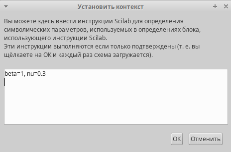{#fig:001 width=70%}

Для реализации модели потребуется:
* CLOCK_c — запуск часов модельного времени;
* CSCOPE — регистрирующее устройство для построения графика;
* TEXT_f — задаёт текст примечаний;
* MUX — мультиплексер, позволяющий в данном случае вывести на графике сразу несколько кривых;
* INTEGRAL_m — блок интегрирования
* GAINBLK_f — в данном случае позволяет задать значения коэффициентов β и ν;
* SUMMATION — блок суммирования;
* PROD_f — поэлементное произведение двух векторов на входе блока.

Добавляем эти блоки из палитры инструментов и строим с их помощью данную систему дифференциальных уравнений:

$$
\begin{cases}
  \dot s = - \beta s(t)i(t); \\
  \dot i = \beta s(t)i(t) - \nu i(t);\\
  \dot r = \nu i(t),
\end{cases}
$$

где $\beta$ -- скорость заражения, $\nu$ -- скорость выздоровления.

Реализованная модель эпидемии. Выходы трёх блоков интегрирования соединяем с мультиплексором.(рис. [-@fig:002])

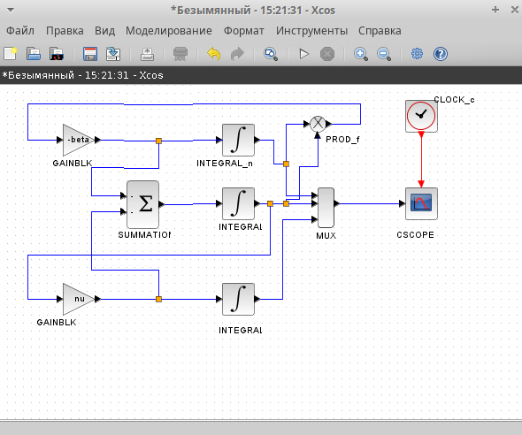{#fig:002 width=70%}

В параметрах верхнего блока интегрирования задаем значения s(0) = 0, 999, который отвечает за здоровых особей. (рис. [-@fig:003])

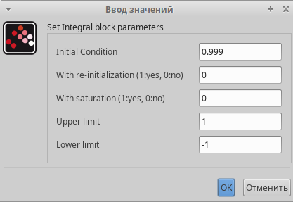{#fig:003 width=70%}

В параметрах среднего блока интегрирования задаем значения i(0) = 0, 001, который отвечает за переносчиков болезни. (рис. [-@fig:004])

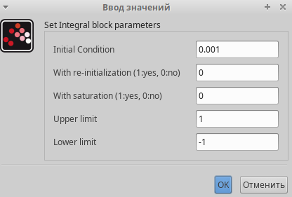{#fig:004 width=70%}

В нижнем блоке интегрирования начальные значения по умолчанию заданы нулю, как в нашем условии. Данная часть отвечает за тех, кто имеет иммунитет.

Далее, устанавливаем конечное время интегрирования. Оно равно 30 (рис. [-@fig:005])

{#fig:005 width=70%}

Результат моделирования представлен на (рис. [-@fig:006]), где черной линией обозначен график s(t) (динамика численности уязвимых к болезни особей), красная линия r(t) — динамику численности выздоровевших особей, наконец, зеленая линия i(t) — динамику численности заражённых особей. Пересечение трёх линий определяет порог эпидемии.

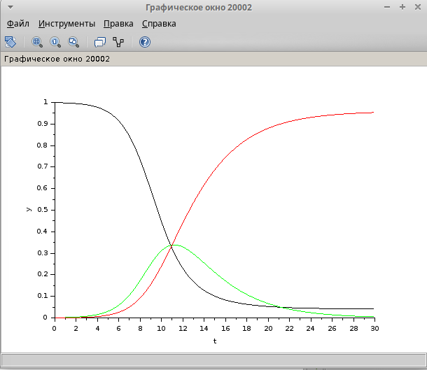{#fig:006 width=70%}

## Реализация модели с помощью блока Modelica в xcos

В данном задании необходимо было реализовать такую же модель эпидемии при beta=1, nu=0.3, только с помощью блока Modelica в xcos. Для начала добавляем новый блок констант и блок реализации кода на Modelica. Таким образом выглядит наша модель (рис. [-@fig:007])

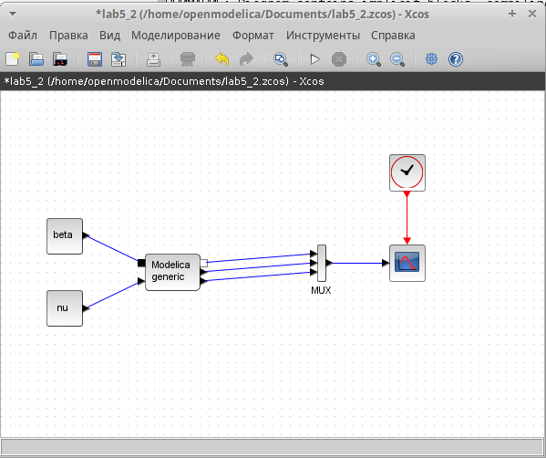{#fig:007 width=70%}

Указываем параметры для блока реализации. Переменные на входе (“beta”, “nu”) и выходе (“s”, “i”, “r”) блока заданы как внешние (“E”). (рис. [-@fig:008])

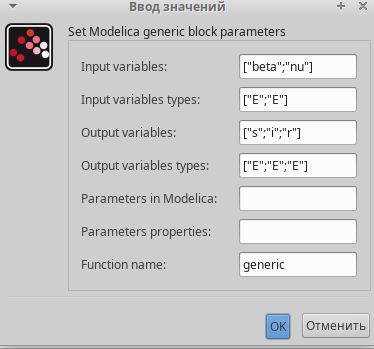{#fig:008 width=70%}

Код на языке Modelica. Задаем переменные beta, nu. Указываем начальные значения для s, i, r и пишем систему уравнения. (рис. [-@fig:009])

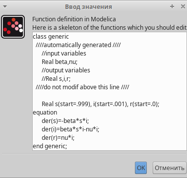{#fig:009 width=70%}

Результат работы модели. Он идентичен с реализацией в xcos.  (рис. [-@fig:0010])

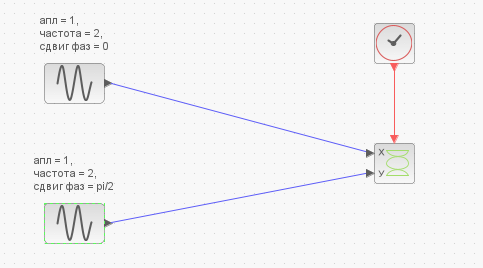{#fig:0010 width=70%}

## Выполнение упражнени построения модели эпидемии в OpenModelica

Код реализации модели эпидемии в OpenModelica. Задаем все начальные параметры с помощью parameter Real, как было в реализациях xcos. Записываем систему уравнения, реализация очень сильно схожа с реализацией с помощью блока Modelica в xcos (рис. [-@fig:0011])

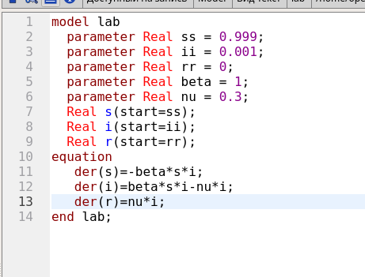{#fig:0011 width=70%}

Результат модели. Результат идентичен с построением с помощью других способов, значит все выполнено правильно. (рис. [-@fig:0012])

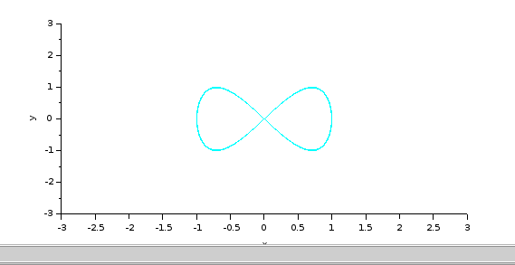{#fig:0012 width=70%}

## Задание для самостоятельного выполнения. Реализация с помощью xcos

Необходимо реализовать такую же модель эпидемии, только с учётом процесса рождения / гибели особей в xcos (в том числе и с использованием блока Modelica), а также в OpenModelica.

Так выглядит система уравнения:

$$
\begin{cases}
  \dot s = - \beta s(t)i(t) + \mu (N - s(t)); \\
  \dot i = \beta s(t)i(t) - \nu i(t) - \mu i(t);\\
  \dot r = \nu i(t) - \mu r(t),
\end{cases}
$$

где $\mu$ — константа, которая равна коэффициенту смертности и рождаемости.

Реализуем эту модель в *xcos*. Тут нам понадобятся три блока суммирования и 4 блока констант (добавляется константа $\nu$).

В меню моделирования устанавливаем переменные окружения. (рис. [-@fig:0013]) Реализация с помощью xcos. (рис. [-@fig:0014])

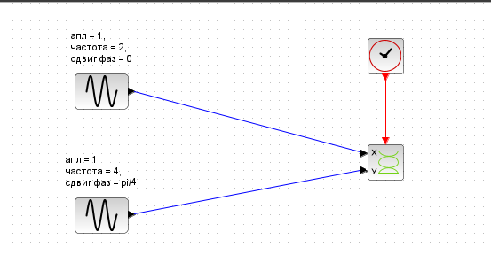{#fig:0013 width=70%}

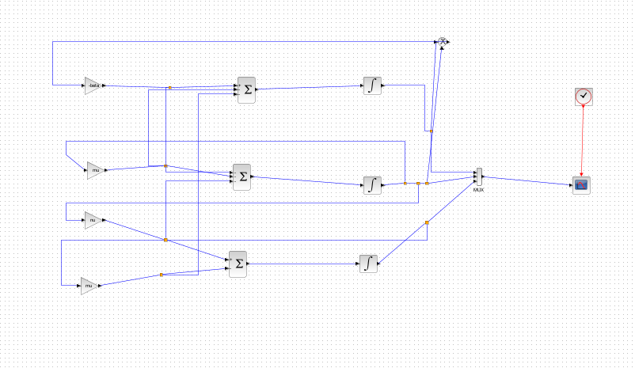{#fig:0014 width=70%}

В параметрах блоков интегрирования нет изменений, указываем все начальные значения из предыдущих этапов выполнения. 

Результат моделирования представлен на (рис. [-@fig:0015]), где черной линией обозначен график s(t) (динамика численности уязвимых к болезни особей), красная линия r(t) — динамику численности выздоровевших особей, наконец, зеленая линия i(t) — динамику численности заражённых особей. Пересечение трёх линий определяет порог эпидемии.

{#fig:0015 width=70%}

## Задание для самостоятельного выполнения. Реализация с помощью блока Modelica в xcos

Реализация с помощью блока Modelica в xcos. (рис. [-@fig:0016])

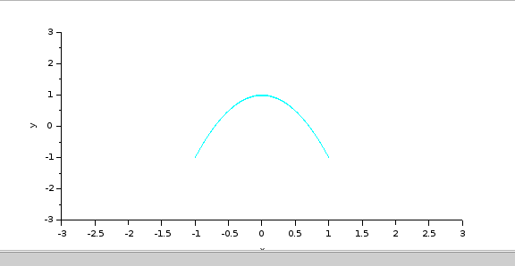{#fig:0016 width=70%}

Указываем параметры для блока реализации. Переменные на входе (“beta”, “nu”, "mu") и выходе (“s”, “i”, “r”) блока заданы как внешние (“E”). (рис. [-@fig:0017])

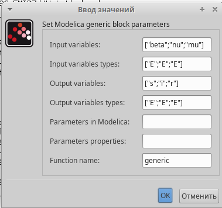{#fig:0017 width=70%}

Код на языке Modelica. Задаем переменные beta, nu, mu. Указываем начальные значения для s, i, r и пишем систему уравнения. (рис. [-@fig:0018])

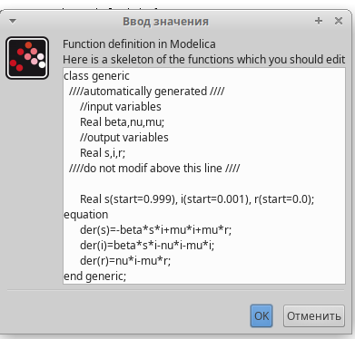{#fig:0018 width=70%}

Результат моделирования представлен на (рис. [-@fig:0019]), где черной линией обозначен график s(t) (динамика численности уязвимых к болезни особей), красная линия r(t) — динамику численности выздоровевших особей, наконец, зеленая линия i(t) — динамику численности заражённых особей. Пересечение трёх линий определяет порог эпидемии.

{#fig:0019 width=70%}

## Задание для самостоятельного выполнения. Реализация в OpenModelica

Код реализации модели эпидемии в OpenModelica. Задаем все начальные параметры с помощью parameter Real, как было в реализациях xcos. Записываем систему уравнения, реализация очень сильно схожа с реализацией с помощью блока Modelica в xcos (рис. [-@fig:0020])

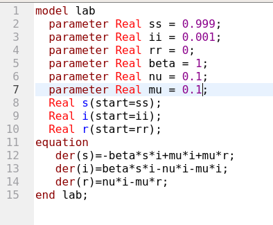{#fig:0020 width=70%}

Результат модели. Результат идентичен с построением с помощью других способов, значит все выполнено правильно. (рис. [-@fig:0021])

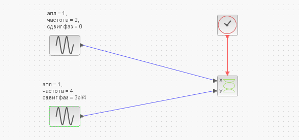{#fig:0021 width=70%}

## Результаты на различных параметрах. 

При mu=0.6, nu=0.1, beta=1 (рис. [-@fig:0022]), (рис. [-@fig:0023])

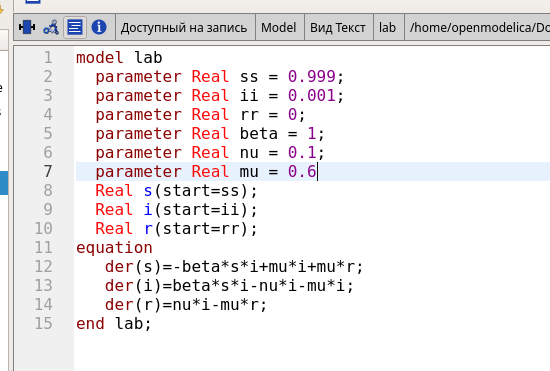{#fig:0022 width=70%}

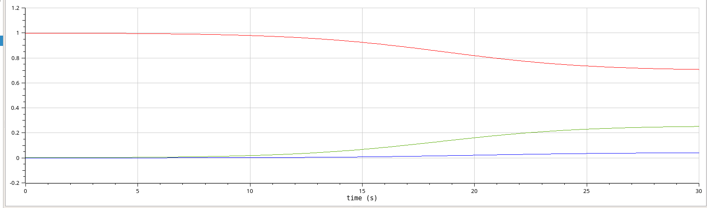{#fig:0023 width=70%}

При mu=0.6, nu=0.6, beta=1 (рис. [-@fig:0024]), (рис. [-@fig:0025])

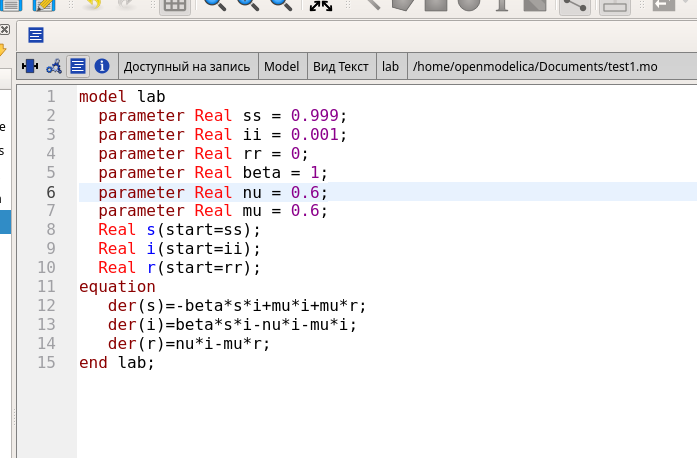{#fig:0024 width=70%}

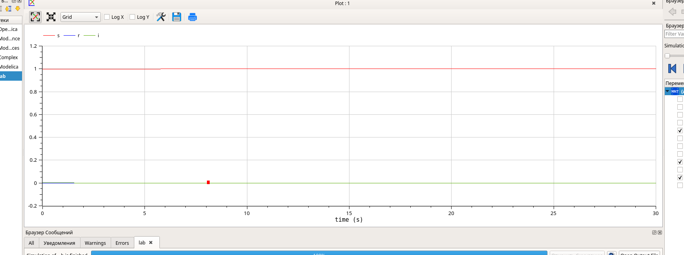{#fig:0025 width=70%}

Исходя из анализа графиков, можно сделать вывод, что чем выше значение любого из параметров, тем быстрее система достигает стационарного состояния. При высоком коэффициенте заражения 𝛽 система быстро проходит через пик развития эпидемии и достигает стационарного состояния.

# Выводы

Построил модели эпидемии (SIR) в xcos, с помощью блока Modelica и в OpenModelica. 

# Список литературы{.unnumbered}

::: {#refs}
:::
