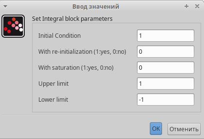
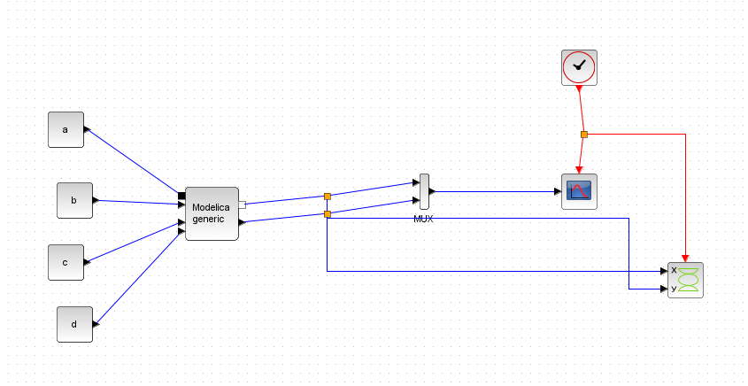

---
## Front matter
lang: ru-RU
title: Лабораторная работа № 6
subtitle: Имитационной моделирование
author:
  - Королёв И.А.
institute:
  - Российский университет дружбы народов, Москва, Россия

## i18n babel
babel-lang: russian
babel-otherlangs: english

## Formatting pdf
toc: false
toc-title: Содержание
slide_level: 2
aspectratio: 169
section-titles: true
theme: metropolis
header-includes:
 - \metroset{progressbar=frametitle,sectionpage=progressbar,numbering=fraction}
---

# Информация

## Докладчик

:::::::::::::: {.columns align=center}
::: {.column width="70%"}

  * Королёв Иван Андреевич
  * Студент
  * Российский университет дружбы народов

:::
::::::::::::::

# Цель работы

Реализовать модель "хищник-жертва" в xcos, с помощью блока моделирования в xcos и OpenModelica

# Задание

1. Реализация модели в xcos

2. Реализация модели с помощью блока Modelica в xcos

3. Реализация модели в OpenModelica. Построить графики изменения численности популяций и фазовый портрет

# Теоретическое введение

Модель «хищник–жертва» (модель Лотки — Вольтерры) представляет собой модель
межвидовой конкуренции. В математической
форме модель имеет вид:

$$
\begin{cases}
  \dot x = ax - bxy \\
  \dot y = cxy - dy,
\end{cases}
$$

где $x$ — количество жертв; $y$ — количество хищников; $a, b, c, d$ — коэффициенты, отражающие взаимодействия между видами: $a$ — коэффициент рождаемости
жертв; $b$ — коэффициент убыли жертв; $c$ — коэффициент рождения хищников; $d$ —
коэффициент убыли хищников.

# Выполнение лабораторной работы

# Реализация модели в xcos

{#fig:001 width=58%}

# Реализация модели в xcos

{#fig:002 width=58%}

# Реализация модели в xcos

{#fig:003 width=58%}

# Реализация модели в xcos

{#fig:004 width=58%}

# Реализация модели в xcos

{#fig:005 width=58%}

# Реализация модели в xcos

{#fig:006 width=58%}

# Реализация модели в xcos

{#fig:007 width=58%}

# Реализация модели с помощью блока Modelica в xcos

{#fig:008 width=58%}

# Реализация модели с помощью блока Modelica в xcos

{#fig:009 width=58%}

# Реализация модели с помощью блока Modelica в xcos

{#fig:0010 width=58%}

# Реализация модели с помощью блока Modelica в xcos

{#fig:0011 width=58%}

# Реализация модели с помощью блока Modelica в xcos

{#fig:0012 width=58%}

# Реализация модели в OpenModelica.

{#fig:0013 width=58%}

# Реализация модели в OpenModelica.

{#fig:0014 width=58%}

# Реализация модели в OpenModelica.

{#fig:0015 width=58%}

# Выводы

Реализовал модель "хищник-жертва" в xcos, с помощью блока моделирования в xcos и OpenModelica

