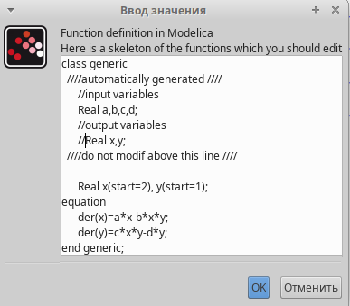
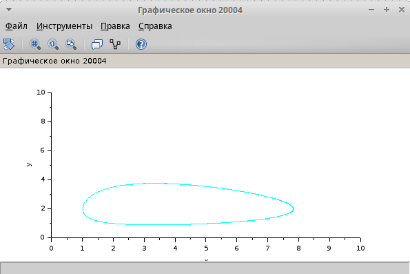

---
## Front matter
title: "Лабораторная работа № 6"
subtitle: "Имитационное моделирование"
author: "Королёв Иван"

## Generic otions
lang: ru-RU
toc-title: "Содержание"

## Bibliography
bibliography: bib/cite.bib
csl: pandoc/csl/gost-r-7-0-5-2008-numeric.csl

## Pdf output format
toc: true # Table of contents
toc-depth: 2
lof: true # List of figures
lot: true # List of tables
fontsize: 12pt
linestretch: 1.5
papersize: a4
documentclass: scrreprt
## I18n polyglossia
polyglossia-lang:
  name: russian
  options:
	- spelling=modern
	- babelshorthands=true
polyglossia-otherlangs:
  name: english
## I18n babel
babel-lang: russian
babel-otherlangs: english
## Fonts
mainfont: IBM Plex Serif
romanfont: IBM Plex Serif
sansfont: IBM Plex Sans
monofont: IBM Plex Mono
mathfont: STIX Two Math
mainfontoptions: Ligatures=Common,Ligatures=TeX,Scale=0.94
romanfontoptions: Ligatures=Common,Ligatures=TeX,Scale=0.94
sansfontoptions: Ligatures=Common,Ligatures=TeX,Scale=MatchLowercase,Scale=0.94
monofontoptions: Scale=MatchLowercase,Scale=0.94,FakeStretch=0.9
mathfontoptions:
## Biblatex
biblatex: true
biblio-style: "gost-numeric"
biblatexoptions:
  - parentracker=true
  - backend=biber
  - hyperref=auto
  - language=auto
  - autolang=other*
  - citestyle=gost-numeric
## Pandoc-crossref LaTeX customization
figureTitle: "Рис."
tableTitle: "Таблица"
listingTitle: "Листинг"
lofTitle: "Список иллюстраций"
lotTitle: "Список таблиц"
lolTitle: "Листинги"
## Misc options
indent: true
header-includes:
  - \usepackage{indentfirst}
  - \usepackage{float} # keep figures where there are in the text
  - \floatplacement{figure}{H} # keep figures where there are in the text
---

# Цель работы

Реализовать модель "хищник-жертва" в xcos, с помощью блока моделирования в xcos и OpenModelica

# Задание

1. Реализация модели в xcos

2. Реализация модели с помощью блока Modelica в xcos

3. Реализация модели в OpenModelica. Построить графики изменения численности популяций и фазовый портрет

# Теоретическое введение

Модель «хищник–жертва» (модель Лотки — Вольтерры) представляет собой модель
межвидовой конкуренции. В математической
форме модель имеет вид:

$$
\begin{cases}
  \dot x = ax - bxy \\
  \dot y = cxy - dy,
\end{cases}
$$

где $x$ — количество жертв; $y$ — количество хищников; $a, b, c, d$ — коэффициенты, отражающие взаимодействия между видами: $a$ — коэффициент рождаемости
жертв; $b$ — коэффициент убыли жертв; $c$ — коэффициент рождения хищников; $d$ —
коэффициент убыли хищников.

# Выполнение лабораторной работы

## Реализация модели в xcos

Для начала фиксируем начальные данные a=2,b=1,c=0.3,d=1.(рис. [-@fig:001]).

{#fig:001 width=70%}

Реализуем модель хищник-жертва с помощью блоков. Все блоки идентичны с предыдущей лабораторной, блок времени, блок произведение, интегрирования, суммы и тд. Только дополнительно потребуется блок регистрирующее устройство для построения фазового портрета. (CSCOPXY). Первое уравнение модели задано верхним блоком интегрирования, блоком произведения и блоками задания коэффициентов a и b. Второе уравнение модели задано нижним блоком интегрирования и блоками задания коэффициентов. (рис. [-@fig:002]).

{#fig:002 width=70%}

Задаем начальные значения для x и y в параметрах блоков интегрирования. (рис. [-@fig:003]), (рис. [-@fig:004])

{#fig:003 width=70%}

{#fig:004 width=70%}

Устанавливаем конечное время интегрирования 30. (рис. [-@fig:005])

{#fig:005 width=70%}

Фазовый портрет. (рис. [-@fig:006])

{#fig:006 width=70%}

Динамика изменения численности хищников и жертв. Черной линией обозначена динамика численности жертв. Зеленой линией обозначена динамика численности хищников. (рис. [-@fig:007])

{#fig:007 width=70%}

## Реализация модели с помощью блока Modelica в xcos

Как и ранее, задаем значения коэффициентам a,b,c,d. Устанавливаем конечное время интегрирования. Реализуем модель. Нам понадобится блок моделирования, блок констант и регистрирующее устройство для построения фазового портрета и для построения графика. (рис. [-@fig:008])

{#fig:008 width=70%}

Параметры блока моделирования и программный код (рис. [-@fig:009]), (рис. [-@fig:0010])

{#fig:009 width=70%}

{#fig:0010 width=70%}

Фазовый портрет и график изменения численности популяций. Результат полностью идентичен с xcos. (рис. [-@fig:0011]), (рис. [-@fig:0012])

{#fig:0011 width=70%}

{#fig:0012 width=70%}

## Реализация модели в OpenModelica.

Код для реализации данной модели. Задаем начальные коэффициенты и пишем уравнения модели. Задаем конечное время интегрирования. (рис. [-@fig:0013])

{#fig:0013 width=70%}

Фазовый портрет и график изменения численности популяций. Результат полностью идентичен с предыдущими реализациями. (рис. [-@fig:0014]), (рис. [-@fig:0015])

{#fig:0014 width=70%}

{#fig:0015 width=70%}

# Выводы

Реализовал модель "хищник-жертва" в xcos, с помощью блока моделирования в xcos и OpenModelica

# Список литературы{.unnumbered}

::: {#refs}
:::
