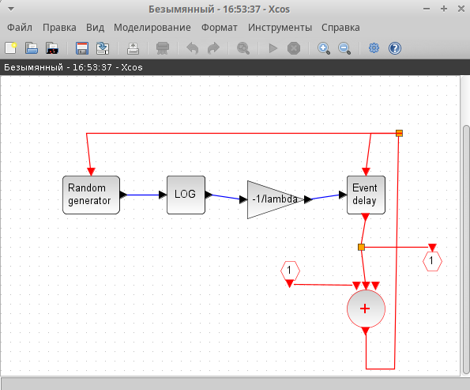
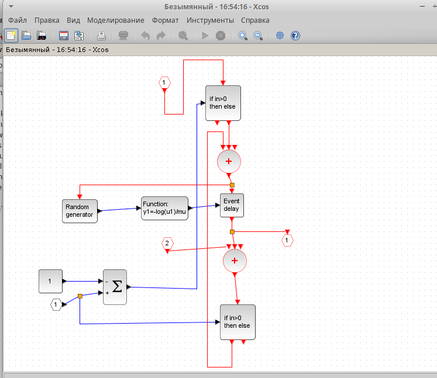

---
## Front matter
lang: ru-RU
title: Лабораторная работа № 7
subtitle: Имитационное моделирование
author:
  - Королёв И.А.
institute:
  - Российский университет дружбы народов, Москва, Россия

## i18n babel
babel-lang: russian
babel-otherlangs: english

## Formatting pdf
toc: false
toc-title: Содержание
slide_level: 2
aspectratio: 169
section-titles: true
theme: metropolis
header-includes:
 - \metroset{progressbar=frametitle,sectionpage=progressbar,numbering=fraction}
---

# Информация

## Докладчик

:::::::::::::: {.columns align=center}
::: {.column width="70%"}

  * Королёв Иван Андреевич
  * Студент
  * Российский университет дружбы народов
  
:::
::::::::::::::

# Цель работы

Рассмотреть пример моделирования в *xcos* системы массового обслуживания типа $M|M|1|\infty$.

# Задание

1. Реализовать модель системы массового обслуживания типа $M|M|1|\infty$;
2. Построить график поступления и обработки заявок;
3. Построить график динамики размера очереди.

# Выполнение лабораторной работы

# Для начала необходимо указать начальные параметры. 

{#fig:001 width=70%}

# Построение суперблока отвечающего за поступление заявок.

{#fig:002 width=70%}

# Построение суперблока отвечающего за обработку заявок

{#fig:003 width=70%}

# Модель $M|M|1|\infty$

{#fig:004 width=70%}

# График поступления и обработки заявок 

{#fig:005 width=70%}

# График динамики размера очереди 

{#fig:006 width=70%}

# Выводы

Рассмотрел пример моделирования в *xcos* системы массового обслуживания типа $M|M|1|\infty$.

# Список литературы{.unnumbered}

::: {#refs}
:::
