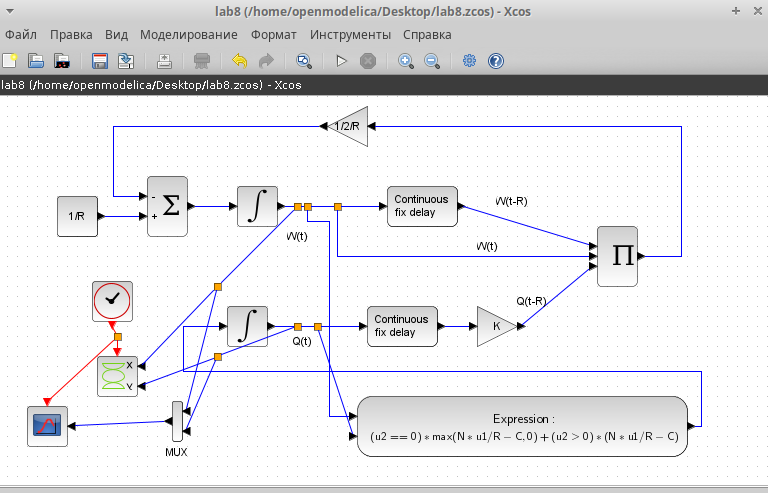
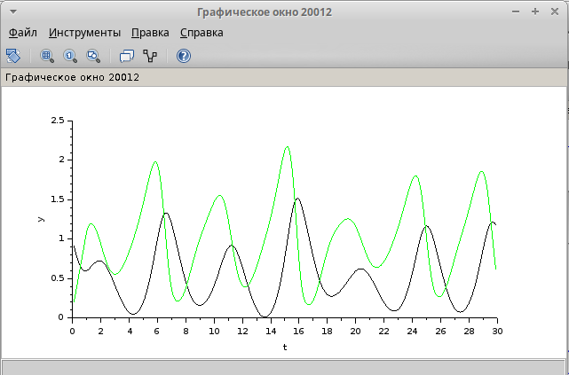
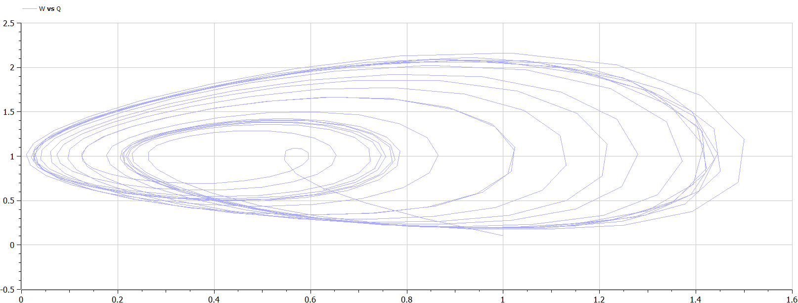

---
## Front matter
title: "Лабораторная работа № 8"
subtitle: "TCP/AQM"
author: "Королёв Иван"

## Generic otions
lang: ru-RU
toc-title: "Содержание"

## Bibliography
bibliography: bib/cite.bib
csl: pandoc/csl/gost-r-7-0-5-2008-numeric.csl

## Pdf output format
toc: true # Table of contents
toc-depth: 2
lof: true # List of figures
lot: true # List of tables
fontsize: 12pt
linestretch: 1.5
papersize: a4
documentclass: scrreprt
## I18n polyglossia
polyglossia-lang:
  name: russian
  options:
	- spelling=modern
	- babelshorthands=true
polyglossia-otherlangs:
  name: english
## I18n babel
babel-lang: russian
babel-otherlangs: english
## Fonts
mainfont: IBM Plex Serif
romanfont: IBM Plex Serif
sansfont: IBM Plex Sans
monofont: IBM Plex Mono
mathfont: STIX Two Math
mainfontoptions: Ligatures=Common,Ligatures=TeX,Scale=0.94
romanfontoptions: Ligatures=Common,Ligatures=TeX,Scale=0.94
sansfontoptions: Ligatures=Common,Ligatures=TeX,Scale=MatchLowercase,Scale=0.94
monofontoptions: Scale=MatchLowercase,Scale=0.94,FakeStretch=0.9
mathfontoptions:
## Biblatex
biblatex: true
biblio-style: "gost-numeric"
biblatexoptions:
  - parentracker=true
  - backend=biber
  - hyperref=auto
  - language=auto
  - autolang=other*
  - citestyle=gost-numeric
## Pandoc-crossref LaTeX customization
figureTitle: "Рис."
tableTitle: "Таблица"
listingTitle: "Листинг"
lofTitle: "Список иллюстраций"
lotTitle: "Список таблиц"
lolTitle: "Листинги"
## Misc options
indent: true
header-includes:
  - \usepackage{indentfirst}
  - \usepackage{float} # keep figures where there are in the text
  - \floatplacement{figure}{H} # keep figures where there are in the text
---

# Цель работы 

Реализовать модель TCP/AQM в xcos и OpenModelica.

# Задание

1. Построить модель TCP/AQM в xcos;
2. Построить графики динамики изменения размера TCP окна $W(t)$ и размера очереди $Q(t)$;
3. Построить модель TCP/AQM в OpenModelica;

# Выполнение лабораторной работы 5

## Реализация модели эпидемии в xcos

Зафиксируем начальные данные: **β = 1, ν = 0, 3, s(0) = 0, 999, i(0) = 0, 001, r(0) = 0**.

В меню моделирования устанавливаем переменные окружения (рис. [-@fig:0001])

{#fig:0001 width=70%}

Для реализации модели потребуется:
* CLOCK_c — запуск часов модельного времени;
* CSCOPE — регистрирующее устройство для построения графика;
* TEXT_f — задаёт текст примечаний;
* MUX — мультиплексер, позволяющий в данном случае вывести на графике сразу несколько кривых;
* INTEGRAL_m — блок интегрирования
* GAINBLK_f — в данном случае позволяет задать значения коэффициентов β и ν;
* SUMMATION — блок суммирования;
* PROD_f — поэлементное произведение двух векторов на входе блока.

Добавляем эти блоки из палитры инструментов и строим с их помощью данную систему дифференциальных уравнений:

$$
\begin{cases}
  \dot s = - \beta s(t)i(t); \\
  \dot i = \beta s(t)i(t) - \nu i(t);\\
  \dot r = \nu i(t),
\end{cases}
$$

где $\beta$ -- скорость заражения, $\nu$ -- скорость выздоровления.

Реализованная модель эпидемии. Выходы трёх блоков интегрирования соединяем с мультиплексором.(рис. [-@fig:0002])

{#fig:0002 width=70%}

В параметрах верхнего блока интегрирования задаем значения s(0) = 0, 999, который отвечает за здоровых особей. (рис. [-@fig:0003])

{#fig:0003 width=70%}

В параметрах среднего блока интегрирования задаем значения i(0) = 0, 001, который отвечает за переносчиков болезни. (рис. [-@fig:0004])

{#fig:0004 width=70%}

В нижнем блоке интегрирования начальные значения по умолчанию заданы нулю, как в нашем условии. Данная часть отвечает за тех, кто имеет иммунитет.

Далее, устанавливаем конечное время интегрирования. Оно равно 30 (рис. [-@fig:0005])

{#fig:0005 width=70%}

Результат моделирования представлен на (рис. [-@fig:0006]), где черной линией обозначен график s(t) (динамика численности уязвимых к болезни особей), красная линия r(t) — динамику численности выздоровевших особей, наконец, зеленая линия i(t) — динамику численности заражённых особей. Пересечение трёх линий определяет порог эпидемии.

{#fig:0006 width=70%}

## Реализация модели с помощью блока Modelica в xcos

В данном задании необходимо было реализовать такую же модель эпидемии при beta=1, nu=0.3, только с помощью блока Modelica в xcos. Для начала добавляем новый блок констант и блок реализации кода на Modelica. Таким образом выглядит наша модель (рис. [-@fig:0007])

{#fig:0007 width=70%}

Указываем параметры для блока реализации. Переменные на входе (“beta”, “nu”) и выходе (“s”, “i”, “r”) блока заданы как внешние (“E”). (рис. [-@fig:0008])

{#fig:0008 width=70%}

Код на языке Modelica. Задаем переменные beta, nu. Указываем начальные значения для s, i, r и пишем систему уравнения. (рис. [-@fig:0009])

{#fig:0009 width=70%}

Результат работы модели. Он идентичен с реализацией в xcos.  (рис. [-@fig:00010])

{#fig:00010 width=70%}

## Выполнение упражнени построения модели эпидемии в OpenModelica

Код реализации модели эпидемии в OpenModelica. Задаем все начальные параметры с помощью parameter Real, как было в реализациях xcos. Записываем систему уравнения, реализация очень сильно схожа с реализацией с помощью блока Modelica в xcos (рис. [-@fig:00011])

{#fig:00011 width=70%}

Результат модели. Результат идентичен с построением с помощью других способов, значит все выполнено правильно. (рис. [-@fig:00012])

{#fig:00012 width=70%}

## Задание для самостоятельного выполнения. Реализация с помощью xcos

Необходимо реализовать такую же модель эпидемии, только с учётом процесса рождения / гибели особей в xcos (в том числе и с использованием блока Modelica), а также в OpenModelica.

Так выглядит система уравнения:

$$
\begin{cases}
  \dot s = - \beta s(t)i(t) + \mu (N - s(t)); \\
  \dot i = \beta s(t)i(t) - \nu i(t) - \mu i(t);\\
  \dot r = \nu i(t) - \mu r(t),
\end{cases}
$$

где $\mu$ — константа, которая равна коэффициенту смертности и рождаемости.

Реализуем эту модель в *xcos*. Тут нам понадобятся три блока суммирования и 4 блока констант (добавляется константа $\nu$).

В меню моделирования устанавливаем переменные окружения. (рис. [-@fig:00013]) Реализация с помощью xcos. (рис. [-@fig:00014])

{#fig:00013 width=70%}

{#fig:00014 width=70%}

В параметрах блоков интегрирования нет изменений, указываем все начальные значения из предыдущих этапов выполнения. 

Результат моделирования представлен на (рис. [-@fig:00015]), где черной линией обозначен график s(t) (динамика численности уязвимых к болезни особей), красная линия r(t) — динамику численности выздоровевших особей, наконец, зеленая линия i(t) — динамику численности заражённых особей. Пересечение трёх линий определяет порог эпидемии.

{#fig:00015 width=70%}

## Задание для самостоятельного выполнения. Реализация с помощью блока Modelica в xcos

Реализация с помощью блока Modelica в xcos. (рис. [-@fig:00016])

{#fig:00016 width=70%}

Указываем параметры для блока реализации. Переменные на входе (“beta”, “nu”, "mu") и выходе (“s”, “i”, “r”) блока заданы как внешние (“E”). (рис. [-@fig:00017])

{#fig:00017 width=70%}

Код на языке Modelica. Задаем переменные beta, nu, mu. Указываем начальные значения для s, i, r и пишем систему уравнения. (рис. [-@fig:00018])

{#fig:00018 width=70%}

Результат моделирования представлен на (рис. [-@fig:00019]), где черной линией обозначен график s(t) (динамика численности уязвимых к болезни особей), красная линия r(t) — динамику численности выздоровевших особей, наконец, зеленая линия i(t) — динамику численности заражённых особей. Пересечение трёх линий определяет порог эпидемии.

{#fig:00019 width=70%}

## Задание для самостоятельного выполнения. Реализация в OpenModelica

Код реализации модели эпидемии в OpenModelica. Задаем все начальные параметры с помощью parameter Real, как было в реализациях xcos. Записываем систему уравнения, реализация очень сильно схожа с реализацией с помощью блока Modelica в xcos (рис. [-@fig:00020])

{#fig:00020 width=70%}

Результат модели. Результат идентичен с построением с помощью других способов, значит все выполнено правильно. (рис. [-@fig:00021])

{#fig:00021 width=70%}

## Результаты на различных параметрах. 

При mu=0.6, nu=0.1, beta=1 (рис. [-@fig:00022]), (рис. [-@fig:00023])

{#fig:00022 width=70%}

{#fig:00023 width=70%}

При mu=0.6, nu=0.6, beta=1 (рис. [-@fig:00024]), (рис. [-@fig:00025])

{#fig:00024 width=70%}

{#fig:00025 width=70%}

Исходя из анализа графиков, можно сделать вывод, что чем выше значение любого из параметров, тем быстрее система достигает стационарного состояния. При высоком коэффициенте заражения 𝛽 система быстро проходит через пик развития эпидемии и достигает стационарного состояния.

# Выполнение лабораторной работы 6

## Реализация модели в xcos

Для начала фиксируем начальные данные a=2,b=1,c=0.3,d=1.(рис. [-@fig:01]).

{#fig:01 width=70%}

Реализуем модель хищник-жертва с помощью блоков. Все блоки идентичны с предыдущей лабораторной, блок времени, блок произведение, интегрирования, суммы и тд. Только дополнительно потребуется блок регистрирующее устройство для построения фазового портрета. (CSCOPXY). Первое уравнение модели задано верхним блоком интегрирования, блоком произведения и блоками задания коэффициентов a и b. Второе уравнение модели задано нижним блоком интегрирования и блоками задания коэффициентов. (рис. [-@fig:002]).

{#fig:02 width=70%}

Задаем начальные значения для x и y в параметрах блоков интегрирования. (рис. [-@fig:03]), (рис. [-@fig:04])

{#fig:03 width=70%}

{#fig:04 width=70%}

Устанавливаем конечное время интегрирования 30. (рис. [-@fig:05])

{#fig:05 width=70%}

Фазовый портрет. (рис. [-@fig:06])

{#fig:06 width=70%}

Динамика изменения численности хищников и жертв. Черной линией обозначена динамика численности жертв. Зеленой линией обозначена динамика численности хищников. (рис. [-@fig:07])

{#fig:07 width=70%}

## Реализация модели с помощью блока Modelica в xcos

Как и ранее, задаем значения коэффициентам a,b,c,d. Устанавливаем конечное время интегрирования. Реализуем модель. Нам понадобится блок моделирования, блок констант и регистрирующее устройство для построения фазового портрета и для построения графика. (рис. [-@fig:08])

{#fig:08 width=70%}

Параметры блока моделирования и программный код (рис. [-@fig:09]), (рис. [-@fig:010])

{#fig:09 width=70%}

{#fig:010 width=70%}

Фазовый портрет и график изменения численности популяций. Результат полностью идентичен с xcos. (рис. [-@fig:011]), (рис. [-@fig:012])

{#fig:011 width=70%}

{#fig:012 width=70%}

## Реализация модели в OpenModelica.

Код для реализации данной модели. Задаем начальные коэффициенты и пишем уравнения модели. Задаем конечное время интегрирования. (рис. [-@fig:013])

{#fig:013 width=70%}

Фазовый портрет и график изменения численности популяций. Результат полностью идентичен с предыдущими реализациями. (рис. [-@fig:014]), (рис. [-@fig:015])

{#fig:014 width=70%}

{#fig:015 width=70%}

# Выполнение лабораторной работы 7

Реализация модели системы массового обслуживания типа $M|M|1|\infty$. Для начала необходимо указать начальные параметры. (рис. [-@fig:1]).

{#fig:1 width=70%}

Построение суперблока отвечающего за поступление заявок. (рис. [-@fig:2])

{#fig:2 width=70%}

Построение суперблока отвечающего за обработку заявок. (рис. [-@fig:3])

{#fig:3 width=70%}

Модель $M|M|1|\infty$ (рис. [-@fig:4])

{#fig:4 width=70%}

График поступления и обработки заявок (рис. [-@fig:5])

{#fig:5 width=70%}

График динамики размера очереди (рис. [-@fig:6])

{#fig:6 width=70%}

# Выполнение лабораторной работы 8

## Реализация в xcos

Построим схему xcos, моделирующую нашу систему, с начальными значениями параметров $N = 1, R = 1, K = 5.3, C = 1, W(0) = 0.1, Q(0) = 1$.
Для этого сначала зададим переменные окружения (рис. [-@fig:001]).

{#fig:001 width=70%}

Затем реализуем модель TCP/AQM, разместив блоки интегрирования, суммирования, произведения, констант, а также регистрирующие устройства (рис. [-@fig:002]):

{#fig:002 width=70%}

В результате получим динамику изменения размера TCP окна W(t) (зеленая линия) и размера очереди Q(t) (черная линия), а также фазовый портрет, который показывает наличие автоколебаний параметров системы — фазовая траектория осциллирует вокруг своей стационарной точки (рис. [-@fig:003], [-@fig:004]):

{#fig:003 width=70%}

{#fig:004 width=70%}

Уменьшив скорость обработки пакетов $C$ до $0.9$ увидим, что автоколебания стали более выраженными (рис. [-@fig:005], [-@fig:006]).

{#fig:005 width=70%}

{#fig:006 width=70%}

## Реализация модели в OpenModelica

Перейдем к реализации модели в OpenModelica. Зададим параметры, начальные значения и систему уравнений.

```
parameter Real N=1;
parameter Real R=1;
parameter Real K=5.3;
parameter Real C=1;

Real W(start=0.1);
Real Q(start=1);

equation

der(W)= 1/R - W*delay(W, R)/(2*R)*K*delay(Q, R);
der(Q)= if (Q==0) then max(N*W/R-C,0) else (N*W/R-C);
```

Выполнив симуляцию, получим динамику изменения размера TCP окна W(t)(зеленая линия) и размера очереди Q(t)(черная линия), а также фазовый портрет, который показывает наличие автоколебаний параметров системы — фазовая траектория осциллирует вокруг своей стационарной точки (рис. [-@fig:007], [-@fig:008]).

{#fig:007 width=70%}

{#fig:008 width=70%}

# Выводы

В процессе выполнения данной лабораторной работы я реализовал модель TCP/AQM в xcos и OpenModelica.
