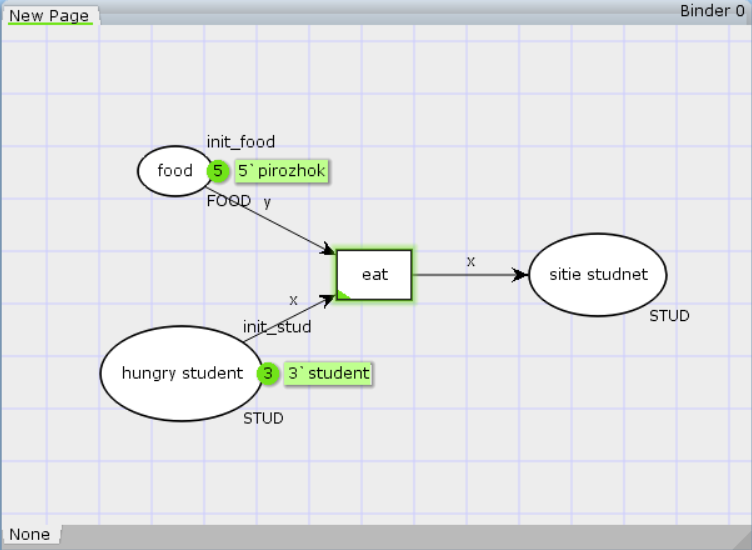
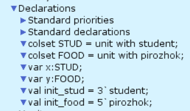
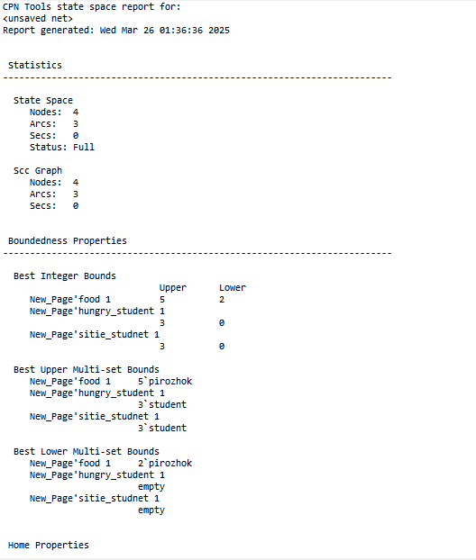
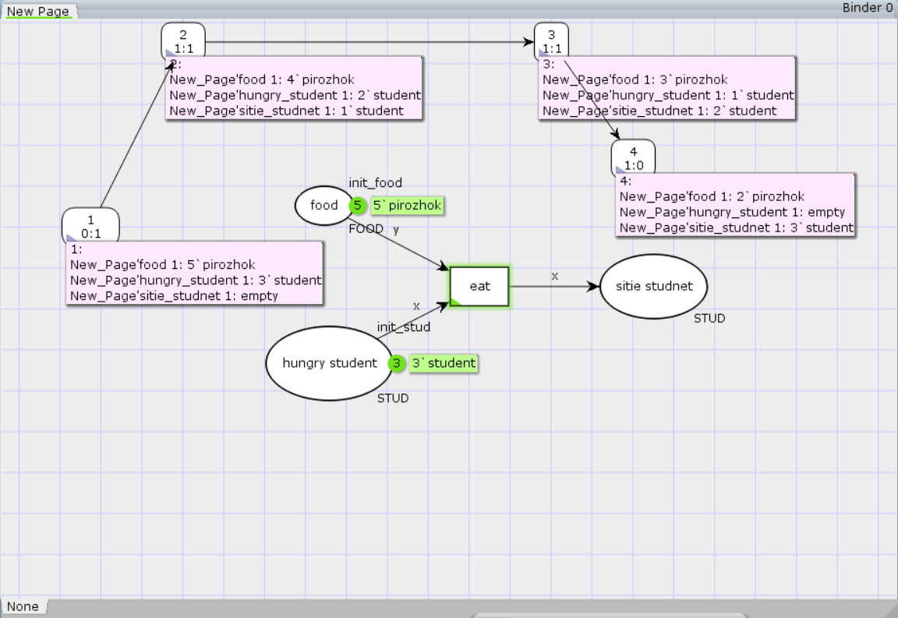

---
## Front matter
lang: ru-RU
title: Лабораторная работа № 9
subtitle: Голодные студенты
author:
  - Королёв И.А.
institute:
  - Российский университет дружбы народов, Москва, Россия

## i18n babel
babel-lang: russian
babel-otherlangs: english

## Formatting pdf
toc: false
toc-title: Содержание
slide_level: 2
aspectratio: 169
section-titles: true
theme: metropolis
header-includes:
 - \metroset{progressbar=frametitle,sectionpage=progressbar,numbering=fraction}
---

# Информация

## Докладчик

:::::::::::::: {.columns align=center}
::: {.column width="70%"}

  * Королёв И.А.
  * Студент
  * Российский университет дружбы народов

:::
::::::::::::::

# Цель работы

Необходимо построить модель, которая описывает студентов, обедающих пирожками

# Задание

1. Построить модель
2. Сформулировать отчет о пространстве состояний
3. Построить граф состояний

# Выполнение лабораторной работы

# Построение модели

{#fig:001 width=70%}

# Построение модели

{#fig:002 width=70%}

# Отчет о пространстве состояний

{#fig:003 width=70%}

# Граф состояний

{#fig:004 width=70%}

# Выводы

Построил модель, которая описывает студентов, обедающих пирожками

# Список литературы{.unnumbered}

::: {#refs}
:::
