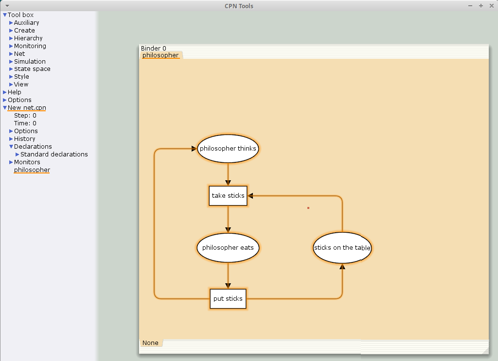
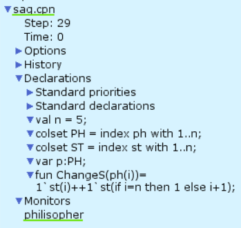
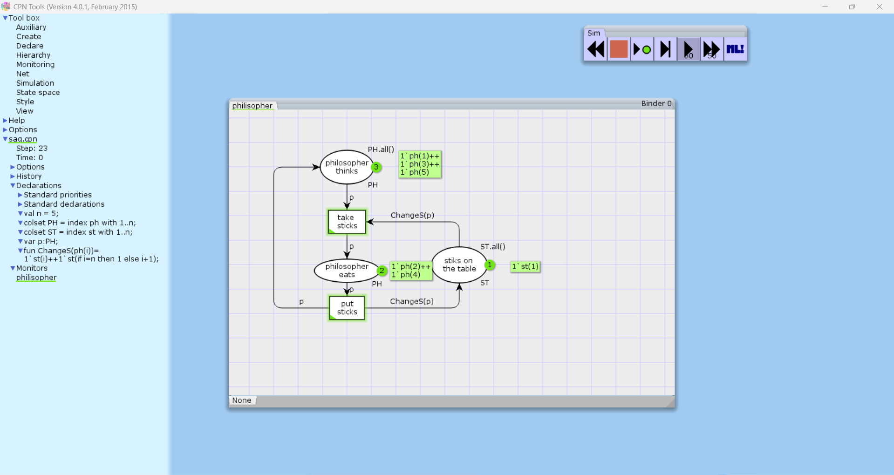
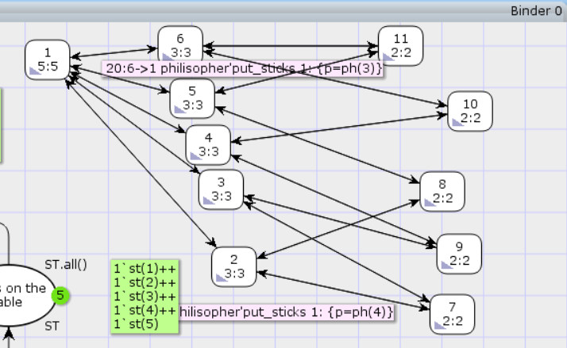

---
## Front matter
lang: ru-RU
title: Лабораторная работа № 10
subtitle: Имитационное моделирование
author:
  - Королёв И.А.
institute:
  - Российский университет дружбы народов, Москва, Россия

## i18n babel
babel-lang: russian
babel-otherlangs: english

## Formatting pdf
toc: false
toc-title: Содержание
slide_level: 2
aspectratio: 169
section-titles: true
theme: metropolis
header-includes:
 - \metroset{progressbar=frametitle,sectionpage=progressbar,numbering=fraction}
---

# Информация

## Докладчик

:::::::::::::: {.columns align=center}
::: {.column width="70%"}

  * Королёв И.А.
  * Студент
  * Российский университет дружбы народов

:::
::::::::::::::

# Цель работы

Освоить программу СPNTools и её основные инструменты. Построить модель задачи об обедающих мудрецах

# Задание

1. Нарисовать граф сети
2. Задать декларации модели
3. Моделирование
4. Отчет о пространстве состояний
5. Граф пространства состояний

# Теоретическое введение

CPN Tools — это инструмент для редактирования, моделирования и анализа сетей Петри высокого уровня. Он поддерживает базовые сети Петри, а также временные сети Петри и цветные сети Петри. Он имеет симулятор и инструмент анализа пространства состояний.

# Выполнение лабораторной работы

# Построение графа сети

{#fig:001 width=50%}

# Декларации модели

{#fig:002 width=50%}

# Демонстрация модели

{#fig:003 width=50%}

# Отчет о пространстве состояний

{#fig:004 width=50%}

# Граф

{#fig:005 width=50%}

# Выводы

Освоил программу СPNTools и её основные инструменты. Построил модель задачи об обедающих мудрецах

# Список литературы{.unnumbered}
imi_mod
::: {#refs}
:::
