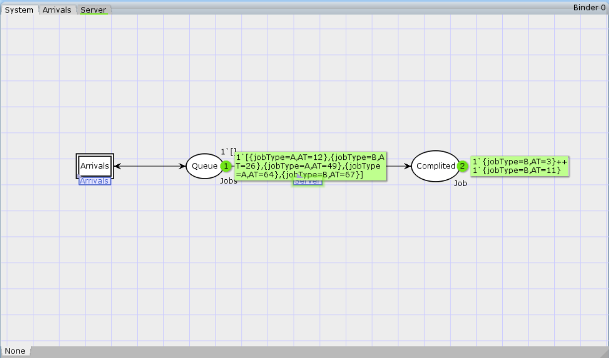
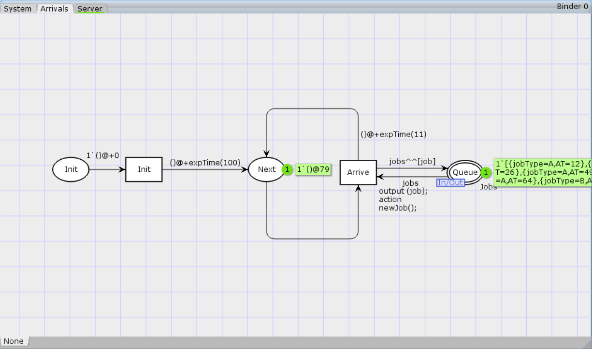
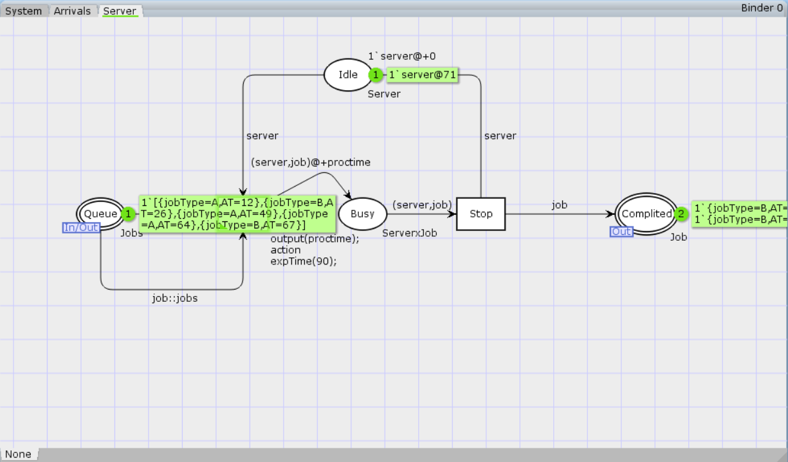
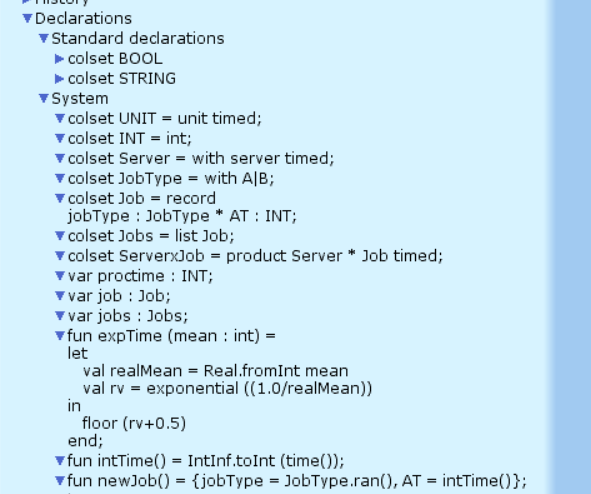

---
## Front matter
lang: ru-RU
title: Лабораторная работа № 11
subtitle: Имитационное моделирование
author:
  - Королёв И.А.
institute:
  - Российский университет дружбы народов, Москва, Россия

## i18n babel
babel-lang: russian
babel-otherlangs: english

## Formatting pdf
toc: false
toc-title: Содержание
slide_level: 2
aspectratio: 169
section-titles: true
theme: metropolis
header-includes:
 - \metroset{progressbar=frametitle,sectionpage=progressbar,numbering=fraction}
---

# Информация

## Докладчик

:::::::::::::: {.columns align=center}
::: {.column width="70%"}

  * Королёв Иван Андреевич
  * Студент
  * Российский университет дружбы народов

:::
::::::::::::::

# Введение

**Цель работы**

Реализовать модель $M|M|1$ в CPN tools.

# Задание

- Реализовать в CPN Tools модель системы массового обслуживания M|M|1.

# Выполнение лабораторной работы

# Граф сети системы обработки заявок в очереди

{#fig:01 width=70%}

# Граф генератор заявок в системе

{#fig:02 width=70%}

# Граф процесса обработки заявок на сервере системы

{#fig:03 width=70%}

# Декларации системы

{#fig:04 width=70%}

# График изменения задержки в очереди

{#fig:05 width=70%}

# Выводы

В процессе выполнения данной лабораторной работы я реализовал модель системы массового обслуживания $M|M|1$ в CPN Tools. 
