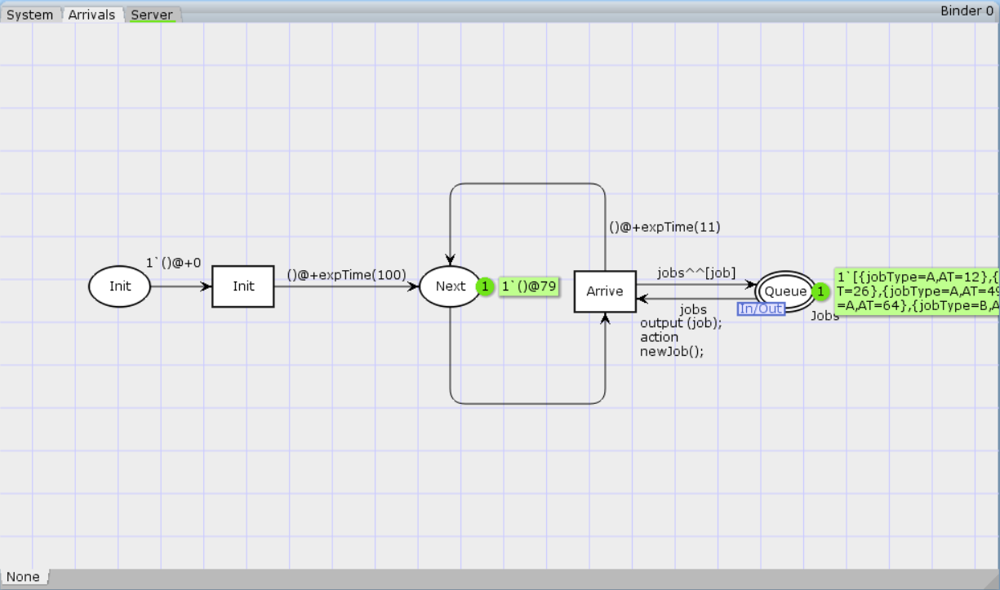

---
## Front matter
title: "Лабораторная работа №11"
subtitle: "Модель системы массового обслуживания $M|M|1$"
author: "Королёв Иван Андреевич"

## Generic otions
lang: ru-RU
toc-title: "Содержание"

## Bibliography
bibliography: bib/cite.bib
csl: pandoc/csl/gost-r-7-0-5-2008-numeric.csl

## Pdf output format
toc: true # Table of contents
toc-depth: 2
lof: true # List of figures
lot: false # List of tables
fontsize: 12pt
linestretch: 1.5
papersize: a4
documentclass: scrreprt
## I18n polyglossia
polyglossia-lang:
  name: russian
  options:
	- spelling=modern
	- babelshorthands=true
polyglossia-otherlangs:
  name: english
## I18n babel
babel-lang: russian
babel-otherlangs: english
## Fonts
mainfont: PT Serif
romanfont: PT Serif
sansfont: PT Sans
monofont: PT Mono
mainfontoptions: Ligatures=TeX
romanfontoptions: Ligatures=TeX
sansfontoptions: Ligatures=TeX,Scale=MatchLowercase
monofontoptions: Scale=MatchLowercase,Scale=0.9
## Biblatex
biblatex: true
biblio-style: "gost-numeric"
biblatexoptions:
  - parentracker=true
  - backend=biber
  - hyperref=auto
  - language=auto
  - autolang=other*
  - citestyle=gost-numeric
## Pandoc-crossref LaTeX customization
figureTitle: "Рис."
tableTitle: "Таблица"
listingTitle: "Листинг"
lofTitle: "Список иллюстраций"
lotTitle: "Список таблиц"
lolTitle: "Листинги"
## Misc options
indent: true
header-includes:
  - \usepackage{indentfirst}
  - \usepackage{float} # keep figures where there are in the text
  - \floatplacement{figure}{H} # keep figures where there are in the text
---

# Введение

**Цель работы**

Реализовать модель $M|M|1$ в CPN tools.

# Задание

- Реализовать в CPN Tools модель системы массового обслуживания M|M|1.

# Выполнение лабораторной работы

Создаем три отдельных листа: на первом листе граф системы, на втором - генератор заявок, на третьем - сервер обработки заявок (рис. [-@fig:01]), (рис. [-@fig:02]), (рис. [-@fig:03])

Сеть имеет 2 позиции (очередь — `Queue`, обслуженные заявки — `Complited`)
и два перехода (генерировать заявку — `Arrivals`, передать заявку на обработку сер-
веру — `Server`). Переходы имеют сложную иерархическую структуру, задаваемую
на отдельных листах модели (с помощью соответствующего инструмента меню —
Hierarchy).

Между переходом `Arrivals` и позицией `Queue`, а также между позицией `Queue`
и переходом `Server` установлена дуплексная связь. Между переходом `Server` и позицией `Complited` — односторонняя связь.

Граф генератора заявок имеет 3 позиции (текущая заявка — `Init`, следующая
заявка — `Next`, очередь — `Queue` из листа `System`) и 2 перехода (`Init` — определяет
распределение поступления заявок по экспоненциальному закону с интенсивностью
100 заявок в единицу времени, `Arrive` — определяет поступление заявок в очередь).

Граф процесса обработки заявок на сервере имеет 4 позиции (`Busy` — сервер
занят, `Idle` — сервер в режиме ожидания, `Queue` и `Complited` из листа `System`) и 2
перехода (`Start` — начать обработку заявки, `Stop` — закончить обработку заявки).

{#fig:01 width=70%}

{#fig:02 width=70%}

{#fig:03 width=70%}

Задаем декларации системы. Определим множества цветов системы (colorset):

- фишки типа `UNIT` определяют моменты времени;
- фишки типа `INT` определяют моменты поступления заявок в систему.
- фишки типа `JobType` определяют 2 типа заявок — A и B;
- кортеж `Job` имеет 2 поля: jobType определяет тип работы (соответственно имеет тип `JobType`, поле `AT` имеет тип `INT` и используется для хранения времени нахождения заявки в системе);
- фишки `Jobs` — список заявок;
- фишки типа `ServerxJob` — определяют состояние сервера, занятого обработкой
заявок.

Переменные модели:

- `proctime` — определяет время обработки заявки;
- `job` — определяет тип заявки;
- `jobs` — определяет поступление заявок в очередь.

Определим функции системы:

- функция `expTime` описывает генерацию целочисленных значений через интервалы времени, распределённые по экспоненциальному закону;
- функция `intTime` преобразует текущее модельное время в целое число;
- функция `newJob` возвращает значение из набора `Job` — случайный выбор типа
заявки (A или B). (рис. [-@fig:04])

{#fig:04 width=70%}

## Мониторинг

График изменения задержки в очереди (рис. [-@fig:05])

{#fig:05 width=70%}

# Выводы

В процессе выполнения данной лабораторной работы я реализовал модель системы массового обслуживания $M|M|1$ в CPN Tools.
