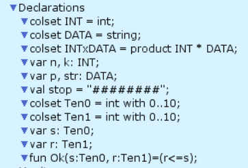
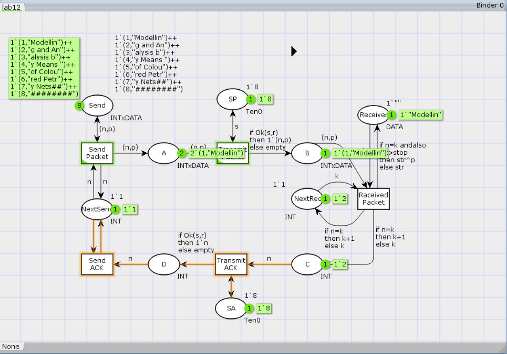

---
## Front matter
lang: ru-RU
title: Лабораторная работа № 12
subtitle: Имитационное моделирование
author:
  - Королёв И.А.
institute:
  - Российский университет дружбы народов, Москва, Россия

## i18n babel
babel-lang: russian
babel-otherlangs: english

## Formatting pdf
toc: false
toc-title: Содержание
slide_level: 2
aspectratio: 169
section-titles: true
theme: metropolis
header-includes:
 - \metroset{progressbar=frametitle,sectionpage=progressbar,numbering=fraction}
---

# Информация

## Докладчик

:::::::::::::: {.columns align=center}
::: {.column width="70%"}

  * Королёв И.А.
  * Студент
  * Российский университет дружбы народов

:::
::::::::::::::

# Введение

## Цели и задачи

**Цель работы**

Реализовать простой протокол передачи данных в CPN Tools.

**Задание**

- Реализовать простой протокол передачи данных в CPN Tools.
- Вычислить пространство состояний, сформировать отчет о нем и построить граф.

# Выполнение лабораторной работы

{#fig:001 width=70%}

# Выполнение лабораторной работы

{#fig:002 width=70%}

# Выполнение лабораторной работы

{#fig:003 width=70%}

# Упражнение

```

 Statistics
------------------------------------------------------------------------

  State Space
     Nodes:  13341
     Arcs:   206461
     Secs:   300
     Status: Partial

  Scc Graph
     Nodes:  6975
     Arcs:   170859
     Secs:   14

```

# Выводы

В процессе выполнения данной лабораторной работы я реализовал простой протокол передачи данных в CPN Tools и проведен анализ его пространства состояний.
