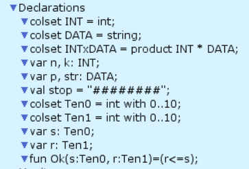
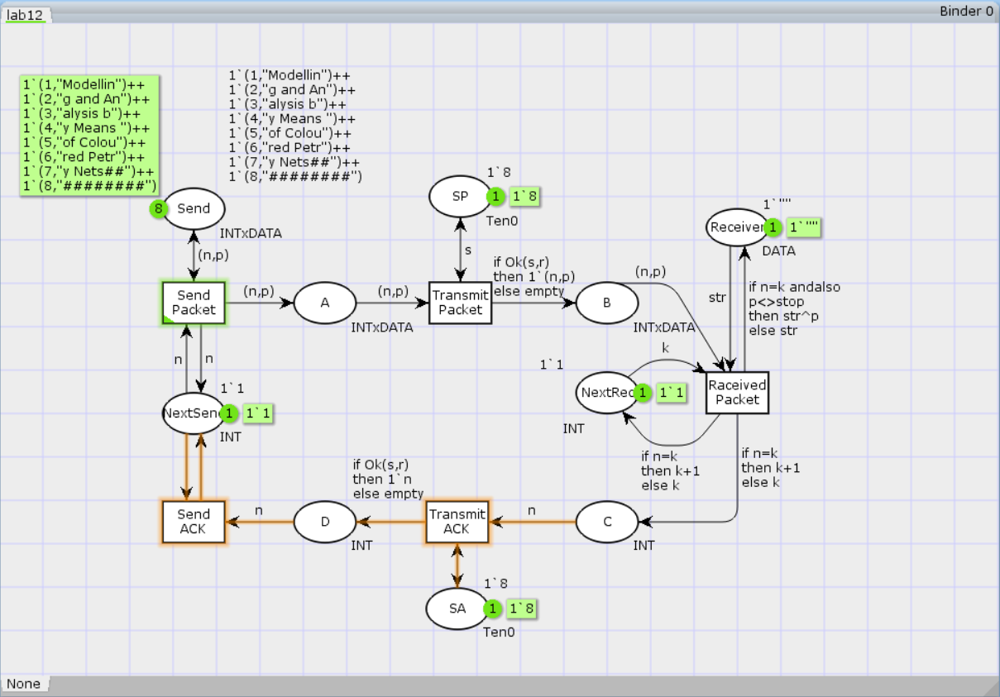
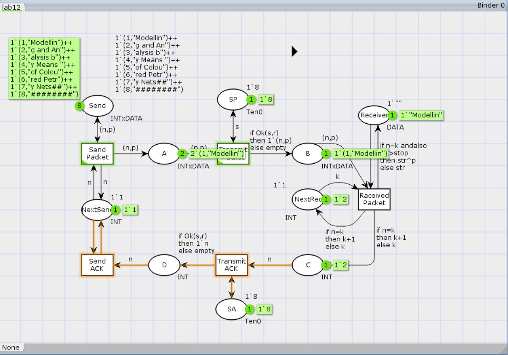

---
## Front matter
title: "Лабораторная работа №12"
subtitle: "Имитационное моделирование"
author: "Королёв Иван"

## Generic otions
lang: ru-RU
toc-title: "Содержание"

## Bibliography
bibliography: bib/cite.bib
csl: pandoc/csl/gost-r-7-0-5-2008-numeric.csl

## Pdf output format
toc: true # Table of contents
toc-depth: 2
lof: true # List of figures
lot: false # List of tables
fontsize: 12pt
linestretch: 1.5
papersize: a4
documentclass: scrreprt
## I18n polyglossia
polyglossia-lang:
  name: russian
  options:
	- spelling=modern
	- babelshorthands=true
polyglossia-otherlangs:
  name: english
## I18n babel
babel-lang: russian
babel-otherlangs: english
## Fonts
mainfont: PT Serif
romanfont: PT Serif
sansfont: PT Sans
monofont: PT Mono
mainfontoptions: Ligatures=TeX
romanfontoptions: Ligatures=TeX
sansfontoptions: Ligatures=TeX,Scale=MatchLowercase
monofontoptions: Scale=MatchLowercase,Scale=0.9
## Biblatex
biblatex: true
biblio-style: "gost-numeric"
biblatexoptions:
  - parentracker=true
  - backend=biber
  - hyperref=auto
  - language=auto
  - autolang=other*
  - citestyle=gost-numeric
## Pandoc-crossref LaTeX customization
figureTitle: "Рис."
tableTitle: "Таблица"
listingTitle: "Листинг"
lofTitle: "Список иллюстраций"
lotTitle: "Список таблиц"
lolTitle: "Листинги"
## Misc options
indent: true
header-includes:
  - \usepackage{indentfirst}
  - \usepackage{float} # keep figures where there are in the text
  - \floatplacement{figure}{H} # keep figures where there are in the text
---

# Введение

## Цели и задачи

**Цель работы**

Реализовать простой протокол передачи данных в CPN Tools.

**Задание**

- Реализовать простой протокол передачи данных в CPN Tools.
- Вычислить пространство состояний, сформировать отчет о нем и построить граф.

# Выполнение лабораторной работы

Основные состояния: источник (Send), получатель (Receiver).
Действия (переходы): отправить пакет (Send Packet), отправить подтверждение (Send ACK).
Промежуточное состояние: следующий посылаемый пакет (NextSend).
Зададим декларации модели (рис. [-@fig:001]).

{#fig:001 width=70%}

Строим модель. Указываем состояния Send, которая имеет тип INTxDATA и начаальную маркировку, которая содержит сообщение, разбитое по 8 символов
Обязательное добавляем стоповый байт, который определяет конец сообщения. Добавляем остальным состояниям типы данных и начальные значения.
После, добавляем промежуточные состояния, определив дополнительно новые декларации и функцию, которая проверяет, что если нет превышения порога, то истина, если нет  - ложь
Добавляем выражения переходов и таким образом, получим модель простого протокола передачи даннных.
Пакет последовательно проходит: состояние Send, переход Send Packet, состояние A, с некоторой вероятностью переход Transmit Packet, состояние B, попадает
на переход Receive Packet, где проверяется номер пакета и если нет совпадения,
то пакет направляется в состояние Received, а номер пакета передаётся последовательно в состояние C, с некоторой вероятностью в переход Transmit ACK,
далее в состояние D, переход Receive ACK, состояние NextSend (увеличивая на 1
номер следующего пакета), переход Send Packet. Так продолжается до тех пор,
пока не будут переданы все части сообщения. Последней будет передана стоп-последовательность(рис. [-@fig:002]).

{#fig:002 width=70%}

Запуск модели. (рис. [-@fig:003]).

{#fig:003 width=70%}

## Упражнение

Вычислим пространство состояний. Прежде, чем пространство состояний может быть вычислено и проанализировано, необходимо сформировать код пространства состояний. Этот код создается, когда используется инструмент Войти в пространство состояний. Вход в пространство состояний занимает некоторое время. Затем, если ожидается, что пространство состояний будет небольшим, можно просто применить инструмент Вычислить пространство состояний к листу, содержащему страницу сети. Сформируем отчёт о пространстве состояний и проанализируем его.  Чтобы сохранить отчет, необходимо применить инструмент Сохранить отчет о пространстве состояний к листу, содержащему страницу сети и ввести имя файла отчета.

Из него можно увидеть:

- 13341 состояний и 206461 переходов между ними.
- Указаны границы значений для каждого элемента: промежуточные состояния A, B, C(наибольшая верхняя граница у A, так как после него пакеты отбрасываются. Так как мы установили максимум 10, то у следующего состояния B верхняя граница -- 10), вспомогательные состояния SP, SA, NextRec, NextSend, Receiver(в них может находиться только один пакет) и состояние Send(в нем хранится только 8 элементов, так как мы задали их в начале и с ними никаких изменений не происходит).
- Указаны границы в виде мультимножеств.
- Маркировка home для всех состояний (в любую позицию можно попасть из любой другой маркировки).
- Маркировка dead равная 4675 [9999,9998,9997,9996,9995,...] -- это состояния, в которых нет включенных переходов.

```

 Statistics
------------------------------------------------------------------------

  State Space
     Nodes:  13341
     Arcs:   206461
     Secs:   300
     Status: Partial

  Scc Graph
     Nodes:  6975
     Arcs:   170859
     Secs:   14


 Boundedness Properties
------------------------------------------------------------------------

  Best Integer Bounds
                             Upper      Lower
     Main'A 1                20         0
     Main'B 1                10         0
     Main'C 1                6          0
     Main'D 1                5          0
     Main'NextRec 1          1          1
     Main'NextSend 1         1          1
     Main'Reciever 1         1          1
     Main'SA 1               1          1
     Main'SP 1               1          1
     Main'Send 1             8          8

  Best Upper Multi-set Bounds
     Main'A 1            20`(1,"Modellin")++
15`(2,"g and An")++
9`(3,"alysis b")++
4`(4,"y Means ")
     Main'B 1            10`(1,"Modellin")++
7`(2,"g and An")++
4`(3,"alysis b")++
2`(4,"y Means ")
     Main'C 1            6`2++
5`3++
3`4++
1`5
     Main'D 1            5`2++
3`3++
2`4++
1`5
     Main'NextRec 1      1`1++
1`2++
1`3++
1`4++
1`5
     Main'NextSend 1     1`1++
1`2++
1`3++
1`4
     Main'Reciever 1     1`""++
1`"Modellin"++
1`"Modelling and An"++
1`"Modelling and Analysis b"++
1`"Modelling and Analysis by Means "
     Main'SA 1           1`8
     Main'SP 1           1`8
     Main'Send 1         1`(1,"Modellin")++
1`(2,"g and An")++
1`(3,"alysis b")++
1`(4,"y Means ")++
1`(5,"of Colou")++
1`(6,"red Petr")++
1`(7,"y Nets##")++
1`(8,"########")

  Best Lower Multi-set Bounds
     Main'A 1            empty
     Main'B 1            empty
     Main'C 1            empty
     Main'D 1            empty
     Main'NextRec 1      empty
     Main'NextSend 1     empty
     Main'Reciever 1     empty
     Main'SA 1           1`8
     Main'SP 1           1`8
     Main'Send 1         1`(1,"Modellin")++
1`(2,"g and An")++
1`(3,"alysis b")++
1`(4,"y Means ")++
1`(5,"of Colou")++
1`(6,"red Petr")++
1`(7,"y Nets##")++
1`(8,"########")


 Home Properties
------------------------------------------------------------------------

  Home Markings
     None


 Liveness Properties
------------------------------------------------------------------------

  Dead Markings
     4675 [9999,9998,9997,9996,9995,...]

  Dead Transition Instances
     None

  Live Transition Instances
     None


 Fairness Properties
------------------------------------------------------------------------
       Main'Recieved_Packet 1 No Fairness
       Main'Send_ACK 1        No Fairness
       Main'Send_Packet 1     Impartial
       Main'Transmit_ACK 1    No Fairness
       Main'Transmit_Packet 1 Impartial
```


# Выводы

В процессе выполнения данной лабораторной работы я реализовал простой протокол передачи данных в CPN Tools и проведен анализ его пространства состояний.
