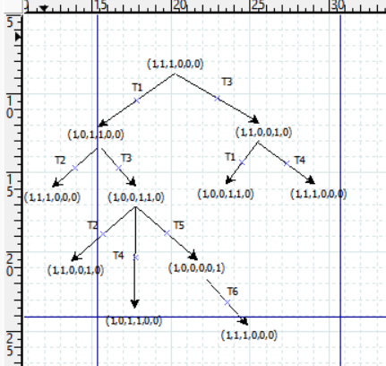
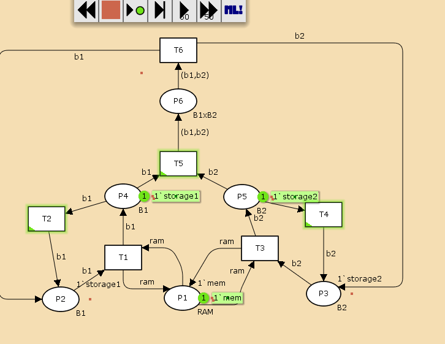
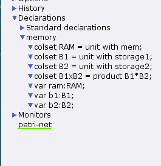
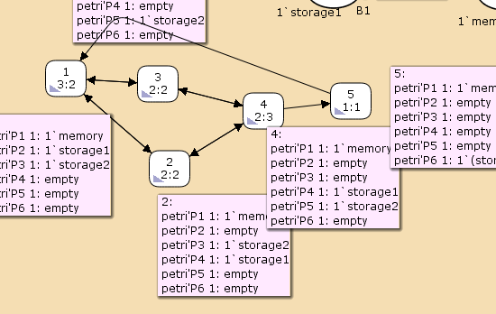

---
## Front matter
lang: ru-RU
title: Лабораторная работа № 13
subtitle: Имитационное моделирование
author:
  - Королёв И.А.
institute:
  - Российский университет дружбы народов, Москва, Россия
  
## i18n babel
babel-lang: russian
babel-otherlangs: english

## Formatting pdf
toc: false
toc-title: Содержание
slide_level: 2
aspectratio: 169
section-titles: true
theme: metropolis
header-includes:
 - \metroset{progressbar=frametitle,sectionpage=progressbar,numbering=fraction}
---

# Цель работы

Необходимо выполнить задание для самостоятельного выполнения. Провести анализ сети Петри с помощью дерева достижимости, промоделировать сеть Петри и вычислить пр-во состояний, сформулировать отчёт и построитиь граф пр-ва состояний.

# Задание

1. Используя теоретические методы анализа сетей Петри, провести анализ сети (с помощью построения дерева достижимости). Определить, является ли сеть безопасной, ограниченной, сохраняющей, имеются ли
тупики.
2. Промоделировать сеть Петри с помощью CPNTools.
3. Вычислить пространство состояний. Сформировать отчёт о пространстве состояний и проанализировать его.Построить граф пространства состояний.

# Теоретическое введение

Сеть Петри — математический объект, используемый для моделирования динамических дискретных систем, предложенный Карлом Петри в 1962 году. 

# Выполнение лабораторной работы

# Анализ сети Петри

{#fig:001 width=70%}

# Выполнение лабораторной работы 

{#fig:002 width=70%}

# Выполнение лабораторной работы 

{#fig:003 width=70%}

# Пространство состояний

{#fig:004 width=70%}

# Пространство состояний

Из отчета можно увидеть:

- есть 5 состояний и 10 переходов между ними, strongly connected components (SCC) graph содержит 1 вершину и 0 переходов.
- Затем указаны границы значений для каждого элемента: состояние P1 всегда заполнено 1 элементом, а остальные содержат максимум 1 элемент, минимум -- 0.
- Также указаны границы в виде мультимножеств.
- Маркировка home для всех состояний, так как в любую позицию мы можем попасть из любой другой маркировки.
- Маркировка dead равная None, так как нет состояний, из которых переходов быть не может.
- В конце указано, что бесконечно часто могут происходить переходы T1, T2, T3, T4, но не обязательно, также состояние T5 необходимо для того, чтобы система не попадала в тупик, а состояние T6 происходит всегда, если доступно.

# Выводы

Выполнил задание для самостоятельного выполнения. Провел анализ сети Петри с помощью дерева достижимости, промоделировал сеть Петри и вычислил пр-во состояний, сформулировал отчёт и построил граф пр-ва состояний.

# Список литературы{.unnumbered}

::: {#refs}
:::
