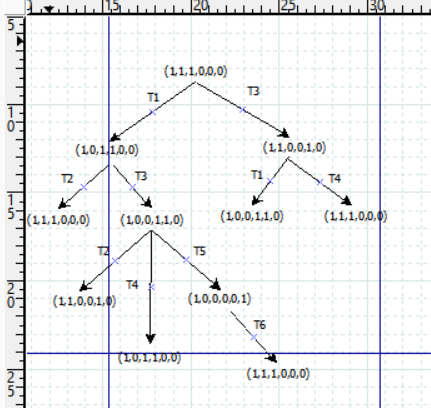

---
## Front matter
title: "Лабораторная работа № 13"
subtitle: "Имитационное моделирование"
author: "Королёв Иван"

## Generic otions
lang: ru-RU
toc-title: "Содержание"

## Bibliography
bibliography: bib/cite.bib
csl: pandoc/csl/gost-r-7-0-5-2008-numeric.csl

## Pdf output format
toc: true # Table of contents
toc-depth: 2
lof: true # List of figures
lot: true # List of tables
fontsize: 12pt
linestretch: 1.5
papersize: a4
documentclass: scrreprt
## I18n polyglossia
polyglossia-lang:
  name: russian
  options:
	- spelling=modern
	- babelshorthands=true
polyglossia-otherlangs:
  name: english
## I18n babel
babel-lang: russian
babel-otherlangs: english
## Fonts
mainfont: IBM Plex Serif
romanfont: IBM Plex Serif
sansfont: IBM Plex Sans
monofont: IBM Plex Mono
mathfont: STIX Two Math
mainfontoptions: Ligatures=Common,Ligatures=TeX,Scale=0.94
romanfontoptions: Ligatures=Common,Ligatures=TeX,Scale=0.94
sansfontoptions: Ligatures=Common,Ligatures=TeX,Scale=MatchLowercase,Scale=0.94
monofontoptions: Scale=MatchLowercase,Scale=0.94,FakeStretch=0.9
mathfontoptions:
## Biblatex
biblatex: true
biblio-style: "gost-numeric"
biblatexoptions:
  - parentracker=true
  - backend=biber
  - hyperref=auto
  - language=auto
  - autolang=other*
  - citestyle=gost-numeric
## Pandoc-crossref LaTeX customization
figureTitle: "Рис."
tableTitle: "Таблица"
listingTitle: "Листинг"
lofTitle: "Список иллюстраций"
lotTitle: "Список таблиц"
lolTitle: "Листинги"
## Misc options
indent: true
header-includes:
  - \usepackage{indentfirst}
  - \usepackage{float} # keep figures where there are in the text
  - \floatplacement{figure}{H} # keep figures where there are in the text
---

# Цель работы

Необходимо выполнить задание для самостоятельного выполнения. Провести анализ сети Петри с помощью дерева достижимости, промоделировать сеть Петри и вычислить пр-во состояний, сформулировать отчёт и построитиь граф пр-ва состояний.

# Задание

1. Используя теоретические методы анализа сетей Петри, провести анализ сети (с помощью построения дерева достижимости). Определить, является ли сеть безопасной, ограниченной, сохраняющей, имеются ли
тупики.
2. Промоделировать сеть Петри с помощью CPNTools.
3. Вычислить пространство состояний. Сформировать отчёт о пространстве состояний и проанализировать его.Построить граф пространства состояний.

# Теоретическое введение

Сеть Петри — математический объект, используемый для моделирования динамических дискретных систем, предложенный Карлом Петри в 1962 году. 

# Выполнение лабораторной работы

## Анализ сети Петри

Построим дерево достижимости (рис. [-@fig:001]).

{#fig:001 width=70%}

Можем увидеть, что представленная сеть:

- безопасна, поскольку в каждой позиции количество фишек не превышает 1;
- ограничена, так как существует такое целое k, что число
фишек в каждой позиции не может превысить k (в данном случае k=1);
- сеть не имеет тупиков;
- сеть не является сохраняющей, так как при переходах t5 и t6 количество фишек меняется.

## Выполнение лабораторной работы 

Моделируем сеть Петри, добавляем позиции, переход и дуги. Далее, в меню задаём новые декларации модели: типы фишек, начальные значения позиций, выражения для дуг. После этого задаем типы фишка и указываем начальные значения мультимножеств. (рис. [-@fig:002]), (рис. [-@fig:003]).

{#fig:002 width=70%}

{#fig:003 width=70%}

## Пространство состояний

Граф пространства состояний, их всего 5 ([-@fig:004]).

{#fig:004 width=70%}

Из отчета можно увидеть:

- есть 5 состояний и 10 переходов между ними, strongly connected components (SCC) graph содержит 1 вершину и 0 переходов.
- Затем указаны границы значений для каждого элемента: состояние P1 всегда заполнено 1 элементом, а остальные содержат максимум 1 элемент, минимум -- 0.
- Также указаны границы в виде мультимножеств.
- Маркировка home для всех состояний, так как в любую позицию мы можем попасть из любой другой маркировки.
- Маркировка dead равная None, так как нет состояний, из которых переходов быть не может.
- В конце указано, что бесконечно часто могут происходить переходы T1, T2, T3, T4, но не обязательно, также состояние T5 необходимо для того, чтобы система не попадала в тупик, а состояние T6 происходит всегда, если доступно.

```
------------------------------------------------------------------------

  State Space
     Nodes:  5
     Arcs:   10
     Secs:   0
     Status: Full

  Scc Graph
     Nodes:  1
     Arcs:   0
     Secs:   0

 Boundedness Properties
------------------------------------------------------------------------

  Best Integer Bounds
                             Upper      Lower
     petri'P1 1              1          1
     petri'P2 1              1          0
     petri'P3 1              1          0
     petri'P4 1              1          0
     petri'P5 1              1          0
     petri'P6 1              1          0

  Best Upper Multi-set Bounds
     petri'P1 1          1`memory
     petri'P2 1          1`storage1
     petri'P3 1          1`storage2
     petri'P4 1          1`storage1
     petri'P5 1          1`storage2
     petri'P6 1          1`(storage1,storage2)

  Best Lower Multi-set Bounds
     petri'P1 1          1`memory
     petri'P2 1          empty
     petri'P3 1          empty
     petri'P4 1          empty
     petri'P5 1          empty
     petri'P6 1          empty


 Home Properties
------------------------------------------------------------------------

  Home Markings
     All


 Liveness Properties
------------------------------------------------------------------------

  Dead Markings
     None

  Dead Transition Instances
     None

  Live Transition Instances
     All


 Fairness Properties
------------------------------------------------------------------------
       petri'T1 1             No Fairness
       petri'T2 1             No Fairness
       petri'T3 1             No Fairness
       petri'T4 1             No Fairness
       petri'T5 1             Just
       petri'T6 1             Fair
```

# Выводы

Выполнил задание для самостоятельного выполнения. Провел анализ сети Петри с помощью дерева достижимости, промоделировал сеть Петри и вычислил пр-во состояний, сформулировал отчёт и построил граф пр-ва состояний.

# Список литературы{.unnumbered}

::: {#refs}
:::
