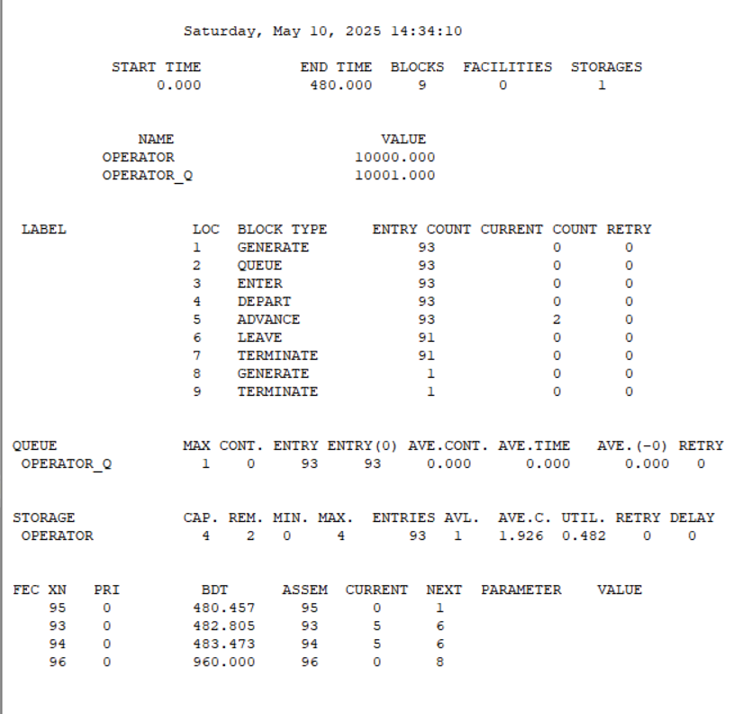

---
## Front matter
lang: ru-RU
title: Лабораторная работа № 14
subtitle: Имитационное моделирование
author:
  - Королёв И.А.
institute:
  - Российский университет дружбы народов, Москва, Россия

## i18n babel
babel-lang: russian
babel-otherlangs: english

## Formatting pdf
toc: false
toc-title: Содержание
slide_level: 2
aspectratio: 169
section-titles: true
theme: metropolis
header-includes:
 - \metroset{progressbar=frametitle,sectionpage=progressbar,numbering=fraction}
---

# Информация

## Докладчик

:::::::::::::: {.columns align=center}
::: {.column width="70%"}

  * Королёв И.А.
  * Студент
  * Российский университет дружбы народов

:::
::::::::::::::

# Цель работы

Реализовать модели обработки заказов в gpss world.

# Задание

* Построение модели оформления заказов клиентов одним оператором
* Построение модели обслуживания двух типов заказов от клиентов в интернет-магазине
* Построение модели оформления заказов несколькими операторами

# Теоретическое введение

gpss - язык моделирования, используемый для имитационного моделирования различных систем, в основном систем массового обслуживания

# Выполнение лабораторной работы

# Построение модели оформления заказов клиентов одним оператором

Модель будет состоять из двух частей: моделирование обработки заказов в интернет-магазине и задание времени моделирования. Для задания равномерного распределения поступления заказов используем блок `GENERATE`, для задания равномерного времени обслуживания (задержки в системе) -- `ADVANCE`. Для моделирования ожидания заявок клиентов в очереди используем блоки `QUEUE` и `DEPART`, в которых в качестве имени очереди укажем `operator_q` Для моделирования поступления заявок для оформления заказов к оператору используем блоки `SEIZE` и `RELEASE` с параметром `operator` — имени «устройства обслуживания».

Требуется, чтобы модельное время было 8 часов. Соответственно, параметр блока `GENERATE` -- 480 (8 часов по 60 минут, всего 480 минут). Работа программы начинается с оператора `START` с начальным значением счётчика завершений, равным 1; заканчивается -- оператором `TERMINATE` с параметром 1, что задаёт ординарность потока в модели.

# Построение модели оформления заказов клиентов одним оператором

{#fig:001 width=70%}

# Построение модели оформления заказов клиентов одним оператором

{#fig:002 width=70%}

# **Упражнение.** 

{#fig:003 width=70%}

# Построение модели оформления заказов клиентов одним оператором

{#fig:004 width=70%}

# Построение модели оформления заказов клиентов одним оператором

{#fig:005 width=70%}

# Построение модели оформления заказов клиентов одним оператором

{#fig:006 width=70%}

# Построение модели обслуживания двух типов заказов от клиентов в интернет-магазине

{#fig:007 width=70%}

# Построение модели обслуживания двух типов заказов от клиентов в интернет-магазине

{#fig:08 width=70%}

# **Упражнение.** 

{#fig:09 width=70%}

# Построение модели обслуживания двух типов заказов от клиентов в интернет-магазине

{#fig:010 width=70%}

# Построение модели оформления заказов несколькими операторами

{#fig:011 width=70%}

# Построение модели оформления заказов несколькими операторами

{#fig:012 width=70%}

# Построение модели оформления заказов несколькими операторами

{#fig:013 width=70%}

# Построение модели оформления заказов несколькими операторами

{#fig:014 width=70%}

# Выводы

Реализовал модели обработки заказов в gpss world.

# Список литературы{.unnumbered}

::: {#refs}
:::
