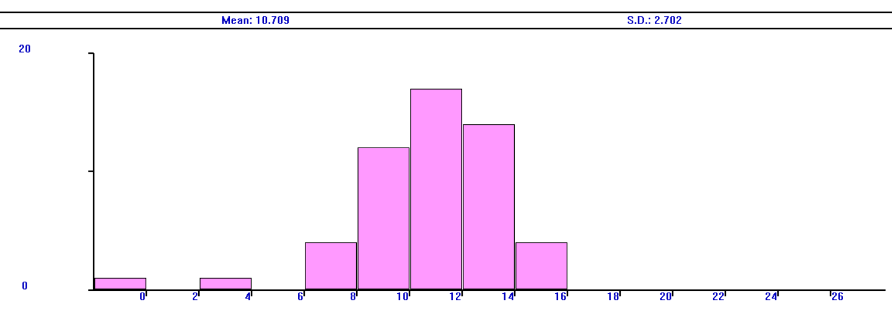

---
## Front matter
title: "Лабораторная работа № 14"
subtitle: "Имитационное моделирование"
author: "Королёв Иван Андреевич"

## Generic otions
lang: ru-RU
toc-title: "Содержание"

## Bibliography
bibliography: bib/cite.bib
csl: pandoc/csl/gost-r-7-0-5-2008-numeric.csl

## Pdf output format
toc: true # Table of contents
toc-depth: 2
lof: true # List of figures
lot: true # List of tables
fontsize: 12pt
linestretch: 1.5
papersize: a4
documentclass: scrreprt
## I18n polyglossia
polyglossia-lang:
  name: russian
  options:
	- spelling=modern
	- babelshorthands=true
polyglossia-otherlangs:
  name: english
## I18n babel
babel-lang: russian
babel-otherlangs: english
## Fonts
mainfont: IBM Plex Serif
romanfont: IBM Plex Serif
sansfont: IBM Plex Sans
monofont: IBM Plex Mono
mathfont: STIX Two Math
mainfontoptions: Ligatures=Common,Ligatures=TeX,Scale=0.94
romanfontoptions: Ligatures=Common,Ligatures=TeX,Scale=0.94
sansfontoptions: Ligatures=Common,Ligatures=TeX,Scale=MatchLowercase,Scale=0.94
monofontoptions: Scale=MatchLowercase,Scale=0.94,FakeStretch=0.9
mathfontoptions:
## Biblatex
biblatex: true
biblio-style: "gost-numeric"
biblatexoptions:
  - parentracker=true
  - backend=biber
  - hyperref=auto
  - language=auto
  - autolang=other*
  - citestyle=gost-numeric
## Pandoc-crossref LaTeX customization
figureTitle: "Рис."
tableTitle: "Таблица"
listingTitle: "Листинг"
lofTitle: "Список иллюстраций"
lotTitle: "Список таблиц"
lolTitle: "Листинги"
## Misc options
indent: true
header-includes:
  - \usepackage{indentfirst}
  - \usepackage{float} # keep figures where there are in the text
  - \floatplacement{figure}{H} # keep figures where there are in the text
---

# Цель работы

Реализовать модели обработки заказов в gpss world.

# Задание

* Построение модели оформления заказов клиентов одним оператором
* Построение модели обслуживания двух типов заказов от клиентов в интернет-магазине
* Построение модели оформления заказов несколькими операторами

# Теоретическое введение

gpss - язык моделирования, используемый для имитационного моделирования различных систем, в основном систем массового обслуживания

# Выполнение лабораторной работы

## Построение модели оформления заказов клиентов одним оператором

Модель будет состоять из двух частей: моделирование обработки заказов в интернет-магазине и задание времени моделирования. Для задания равномерного распределения поступления заказов используем блок `GENERATE`, для задания равномерного времени обслуживания (задержки в системе) -- `ADVANCE`. Для моделирования ожидания заявок клиентов в очереди используем блоки `QUEUE` и `DEPART`, в которых в качестве имени очереди укажем `operator_q` Для моделирования поступления заявок для оформления заказов к оператору используем блоки `SEIZE` и `RELEASE` с параметром `operator` — имени «устройства обслуживания».

Требуется, чтобы модельное время было 8 часов. Соответственно, параметр блока `GENERATE` -- 480 (8 часов по 60 минут, всего 480 минут). Работа программы начинается с оператора `START` с начальным значением счётчика завершений, равным 1; заканчивается -- оператором `TERMINATE` с параметром 1, что задаёт ординарность потока в модели.

Таким образом, имеем (рис. [-@fig:001]).

{#fig:001 width=70%}

На выходе работы программы получаем отчёт. (рис. [-@fig:002]).

{#fig:002 width=70%}

**Упражнение.** 

Меняю интервалы поступления заказов и время оформления заказов клиентов (рис. [-@fig:003]).

{#fig:003 width=70%}

На выходе работы программы получаем отчёт. В результате работы модельное время в начале моделирования: `START TIME`=0.0, момент, когда счетчик завершений принял значение 0: `END TIME`=480.0, количество блоков, использованных в текущей модели, к моменту завершения моделирования: `BLOCKS`=9, количество одноканальных устройств, использованных в модели к моменту завершения моделирования: `FACILITIES`=1, количество многоканальных устройств, использованных в текущей модели к моменту завершения моделирования: `STORAGES`=0. 

**Гистограмма** Команда описания такой таблицы `QTABLE` имеет следующий формат: `Name QTABLE A,B,C,D`
Здесь `Name` -- метка, определяющая имя таблицы. Далее должны быть заданы операнды: `А` задается элемент данных, чьё частотное распределение будет заноситься в таблицу (может быть именем, выражением в скобках или системным числовым атрибутом (СЧА)); `B` задается верхний предел первого частотного интервала; `С` задает ширину частотного интервала — разницу между верхней и нижней границей каждого частотного класса; `D` задаёт число частотных интервалов. 

Код программы будет следующим(рис. [-@fig:004]).

{#fig:004 width=70%}

Гистограмма.  (рис. [-@fig:005]).

{#fig:005 width=70%}

Отчет. [-@fig:006]).

{#fig:006 width=70%}

Проанализируем гистограмму и отчёт. На выходе работы программы получаем отчёт. В результате работы модельное время в начале моделирования: `START TIME`=0.0, момент, когда счетчик завершений принял значение 0: `END TIME`=353.895, количество блоков, использованных в текущей модели, к моменту завершения моделирования: `BLOCKS`=10, количество одноканальных устройств, использованных в модели к моменту завершения моделирования: `FACILITIES`=1, количество многоканальных устройств, использованных в текущей модели к моменту завершения моделирования: `STORAGES`=0. 

Частотность разделена на 15 частотных интервалов с шагом 2 и началом в 0, как мы и задали. Наибольшее количество заявок (17) обрабатывалось 10-12 минут, 14 заявок -- 12-14 минут, 12 заявок -- 8-10 минут, в остальных диапазонах 0-4 заявок. 

## Построение модели обслуживания двух типов заказов от клиентов в интернет-магазине

Необходимо реализовать отличие в оформлении обычных заказов и заказов с дополнительным пакетом услуг. Такую систему можно промоделировать с помощью двух сегментов. Один из них моделирует оформление обычных заказов, а второй -- заказов с дополнительным пакетом услуг. В каждом из сегментов пара `QUEUE–DEPART` должна описывать одну и ту же очередь, а пара блоков `SEIZE–RELEASE` должна описывать в каждом из двух сегментов одно и то же устройство и моделировать работу оператора.
Код и отчет результатов моделирования следующие (рис. [-@fig:007], [-@fig:08]).

{#fig:007 width=70%}

{#fig:08 width=70%}

**Упражнение.** 

Скорректируем модель так, чтобы учитывалось условие, что число заказов с дополнительным пакетом услуг составляет 30% от общего числа заказов.

Будем использовать один блок `order`, а разделим типы заявок с помощью переходов оператором `TRANSFER`. Каждый заказ обрабатывается $10 \pm 2$ минуты, после этого зададим оператор `TRANSFER`, в котором укажем, что с вероятностью 0.7 происходит обработка заявки (переход к блоку `noextra` `RELEASE` operator), а с вероятностью 0.3 дополнительно заказ обрабатывается еще $5 \pm 2$ минуты (переход к блоку `extra` `ADVANCE` 5,2) и только после этого является обработанным ( рис. [-@fig:09]).

{#fig:09 width=70%}

Проанализируем отчёт. На выходе работы программы получаем отчёт. В результате работы модельное время в начале моделирования: `START TIME`=0.0, момент, когда счетчик завершений принял значение 0: `END TIME`=480.0, количество блоков, использованных в текущей модели, к моменту завершения моделирования: `BLOCKS`=11, количество одноканальных устройств, использованных в модели к моменту завершения моделирования: `FACILITIES`=1, количество многоканальных устройств, использованных в текущей модели к моменту завершения моделирования: `STORAGES`=0.  (рис. [-@fig:010]).

{#fig:010 width=70%}

## Построение модели оформления заказов несколькими операторами

В интернет-магазине заказы принимают 4 оператора. Интервалы поступления заказов распределены равномерно с интервалом $5 \pm 2$ мин. Время оформления заказа каждым оператором также распределено равномерно на интервале $10 \pm 2$ мин. обработка поступивших заказов происходит в порядке очереди (FIFO). Требуется определить характеристики очереди заявок на оформление заказов при условии, что заявка может обрабатываться одним из 4-х операторов в течение восьмичасового рабочего дня

С помощью строки `operator STORAGE 4` указываем, что у нас 4 оператора, затем к обычной процедуре генерации и обработки заявки добавляется, что заявку обрабатывает один оператор `operator,1`, сегмент моделирования времени остается без изменений (рис. [-@fig:011]).

{#fig:011 width=70%}

Далее получим и проанализируем отчет (рис. [-@fig:012]).

{#fig:012 width=70%}

**Упражнение**

Изменим модель: требуется учесть в ней возможные отказы клиентов от заказа -- когда при подаче заявки на заказ клиент видит в очереди более двух других заявок, он отказывается от подачи заявки, то есть отказывается от обслуживания (используем блок `TEST` и стандартный числовой атрибут Qj текущей длины очереди j).

Добавим строчку `TEST LE Q$operator_q,2`, которая проверяет больше ли в очереди клиентов, чем два, если нет -- клиент поступает на обработку, иначе уходит. Также в ранее проанализированном отчете видно, что клиентов в очереди не было больше 2, поэтому увеличим время обработки заказов до $30 \pm 2$ мин., чтобы проверить результаты изменений модели (рис. [-@fig:013]).

{#fig:013 width=70%}

Проанализируем отчёт. На выходе работы программы получаем отчёт. В результате работы модельное время в начале моделирования: `START TIME`=0.0, момент, когда счетчик завершений принял значение 0: `END TIME`=480.0, количество блоков, использованных в текущей модели, к моменту завершения моделирования: `BLOCKS`=9, количество одноканальных устройств, использованных в модели к моменту завершения моделирования: `FACILITIES`=1, количество многоканальных устройств, использованных в текущей модели к моменту завершения моделирования: `STORAGES`=0. (рис. [~@fig:014]).

{#fig:014 width=70%}

# Выводы

Реализовал модели обработки заказов в gpss world.

# Список литературы{.unnumbered}

::: {#refs}
:::
