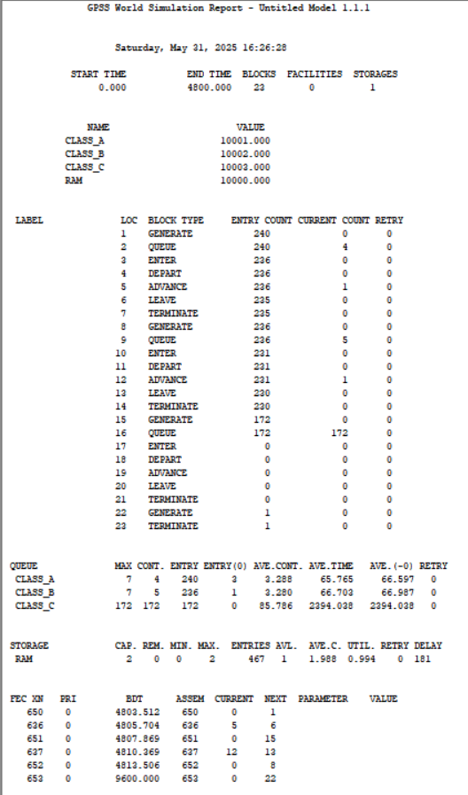
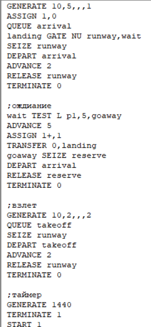
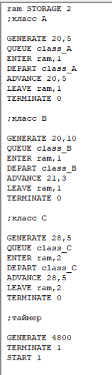

---
## Front matter
lang: ru-RU
title: Лабораторная работа № 15
subtitle: Имитационное моделирование
author:
  - Королёв И.А.
institute:
  - Российский университет дружбы народов, Москва, Россия

## i18n babel
babel-lang: russian
babel-otherlangs: english

## Formatting pdf
toc: false
toc-title: Содержание
slide_level: 2
aspectratio: 169
section-titles: true
theme: metropolis
header-includes:
 - \metroset{progressbar=frametitle,sectionpage=progressbar,numbering=fraction}
---

# Информация

## Докладчик

:::::::::::::: {.columns align=center}
::: {.column width="70%"}

  * Королёв И.А.
  * Студент
  * Российский университет дружбы народов

:::
::::::::::::::

# Цель работы

Реализовать модели обслуживания с приоритетами и провести анализ результатов.

# Задание

1. Смоделировать модель обслуживания механиков на складе
2. Смоделировать модель обслуживания в порту судов двух типов

# Выполнение лабораторной работы

# Моделирование модели обслуживания механиков на складе

{#fig:001 width=70%}

# Моделирование модели обслуживания механиков на складе

{#fig:002 width=70%}

# Моделирование модели обслуживания в порту судов двух типов

{#fig:003 width=70%}

# Моделирование модели обслуживания в порту судов двух типов

{#fig:004 width=70%}

# Выводы

Реализовал модели обслуживания с приоритетами и провести анализ результатов.

