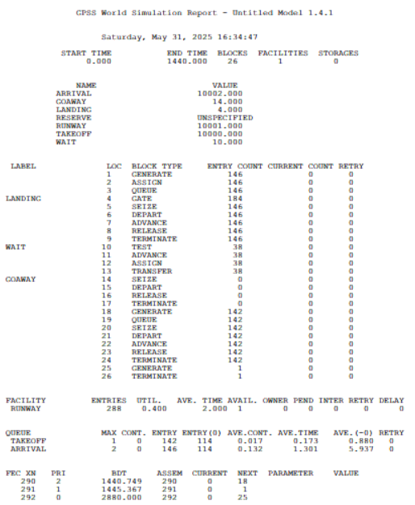

---
## Front matter
lang: ru-RU
title: Лабораторная работа № 17
subtitle: Имитационное моделирование
author:
  - Королёв И.А.
institute:
  - Российский университет дружбы народов, Москва, Россия

## i18n babel
babel-lang: russian
babel-otherlangs: english

## Formatting pdf
toc: false
toc-title: Содержание
slide_level: 2
aspectratio: 169
section-titles: true
theme: metropolis
header-includes:
 - \metroset{progressbar=frametitle,sectionpage=progressbar,numbering=fraction}
---

# Информация

## Докладчик

:::::::::::::: {.columns align=center}
::: {.column width="70%"}

  * Королёв И.А.
  * Студент
  * Российский университет дружбы народов

:::
::::::::::::::

# Цель работы

Реализовать с помощью gpss модели работы вычислительного центра, аэропорта и морского порта.

# Задание

Реализовать с помощью gpss:

- модель работы вычислительного центра;
- модель работы аэропорта;
- модель работы морского порта.

# Выполнение лабораторной работы

# Моделирование работы вычислительного центра

{#fig:001 width=55%}

# Моделирование работы вычислительного центра

{#fig:002 width=55%}

# Модель работы аэропорта

{#fig:003 width=55%}

# Модель работы аэропорта

{#fig:004 width=55%}

# Моделирование работы морского порта

{#fig:005 width=55%}

# Моделирование работы морского порта

{#fig:006 width=55%}

# Моделирование работы морского порта

{#fig:007 width=55%}

# Моделирование работы морского порта

{#fig:008 width=55%}

# Моделирование работы морского порта

{#fig:009 width=55%}

# Моделирование работы морского порта

{#fig:010 width=55%}

# Моделирование работы морского порта

{#fig:011 width=55%}

# Моделирование работы морского порта

{#fig:012 width=55%}

# Выводы

Реализованы модели: 

- модель работы вычислительного центра;
- модель работы аэропорта;
- модель работы морского порта.
