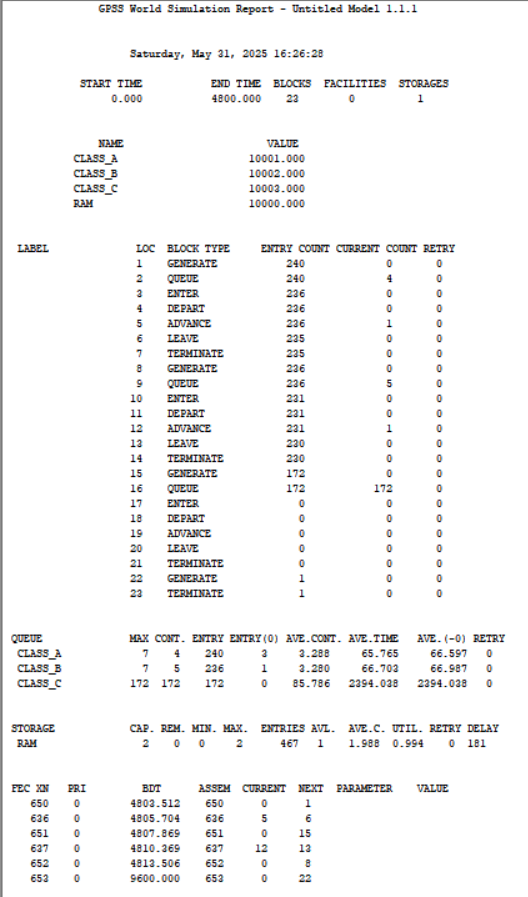

---
## Front matter
title: "Лабораторная работа № 15"
subtitle: "Математическое моделирование"
author: "Королёв Иван"

## Generic otions
lang: ru-RU
toc-title: "Содержание"

## Bibliography
bibliography: bib/cite.bib
csl: pandoc/csl/gost-r-7-0-5-2008-numeric.csl

## Pdf output format
toc: true # Table of contents
toc-depth: 2
lof: true # List of figures
lot: true # List of tables
fontsize: 12pt
linestretch: 1.5
papersize: a4
documentclass: scrreprt
## I18n polyglossia
polyglossia-lang:
  name: russian
  options:
	- spelling=modern
	- babelshorthands=true
polyglossia-otherlangs:
  name: english
## I18n babel
babel-lang: russian
babel-otherlangs: english
## Fonts
mainfont: IBM Plex Serif
romanfont: IBM Plex Serif
sansfont: IBM Plex Sans
monofont: IBM Plex Mono
mathfont: STIX Two Math
mainfontoptions: Ligatures=Common,Ligatures=TeX,Scale=0.94
romanfontoptions: Ligatures=Common,Ligatures=TeX,Scale=0.94
sansfontoptions: Ligatures=Common,Ligatures=TeX,Scale=MatchLowercase,Scale=0.94
monofontoptions: Scale=MatchLowercase,Scale=0.94,FakeStretch=0.9
mathfontoptions:
## Biblatex
biblatex: true
biblio-style: "gost-numeric"
biblatexoptions:
  - parentracker=true
  - backend=biber
  - hyperref=auto
  - language=auto
  - autolang=other*
  - citestyle=gost-numeric
## Pandoc-crossref LaTeX customization
figureTitle: "Рис."
tableTitle: "Таблица"
listingTitle: "Листинг"
lofTitle: "Список иллюстраций"
lotTitle: "Список таблиц"
lolTitle: "Листинги"
## Misc options
indent: true
header-includes:
  - \usepackage{indentfirst}
  - \usepackage{float} # keep figures where there are in the text
  - \floatplacement{figure}{H} # keep figures where there are in the text
---

# Цель работы

Реализовать модели обслуживания с приоритетами и провести анализ результатов.

# Задание

1. Смоделировать модель обслуживания механиков на складе
2. Смоделировать модель обслуживания в порту судов двух типов

# Выполнение лабораторной работы

## Моделирование модели обслуживания механиков на складе

Задаю приоритеты запросов путем использования для операнда E блока GENERATE запросов второй категории большего значения, чем для запросов первой категории. Таким образом, модель: (рис. [-@fig:001]).

{#fig:001 width=70%}

Отчёт данной модели (рис. [-@fig:002]).

{#fig:002 width=70%}

модельное время в начале моделирования: `START TIME`=0.0; абсолютное время или момент, когда счетчик завершений принял значение 0: `END TIME`=28800.0; количество блоков, использованных в текущей модели, к моменту завершения моделирования: `BLOCKS`=16; количество одноканальных устройств, использованных в модели к моменту завершения моделирования: `FACILITIES`=1; количество многоканальных устройств, использованных в текущей модели к моменту завершения моделирования: `STORAGES`=0. Имена, используемые в программе модели: `QS1`(первый тип заявок), `QS2`(второй тип заявок), `STOCKMAN`(обработчик заявок). Было сгенерировано 71 заявка первого типа и 83 второго, а обработано 64 и 81 соответственно. Полезность работы оператора составила 0,967. При этом среднее время занятости оператора составило 190,733 мин.

## Моделирование модели обслуживания в порту судов двух типов

Построение модели  (рис. [-@fig:003]).

{#fig:003 width=70%}

Отчёт данной модели (рис. [-@fig:004]).

{#fig:004 width=70%}

модельное время в начале моделирования: `START TIME`=0.0; абсолютное время или момент, когда счетчик завершений принял значение 0: `END TIME`=175200.0; количество блоков, использованных в текущей модели, к моменту завершения моделирования: `BLOCKS`=28; количество одноканальных устройств, использованных в модели к моменту завершения моделирования: `FACILITIES`=0; количество многоканальных устройств, использованных в текущей модели к моменту завершения моделирования: `STORAGES`=3. Имена, используемые в программе модели: `TYPE1`(первый тип судов), `TYPE2`(второй тип судов), `PRCH1`(первый тип причала), `PRCH2`(второй тип причала). Было сгенерировано 1345 заявок первого типа и 446 второго, а обработано 1339 и 365 соответственно. Полезность работы причалов составила 0,977. При этом среднее время занятости причалов составило 5,863 мин.

# Выводы

Реализовал модели обслуживания с приоритетами и провести анализ результатов.

# Список литературы{.unnumbered}

::: {#refs}
:::
