---
## Front matter
lang: ru-RU
title: Упражнение. Фигуры Лиссажу с помощью xcos
subtitle: Имитационное моделирование
author:
  - Королев И.А.
institute:
  - Российский университет дружбы народов, Москва, Россия
  
## i18n babel
babel-lang: russian
babel-otherlangs: english

## Formatting pdf
toc: false
toc-title: Содержание
slide_level: 2
aspectratio: 169
section-titles: true
theme: metropolis
header-includes:
 - \metroset{progressbar=frametitle,sectionpage=progressbar,numbering=fraction}
---

# Информация

## Докладчик

:::::::::::::: {.columns align=center}
::: {.column width="70%"}

  * Королев Иван Андреевич
  * Студент, НФИбд-01-22
  * Российский университет дружбы народов

:::
::::::::::::::

# Цель работы

Освоить систему компьютерной математики, предназначенной для решения вычислительных задач Scilab. Построить фигуры Лиссажу с различными параметрами. 

# Задание

Постройте с помощью xcos фигуры Лиссажу со следующими параметрами:
1. A = B = 1, a = 2, b = 2, δ = 0; π/4; π/2; 3π/4; π;
2. A = B = 1, a = 2, b = 4, δ = 0; π/4; π/2; 3π/4; π;
3. A = B = 1, a = 2, b = 6, δ = 0; π/4; π/2; 3π/4; π;
4. A = B = 1, a = 2, b = 3, δ = 0; π/4; π/2; 3π/4; π.

# Теоретическое введение

**Scilab** — система компьютерной математики, предназначенная для решения вычислительных задач. Основное окно Scilab содержит обозреватель файлов, командное окно, *обозреватель переменных* и *журнал команд*.
Программа xcos является приложением к пакету Scilab. Для вызова окна xcos необходимо в меню основного окна Scilab выбрать Инструменты, Визуальное моделирование xcos.
При моделировании с использованием xcos реализуется принцип визуального программирования, в соответствии с которым пользователь на экране из палитры блоков создаёт модель и осуществляет расчёты.

# Выполнение лабораторной работы

# Моделирование выражения для кривой Лиссажу в Scilab

Математическое выражение для кривой Лиссажу:
$$
\begin{cases}
  x(t) = A sin(at + \delta),\\
  y(t) = B sin(bt),
\end{cases}
$$
где A, B — амплитуды колебаний, a, b — частоты, δ — сдвиг фаз.

В модели, использованы следующие блоки xcos:
- CLOCK_c — запуск часов модельного времени;
- GENSIN_f — блок генератора синусоидального сигнала;
- CANIMXY — анимированное регистрирующее устройство для построения графика типа y = f(x);
- TEXT_f — задаёт текст примечаний

# Моделирование выражения для кривой Лиссажу в Scilab

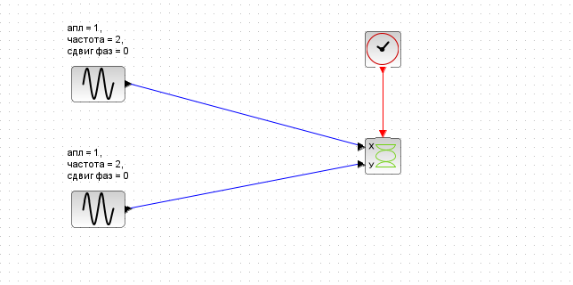{#fig:001 width=55%}

Для каждого случая будет необходимо изменять частоту и сдвиг фазы.

# Построение с помощью xcos фигуры Лиссажу для первого случая

В 1-м случае необходимо было построить фигуры Лиссажу со следующими параметрами: **A = B = 1, a = 2, b = 2, δ = 0; π/4; π/2; 3π/4; π;** 

# Построение с помощью xcos фигуры Лиссажу для первого случая

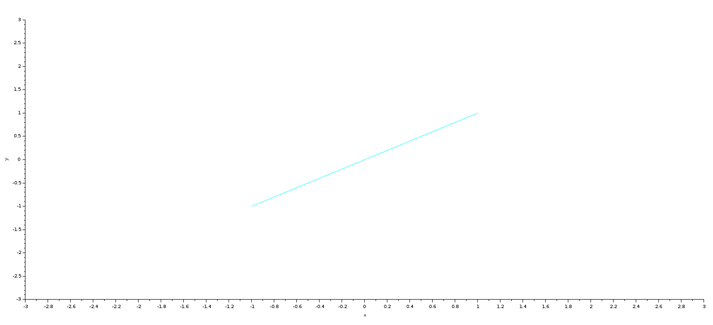{#fig:002 width=70%}

# Построение с помощью xcos фигуры Лиссажу для первого случая

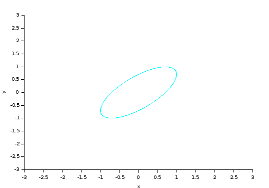{#fig:003 width=70%}

# Построение с помощью xcos фигуры Лиссажу для первого случая

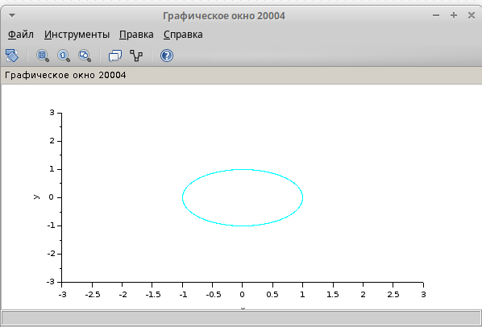{#fig:004 width=70%}

# Построение с помощью xcos фигуры Лиссажу для первого случая

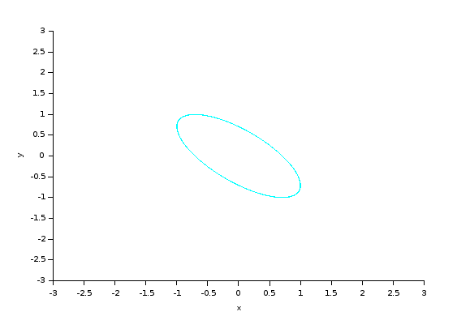{#fig:005 width=70%}

# Построение с помощью xcos фигуры Лиссажу для первого случая

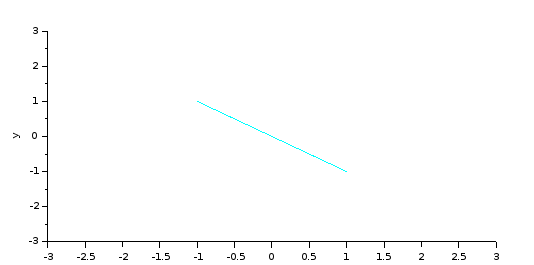{#fig:006 width=70%}

# Построение с помощью xcos фигуры Лиссажу для второго случая

Во 2-м случае необходимо было построить фигуры Лиссажу со следующими параметрами: **A = B = 1, a = 2, b = 4, δ = 0; π/4; π/2; 3π/4; π;** 

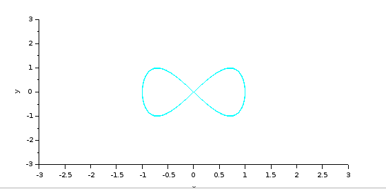{#fig:007 width=70%}

# Построение с помощью xcos фигуры Лиссажу для второго случая

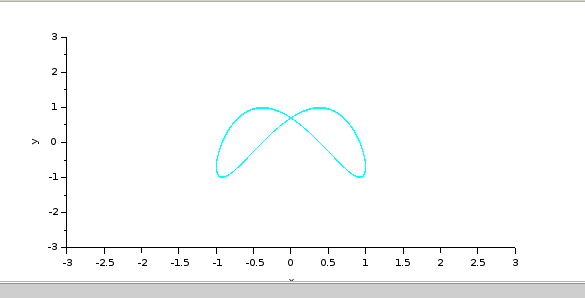{#fig:008 width=70%}

# Построение с помощью xcos фигуры Лиссажу для второго случая

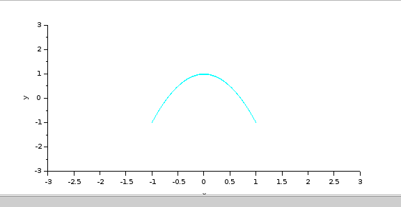{#fig:009 width=70%}

# Построение с помощью xcos фигуры Лиссажу для второго случая

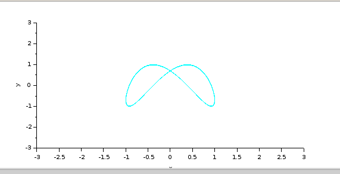{#fig:0010 width=70%}

# Построение с помощью xcos фигуры Лиссажу для второго случая

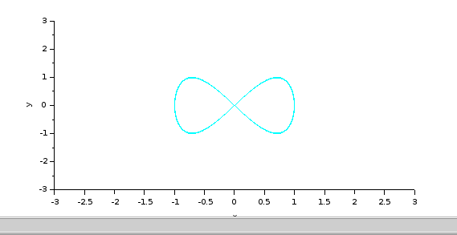{#fig:0011 width=70%}

# Построение с помощью xcos фигуры Лиссажу для третьего случая

В 3-м случае необходимо было построить фигуры Лиссажу со следующими параметрами: **A = B = 1, a = 2, b = 6, δ = 0; π/4; π/2; 3π/4; π;**

# Построение с помощью xcos фигуры Лиссажу для третьего случая

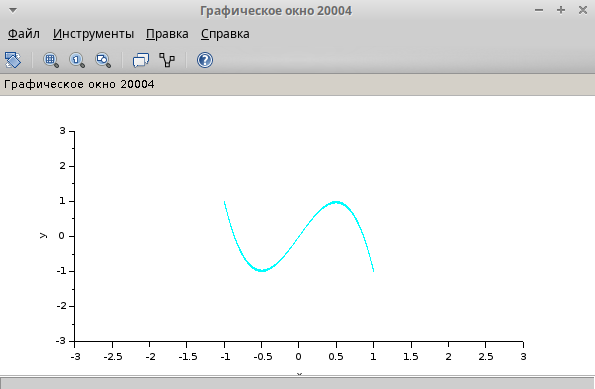{#fig:0012 width=70%}

# Построение с помощью xcos фигуры Лиссажу для третьего случая

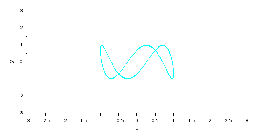{#fig:0013 width=70%}

# Построение с помощью xcos фигуры Лиссажу для третьего случая

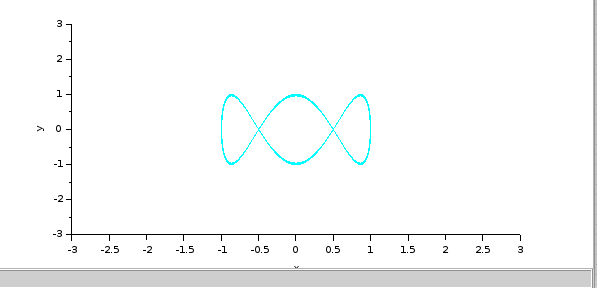{#fig:0014 width=70%}

# Построение с помощью xcos фигуры Лиссажу для третьего случая

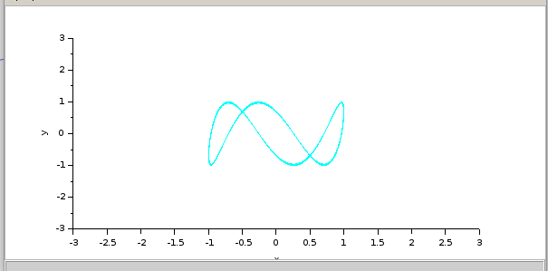{#fig:0015 width=70%}

# Построение с помощью xcos фигуры Лиссажу для третьего случая

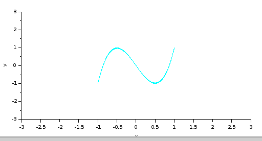{#fig:0016 width=70%}

# Построение с помощью xcos фигуры Лиссажу для четвертого случая

В 4-м случае необходимо было построить фигуры Лиссажу со следующими параметрами: **A = B = 1, a = 2, b = 3, δ = 0; π/4; π/2; 3π/4; π;**

# Построение с помощью xcos фигуры Лиссажу для четвертого случая

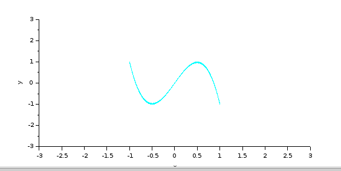{#fig:0017 width=70%}

# Построение с помощью xcos фигуры Лиссажу для четвертого случая

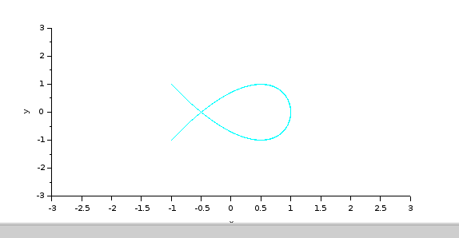{#fig:0018 width=70%}

# Построение с помощью xcos фигуры Лиссажу для четвертого случая

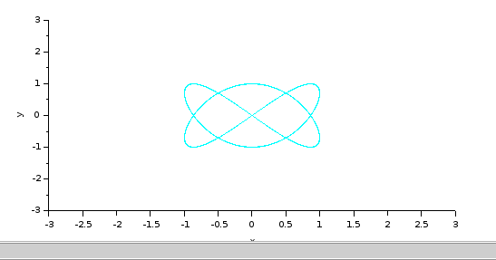{#fig:0019 width=70%}

# Построение с помощью xcos фигуры Лиссажу для четвертого случая

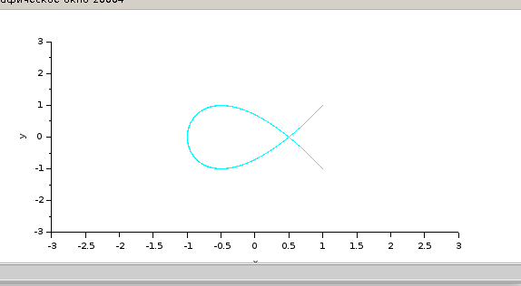{#fig:0020 width=70%}

# Построение с помощью xcos фигуры Лиссажу для четвертого случая

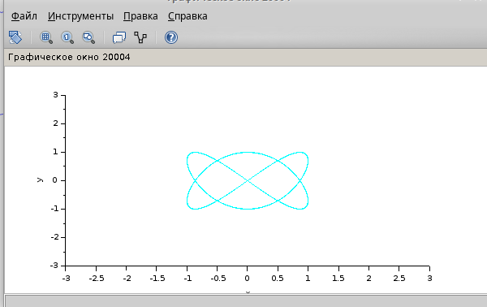{#fig:0021 width=70%}

# Выводы

Освоил систему компьютерной математики, предназначенной для решения вычислительных задач Scilab. Построил фигуры Лиссажу с различными параметрами. 

