---
## Front matter
title: "Упражнение. Фигуры Лиссажу с помощью xcos"
subtitle: "Имитационное моделирование"
author: "Королёв Иван"

## Generic otions
lang: ru-RU
toc-title: "Содержание"

## Bibliography
bibliography: bib/cite.bib
csl: pandoc/csl/gost-r-7-0-5-2008-numeric.csl

## Pdf output format
toc: true # Table of contents
toc-depth: 2
lof: true # List of figures
lot: true # List of tables
fontsize: 12pt
linestretch: 1.5
papersize: a4
documentclass: scrreprt
## I18n polyglossia
polyglossia-lang:
  name: russian
  options:
	- spelling=modern
	- babelshorthands=true
polyglossia-otherlangs:
  name: english
## I18n babel
babel-lang: russian
babel-otherlangs: english
## Fonts
mainfont: IBM Plex Serif
romanfont: IBM Plex Serif
sansfont: IBM Plex Sans
monofont: IBM Plex Mono
mathfont: STIX Two Math
mainfontoptions: Ligatures=Common,Ligatures=TeX,Scale=0.94
romanfontoptions: Ligatures=Common,Ligatures=TeX,Scale=0.94
sansfontoptions: Ligatures=Common,Ligatures=TeX,Scale=MatchLowercase,Scale=0.94
monofontoptions: Scale=MatchLowercase,Scale=0.94,FakeStretch=0.9
mathfontoptions:
## Biblatex
biblatex: true
biblio-style: "gost-numeric"
biblatexoptions:
  - parentracker=true
  - backend=biber
  - hyperref=auto
  - language=auto
  - autolang=other*
  - citestyle=gost-numeric
## Pandoc-crossref LaTeX customization
figureTitle: "Рис."
tableTitle: "Таблица"
listingTitle: "Листинг"
lofTitle: "Список иллюстраций"
lotTitle: "Список таблиц"
lolTitle: "Листинги"
## Misc options
indent: true
header-includes:
  - \usepackage{indentfirst}
  - \usepackage{float} # keep figures where there are in the text
  - \floatplacement{figure}{H} # keep figures where there are in the text
---

# Цель работы

Освоить систему компьютерной математики, предназначенной для решения вычислительных задач Scilab. Построить фигуры Лиссажу с различными параметрами. 

# Задание

Постройте с помощью xcos фигуры Лиссажу со следующими параметрами:
1. A = B = 1, a = 2, b = 2, δ = 0; π/4; π/2; 3π/4; π;
2. A = B = 1, a = 2, b = 4, δ = 0; π/4; π/2; 3π/4; π;
3. A = B = 1, a = 2, b = 6, δ = 0; π/4; π/2; 3π/4; π;
4. A = B = 1, a = 2, b = 3, δ = 0; π/4; π/2; 3π/4; π.

# Теоретическое введение

**Scilab** — система компьютерной математики, предназначенная для решения вычислительных задач. Основное окно Scilab содержит обозреватель файлов, командное окно, *обозреватель переменных* и *журнал команд*.
Программа xcos является приложением к пакету Scilab. Для вызова окна xcos необходимо в меню основного окна Scilab выбрать Инструменты, Визуальное моделирование xcos.
При моделировании с использованием xcos реализуется принцип визуального программирования, в соответствии с которым пользователь на экране из палитры блоков создаёт модель и осуществляет расчёты.

# Выполнение лабораторной работы

## Моделирование выражения для кривой Лиссажу в Scilab

Математическое выражение для кривой Лиссажу:
$$
\begin{cases}
  x(t) = A sin(at + \delta),\\
  y(t) = B sin(bt),
\end{cases}
$$
где A, B — амплитуды колебаний, a, b — частоты, δ — сдвиг фаз.

В модели, изображённой на (рис. [-@fig:001]), использованы следующие блоки xcos:
- CLOCK_c — запуск часов модельного времени;
- GENSIN_f — блок генератора синусоидального сигнала;
- CANIMXY — анимированное регистрирующее устройство для построения графика типа y = f(x);
- TEXT_f — задаёт текст примечаний

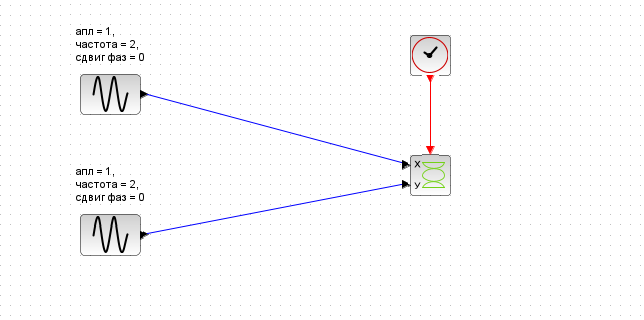{#fig:001 width=70%}

Для каждого случая будет необходимо изменять частоту и сдвиг фазы.

## Построение с помощью xcos фигуры Лиссажу для первого случая

В 1-м случае необходимо было построить фигуры Лиссажу со следующими параметрами: **A = B = 1, a = 2, b = 2, δ = 0; π/4; π/2; 3π/4; π;** (рис. [-@fig:002]), (рис. [-@fig:003]), (рис. [-@fig:004]), (рис. [-@fig:005]), (рис. [-@fig:006])

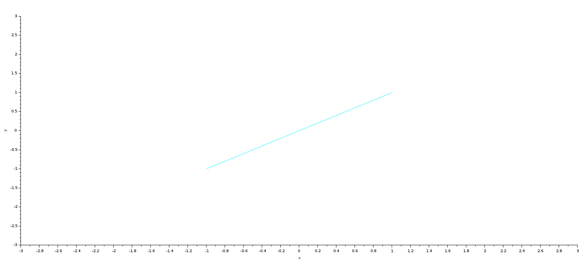{#fig:002 width=70%}

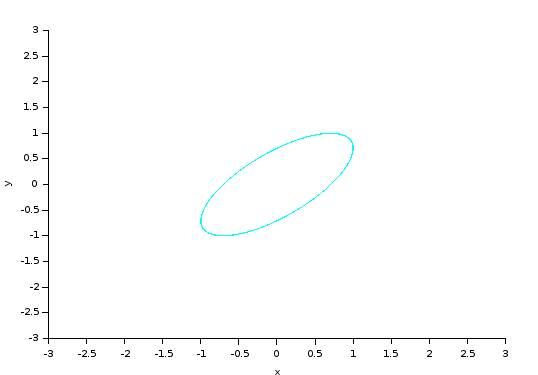{#fig:003 width=70%}

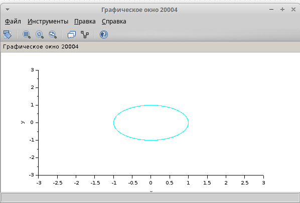{#fig:004 width=70%}

{#fig:005 width=70%}

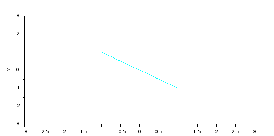{#fig:006 width=70%}

## Построение с помощью xcos фигуры Лиссажу для второго случая

Во 2-м случае необходимо было построить фигуры Лиссажу со следующими параметрами: **A = B = 1, a = 2, b = 4, δ = 0; π/4; π/2; 3π/4; π;** (рис. [-@fig:007]), (рис. [-@fig:008]), (рис. [-@fig:009]), (рис. [-@fig:0010]), (рис. [-@fig:0011])

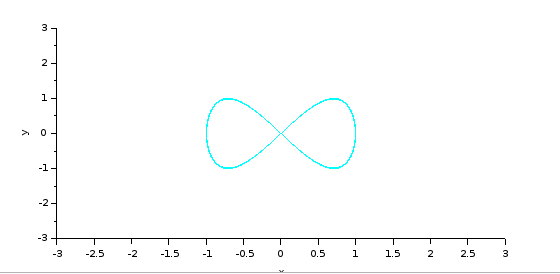{#fig:007 width=70%}

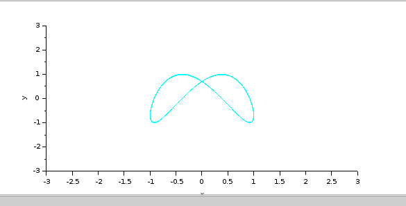{#fig:008 width=70%}

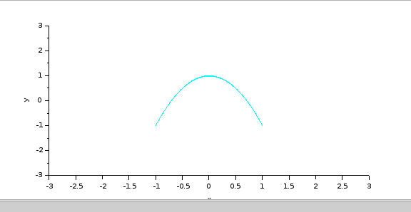{#fig:009 width=70%}

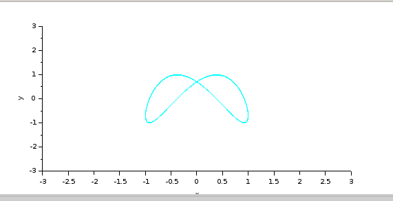{#fig:0010 width=70%}

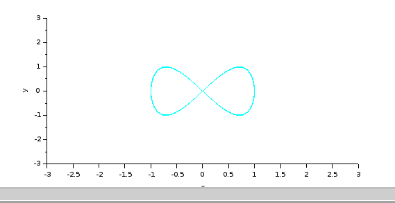{#fig:0011 width=70%}

## Построение с помощью xcos фигуры Лиссажу для третьего случая

В 3-м случае необходимо было построить фигуры Лиссажу со следующими параметрами: **A = B = 1, a = 2, b = 6, δ = 0; π/4; π/2; 3π/4; π;** (рис. [-@fig:0012]), (рис. [-@fig:0013]), (рис. [-@fig:0014]), (рис. [-@fig:0015]), (рис. [-@fig:0016])

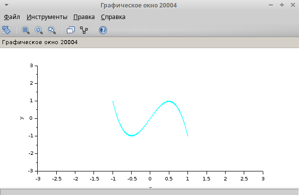{#fig:0012 width=70%}

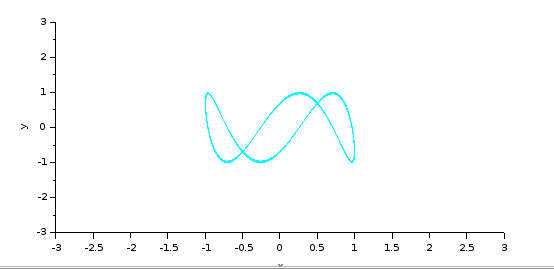{#fig:0013 width=70%}

{#fig:0014 width=70%}

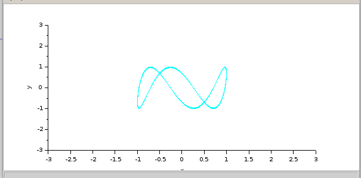{#fig:0015 width=70%}

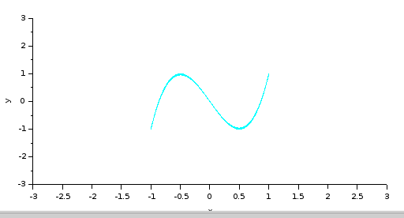{#fig:0016 width=70%}

## Построение с помощью xcos фигуры Лиссажу для четвертого случая

В 4-м случае необходимо было построить фигуры Лиссажу со следующими параметрами: **A = B = 1, a = 2, b = 3, δ = 0; π/4; π/2; 3π/4; π;** (рис. [-@fig:0017]), (рис. [-@fig:0018]), (рис. [-@fig:0019]), (рис. [-@fig:0020]), (рис. [-@fig:0021])

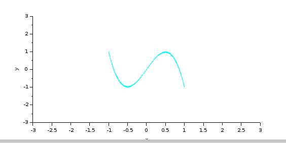{#fig:0017 width=70%}

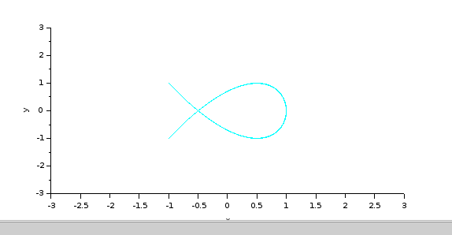{#fig:0018 width=70%}

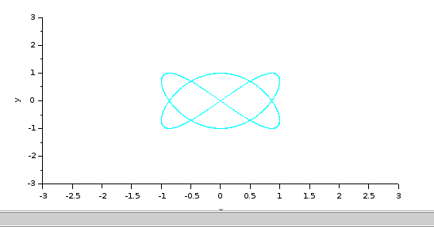{#fig:0019 width=70%}

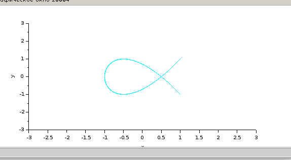{#fig:0020 width=70%}

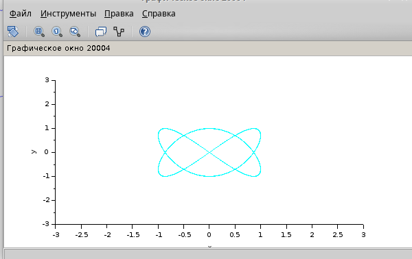{#fig:0021 width=70%}

# Выводы

Освоил систему компьютерной математики, предназначенной для решения вычислительных задач Scilab. Построил фигуры Лиссажу с различными параметрами. 

# Список литературы{.unnumbered}

::: {#refs}
:::
